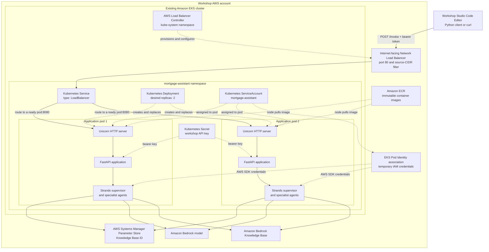
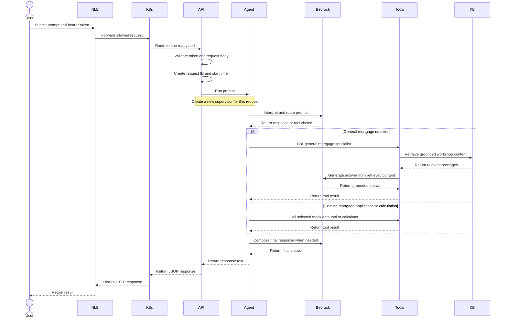

# Lab 03: Run the mortgage assistant as a service on Amazon EKS

In this lab, you package the Strands mortgage assistant as a FastAPI
application and deploy it as a persistent HTTP service on Amazon Elastic
Kubernetes Service (Amazon EKS).

After deployment, the application continues running in EKS. Sending a new
prompt is an HTTP request to the existing service; it does not rebuild the
container image or recreate the EKS cluster.

## Learning objectives

After completing this lab, you will be able to:

- Explain the difference between running an agent locally and hosting it as a
  long-running service.
- Expose a Strands application through a FastAPI API.
- Package the application as a container image.
- Push an immutable image to Amazon Elastic Container Registry (Amazon ECR).
- Deploy two application replicas to an existing EKS cluster.
- Expose the application through an internet-facing Network Load Balancer.
- Protect the API with source-CIDR filtering and a bearer token.
- Use EKS Pod Identity to give the application access to AWS services.
- Send repeated prompts without rebuilding or redeploying the application.
- Inspect pods, logs, health checks, rollouts, and service configuration.
- Trace an invocation from the client through FastAPI and the Strands agent.
- Identify which parts are production-aligned and which require further hardening.

## Estimated time

Allow approximately 45–60 minutes, including the local API exercise, initial
container build, EKS deployment, and validation exercises.

## Architecture

The following diagram shows the infrastructure boundary and what runs inside
each application pod.



Workshop Studio pre-provisions the long-running AWS infrastructure before the
lab begins:

- The VPC and EKS cluster.
- The EKS managed node group.
- The Amazon ECR repository.
- The Amazon Bedrock Knowledge Base.
- The SSM parameter containing the Knowledge Base ID.
- The application EKS Pod Identity role.
- AWS Load Balancer Controller.

Lab 03 consumes these pre-provisioned resources through stable Workshop
Studio interfaces and deploys only the application resources. It does not
create a new EKS cluster or Knowledge Base.

### Where FastAPI sits and why it is used

FastAPI runs inside every application container. It is not a separate EKS
service, sidecar, or managed AWS component. Uvicorn is the long-running server
process in the container, FastAPI implements the HTTP boundary, and the Strands
application is called as ordinary Python code inside the same process.

```text
EKS pod
└── mortgage-assistant container
    └── Uvicorn process
        └── FastAPI application
            └── Strands supervisor and tools
```

EKS schedules and replaces containers, but it does not define an application
API. FastAPI provides that missing application layer:

- A stable `POST /invoke` endpoint for clients.
- JSON request parsing and schema validation.
- Bearer-token enforcement for workshop invocations.
- Consistent status codes and response bodies.
- Request IDs, timing, and centralized exception handling.
- Liveness and readiness endpoints for Kubernetes and the load balancer.
- A long-running process that can accept many prompts after one deployment.

FastAPI itself is not required by Strands; another HTTP or RPC framework could
be used. It is required by this implementation because it is the selected
adapter between external network requests and the Python agent application.

### End-to-end invocation workflow

Only one ready pod handles a particular request. The next request may be routed
to the same pod or the other replica because Lab 03 stores no conversation
state in either pod.



Temporary AWS credentials are supplied to the pod through EKS Pod Identity.
The readiness path also reads the Knowledge Base identifier from SSM. Normal
prompts do not run Docker, push an image, or modify the EKS Deployment.

## Service concepts

### Local process versus long-running service

In Lab 02, each command started a Python process, created the agent, answered
one prompt, and exited:

```text
command -> Python process -> Strands agent -> response -> process exits
```

In Lab 03, FastAPI and Uvicorn continue running inside EKS:

```text
deploy once -> pods remain running -> send many HTTP requests
```

The container image is rebuilt only when you rerun
`scripts/deploy-application.sh`. Normal prompts do not invoke Docker, push an
image, or update Kubernetes.

### Stateless requests

Lab 03 is intentionally stateless. Every request contains one prompt:

```json
{
  "prompt": "What are the benefits of a 15-year mortgage?"
}
```

The API creates a new supervisor agent for that request. It does not receive an
actor ID or session ID, and it does not persist conversation history.

For example, these are two independent requests:

```text
Request 1: I am considering a $600,000 property.
Request 2: What property value did I mention?
```

The second request should not be expected to recall the first request. Lab 04
adds short-term session state and durable long-term memory.

Stateless requests also mean either EKS replica can process a prompt without
requiring session affinity.

### Kubernetes Deployment

The Kubernetes Deployment runs two replicas:

```yaml
replicas: 2
```

It uses a rolling-update strategy:

```yaml
maxUnavailable: 0
maxSurge: 1
```

Kubernetes can start a replacement pod before terminating an old pod. A
PodDisruptionBudget requests that at least one replica remain available during
voluntary disruptions.

### Kubernetes Service and Network Load Balancer

The Kubernetes Service has type `LoadBalancer`. AWS Load Balancer Controller
creates an internet-facing Network Load Balancer and registers pod IP
addresses as targets.

The service accepts traffic on port 80 and forwards it to port 8080 in the
FastAPI containers.

The generated service manifest restricts inbound traffic to the participant's
detected public IP address using a `/32` CIDR by default.

### Health and readiness

The API exposes two unauthenticated operational endpoints:

- `GET /health` confirms that the FastAPI process is running.
- `GET /health/ready` confirms that the application can read the Knowledge
  Base configuration from SSM.

Kubernetes uses `/health` for the liveness probe and `/health/ready` for the
readiness probe. The Network Load Balancer also uses `/health`.

The endpoints remain unauthenticated so Kubernetes and the load balancer can
call them without the participant API key.

## How the implementation works

### Strands application

`app/mortgage_agent.py` contains the same multi-agent application introduced
in Lab 02.

The supervisor routes prompts to specialized tools:

- General mortgage information.
- Existing mock-mortgage questions.
- New mock-loan application questions.
- Calculations.

The general mortgage assistant uses the Bedrock Knowledge Base. At runtime,
`get_knowledge_base_id()` reads its identifier from the SSM parameter created
by the Workshop Studio foundation infrastructure.

### FastAPI application

`app/mortgage_api.py` wraps the Strands application with FastAPI.

The invocation endpoint:

```python
@app.post("/invoke", response_model=InvokeResponse)
def invoke(
    request: InvokeRequest,
    authorization: str | None = Header(default=None),
) -> InvokeResponse:
    authorize(authorization)
    response = run_prompt(request.prompt)
    ...
```

FastAPI validates that the prompt contains between 1 and 4,000 characters.
The response contains:

- A unique request ID.
- The assistant response.
- The request duration in milliseconds.

### Container image

The `Dockerfile`:

1. Starts from the `uv` Python 3.12 slim image.
2. Installs the dependencies from `uv.lock`.
3. Copies only the runtime application files.
4. Creates a non-root user with UID `10001`.
5. Starts Uvicorn on port `8080`.

The container runs with one Uvicorn worker and a concurrency limit of four
requests per pod. Kubernetes provides horizontal process isolation by running
two pods.

### Kubernetes security configuration

The pod configuration:

- Runs as a non-root user.
- Drops all Linux capabilities.
- Disables privilege escalation.
- Uses the runtime-default seccomp profile.
- Uses a read-only root filesystem.
- Mounts a size-limited writable `/tmp` volume.
- Disables automatic Kubernetes service-account token mounting.
- Requests `250m` CPU and `512Mi` memory per pod.
- Limits each pod to one CPU and `2Gi` memory.

The namespace enables the Kubernetes restricted Pod Security Standard.

### EKS Pod Identity

The pods use the `mortgage-assistant` Kubernetes service account. Workshop
Studio foundation infrastructure associates that service account with an IAM
role through EKS Pod Identity.

The application therefore receives temporary AWS credentials without storing
long-lived AWS access keys in the image or Kubernetes Secret. The role allows
the application to:

- Read the Knowledge Base ID from SSM.
- Retrieve content from the Bedrock Knowledge Base.
- Invoke the configured Bedrock model.

### Deployment script

`scripts/deploy-application.sh` automates the application deployment:

1. Reads the EKS cluster name from `/workshop/mortgage-assistant/eks/cluster-name` and the ECR
   repository URI from `/workshop/mortgage-assistant/ecr/repository-uri` in SSM Parameter Store.
2. Defaults `MODEL_ID` to `us.anthropic.claude-sonnet-4-6` and
   `KB_PARAMETER_NAME` to
   `/workshop/mortgage-assistant/bedrock/knowledge-base-id` unless you override
   those environment variables.
3. Detects or accepts the allowed source CIDR.
4. Configures the local `kubectl` context.
5. Confirms that AWS Load Balancer Controller is ready.
6. Authenticates Docker with Amazon ECR.
7. Builds a `linux/amd64` image with an immutable timestamped tag.
8. Pushes the image to the existing ECR repository.
9. Creates or updates the Kubernetes namespace and service account.
10. Creates the API-key Kubernetes Secret.
11. Renders and applies the Deployment, PodDisruptionBudget, and Service.
12. Waits for the Deployment rollout and Network Load Balancer.
13. Checks API health and sends one smoke-test prompt.

### Invocation client

`app/invoke_eks.py` sends prompts to the deployed service.

By default, it uses `kubectl` to discover:

- The Network Load Balancer hostname from the Kubernetes Service.
- The API key from the Kubernetes Secret.

You can also provide the URL and key through command options or environment
variables.

## API and security model

The workshop API uses two controls:

1. The Network Load Balancer permits traffic only from the configured source
   CIDR.
2. `POST /invoke` requires a bearer token stored in a Kubernetes Secret.

The API key is compared using a constant-time comparison. The deployment
script generates a random key unless `MORTGAGE_API_KEY` is already set.

This is appropriate for a self-contained workshop account, but it is not a
complete production identity system. A production API should authenticate
individual users and authorize access to application data.

Use only mock information in this workshop. Do not enter real customer,
personal, account, or financial information.

## TODO: Replace the shared API key with Amazon Cognito

A future workshop revision should replace the shared bearer-token API key with
participant authentication through an Amazon Cognito User Pool.

The intended request flow is:

```text
Participant client
        |
        | Sign in with OAuth 2.0 authorization code and PKCE
        v
Amazon Cognito User Pool
        |
        | Cognito JWT access token
        v
Network Load Balancer
        |
        v
FastAPI on EKS
        |
        | Validate JWT and derive participant identity
        v
Strands mortgage assistant
```

The implementation should:

1. Add the Cognito User Pool, public application client, domain, and required
   outputs to the Workshop Studio foundation infrastructure.
2. Configure the application client for authorization-code flow with PKCE so
   the participant client does not contain an application-client secret.
3. Update `app/invoke_eks.py` to sign in, obtain an access token, refresh it
   when necessary, and send it as the bearer token.
4. Update FastAPI to validate the JWT signature using the User Pool JWKS.
5. Validate the token issuer, expiration, application client, scopes, and
   `token_use=access` claim.
6. Cache the Cognito signing keys while supporting signing-key rotation.
7. Remove random API-key generation and the
   `mortgage-assistant-api-key` Kubernetes Secret.
8. Keep the liveness and readiness endpoints unauthenticated for Kubernetes
   and Network Load Balancer health checks.
9. In Lab 04, derive `actor_id` from the validated Cognito `sub` claim instead
   of accepting an arbitrary actor ID from the request.
10. Add tests for valid, expired, malformed, incorrectly scoped, and
    incorrectly issued tokens.

JWT validation inside FastAPI is the preferred approach for the current
command-line client because it preserves the existing Network Load Balancer
architecture. Switching to an Application Load Balancer with its built-in
Cognito authentication action can be evaluated separately for a browser-based
workshop interface.

## Prerequisites

Use the Workshop Studio environment, complete Labs 01–02, and confirm your AWS
identity:

```bash
aws sts get-caller-identity
```

Confirm that the pre-provisioned EKS cluster is reachable:

```bash
kubectl get nodes
```

You also need:

- AWS CLI v2.
- `kubectl`.
- Docker, with Buildx when available.
- `uv`.
- Python 3.12 or later.
- `curl`.
- `openssl`.
- Access to the Bedrock model configured by the Workshop Studio foundation
  infrastructure.

The scripts use the default AWS CLI profile unless `--profile` is provided.
Workshop Studio has already provisioned the required AWS infrastructure. The
deployment script discovers the environment through the documented SSM
parameters and does not require a CloudFormation stack name or outputs.

## Step 1: Review the Lab 03 files

```text
03-eks-service/
├── app/
│   ├── invoke_eks.py
│   ├── mortgage_agent.py
│   └── mortgage_api.py
├── k8s/
│   ├── base.yaml
│   └── service.template.yaml
├── scripts/
│   └── deploy-application.sh
├── .dockerignore
├── Dockerfile
├── pyproject.toml
└── uv.lock
```

The module is a complete application checkpoint. Lab 04 copies this
application structure and adds memory-specific code.

## Step 2: Install the module and test the agent directly

From the repository root:

```bash
cd 03-eks-service

uv sync --frozen
```

Test the agent as a standalone Python process before starting FastAPI:

```bash
uv run app/mortgage_agent.py \
  --prompt "What are the benefits of a 15-year mortgage?"
```

For a named AWS CLI profile:

```bash
export AWS_PROFILE=YOUR_AWS_PROFILE
export AWS_REGION=us-west-2

uv run app/mortgage_agent.py \
  --prompt "When does mortgage refinancing make sense?"
```

Expected result:

```text
The assistant retrieves relevant information from the workshop Knowledge Base
and explains the answer in plain language.
```

This confirms the application and AWS permissions work before introducing
FastAPI, containers, or Kubernetes.

## Step 3: Run the FastAPI service locally

Set a local API key:

```bash
export MORTGAGE_API_KEY="$(openssl rand -hex 32)"
export AWS_REGION=us-west-2
```

If necessary, also select a named AWS profile:

```bash
export AWS_PROFILE=YOUR_AWS_PROFILE
```

Start Uvicorn:

```bash
uv run uvicorn mortgage_api:app \
  --app-dir app \
  --host 127.0.0.1 \
  --port 8080
```

Leave the server running and use another terminal in `03-eks-service` for the
following commands.

Check liveness:

```bash
curl --fail --silent --show-error \
  http://127.0.0.1:8080/health
```

Expected response:

```json
{"status":"ok"}
```

Check readiness:

```bash
curl --fail --silent --show-error \
  http://127.0.0.1:8080/health/ready
```

Expected response:

```json
{
  "status": "ready",
  "knowledge_base_id": "YOUR_KNOWLEDGE_BASE_ID",
  "model_id": "us.anthropic.claude-sonnet-4-6"
}
```

Invoke the local API using the Python client:

```bash
python3 app/invoke_eks.py \
  --url http://127.0.0.1:8080 \
  --api-key "$MORTGAGE_API_KEY" \
  --prompt "Compare 15-year and 30-year mortgages."
```

Stop Uvicorn with `Ctrl+C` before continuing.

## Step 4: Deploy the application to EKS

Make the deployment script executable:

```bash
chmod +x scripts/deploy-application.sh
```

Deploy using the default AWS CLI profile:

```bash
./scripts/deploy-application.sh --region us-west-2
```

For a named profile:

```bash
./scripts/deploy-application.sh --region us-west-2 --profile YOUR_AWS_PROFILE
```

The script detects your current public IP and permits that `/32` CIDR to reach
the Network Load Balancer.

To provide the CIDR explicitly:

```bash
./scripts/deploy-application.sh --region us-west-2 --service-access-cidr 203.0.113.10/32
```

Replace the example address with the public IP that should be allowed. Avoid
`0.0.0.0/0` unless unrestricted public network access is intentional.

To use a stable API key across deployments:

```bash
export MORTGAGE_API_KEY="$(openssl rand -hex 32)"

./scripts/deploy-application.sh --region us-west-2
```

The first image build, push, EKS rollout, and Network Load Balancer creation
can take several minutes.

At completion, the script prints:

- The EKS cluster name.
- The immutable image URI.
- The API endpoint.
- The API key.
- One smoke-test response.

Do not commit the printed API key or share it outside the workshop account.

## Step 5: Review what the deployment script created

The script creates application resources, not a new EKS cluster.

Display the namespace resources:

```bash
kubectl get all \
  --namespace mortgage-assistant
```

Display the Deployment image:

```bash
kubectl get deployment mortgage-assistant \
  --namespace mortgage-assistant \
  --output jsonpath='{.spec.template.spec.containers[0].image}{"\n"}'
```

Display the non-secret environment configuration:

```bash
kubectl get deployment mortgage-assistant \
  --namespace mortgage-assistant \
  --output jsonpath='{range .spec.template.spec.containers[0].env[*]}{.name}{"\n"}{end}'
```

The `MORTGAGE_API_KEY` value comes from a Secret and is not stored directly in
the Deployment.

Inspect the rendered workload configuration:

```bash
kubectl describe deployment mortgage-assistant \
  --namespace mortgage-assistant
```

## Step 6: Check the EKS deployment

Wait for the Deployment:

```bash
kubectl rollout status \
  deployment/mortgage-assistant \
  --namespace mortgage-assistant
```

Check the replicas and pod placement:

```bash
kubectl get deployment,pods \
  --namespace mortgage-assistant \
  --output wide
```

Expected result:

```text
The Deployment reports 2/2 ready replicas and both pods are Running.
```

Check the Service and Network Load Balancer:

```bash
kubectl get service mortgage-assistant \
  --namespace mortgage-assistant \
  --output wide
```

The `EXTERNAL-IP` column contains the Network Load Balancer hostname.

Display recent logs from both replicas:

```bash
kubectl logs \
  --namespace mortgage-assistant \
  --selector app.kubernetes.io/name=mortgage-assistant \
  --all-containers=true \
  --prefix \
  --tail=100
```

## Step 7: Test liveness and readiness on EKS

Discover the service endpoint:

```bash
export MORTGAGE_API_URL="http://$(
  kubectl get service mortgage-assistant \
    --namespace mortgage-assistant \
    --output jsonpath='{.status.loadBalancer.ingress[0].hostname}'
)"
```

Call the liveness endpoint:

```bash
curl --fail --silent --show-error \
  "$MORTGAGE_API_URL/health"
```

Expected response:

```json
{"status":"ok"}
```

Call the readiness endpoint:

```bash
curl --fail --silent --show-error \
  "$MORTGAGE_API_URL/health/ready"
```

The response identifies the configured Knowledge Base and model.

These endpoints do not require the API key.

## Step 8: Send prompts using the Python client

The client discovers the endpoint and API key automatically:

```bash
python3 app/invoke_eks.py \
  --prompt "When does refinancing make sense?"
```

Print the complete API response:

```bash
python3 app/invoke_eks.py \
  --prompt "Compare 15-year and 30-year mortgages." \
  --json
```

Example response:

```json
{
  "request_id": "e751e211-...",
  "response": "A 15-year mortgage typically...",
  "duration_ms": 3821
}
```

The request ID can be used to correlate a failed request with application
logs.

To bypass Kubernetes discovery, provide the endpoint and key:

```bash
python3 app/invoke_eks.py \
  --url "$MORTGAGE_API_URL" \
  --api-key "$MORTGAGE_API_KEY" \
  --prompt "What are the tradeoffs of a shorter mortgage term?"
```

## Step 9: Invoke the service with curl

Retrieve the API key from the Kubernetes Secret:

```bash
export MORTGAGE_API_KEY="$(
  kubectl get secret mortgage-assistant-api-key \
    --namespace mortgage-assistant \
    --output jsonpath='{.data.api-key}' |
  base64 --decode
)"
```

Send a request:

```bash
curl --fail --silent --show-error \
  --max-time 300 \
  --request POST \
  "$MORTGAGE_API_URL/invoke" \
  --header "Authorization: Bearer $MORTGAGE_API_KEY" \
  --header "Content-Type: application/json" \
  --data '{
    "prompt": "What are the advantages and disadvantages of refinancing?"
  }'
```

Test authentication by omitting the token:

```bash
curl --silent --show-error \
  --request POST \
  "$MORTGAGE_API_URL/invoke" \
  --header "Content-Type: application/json" \
  --data '{"prompt":"What is refinancing?"}'
```

Expected result:

```json
{"detail":"Invalid or missing bearer token"}
```

The HTTP status is `401 Unauthorized`.

## Step 10: Prove that prompts do not rebuild the image

Record the image and current pods:

```bash
kubectl get deployment mortgage-assistant \
  --namespace mortgage-assistant \
  --output jsonpath='{.spec.template.spec.containers[0].image}{"\n"}'

kubectl get pods \
  --namespace mortgage-assistant \
  --selector app.kubernetes.io/name=mortgage-assistant \
  --output custom-columns='NAME:.metadata.name,CREATED:.metadata.creationTimestamp'
```

Send several prompts:

```bash
python3 app/invoke_eks.py \
  --prompt "What is a fixed-rate mortgage?"

python3 app/invoke_eks.py \
  --prompt "When might refinancing be useful?"

python3 app/invoke_eks.py \
  --prompt "Calculate 250000 divided by 300."
```

Run the image and pod commands again.

Expected result:

- The image URI is unchanged.
- The pod names and creation timestamps are unchanged.
- No new image was pushed to ECR.
- Each prompt was handled by the already-running service.

Only rerun `deploy-application.sh` after changing application, container, or
Kubernetes code.

## Step 11: Test service resilience and multiple replicas

Display both pod IP addresses:

```bash
kubectl get pods \
  --namespace mortgage-assistant \
  --selector app.kubernetes.io/name=mortgage-assistant \
  --output wide
```

Display the Service endpoint targets:

```bash
kubectl get endpointslice \
  --namespace mortgage-assistant \
  --selector kubernetes.io/service-name=mortgage-assistant \
  --output wide
```

The Service can route a request to either ready pod.

Delete one pod to simulate a process or node-level interruption:

```bash
POD_NAME="$(
  kubectl get pods \
    --namespace mortgage-assistant \
    --selector app.kubernetes.io/name=mortgage-assistant \
    --output jsonpath='{.items[0].metadata.name}'
)"

kubectl delete pod "$POD_NAME" \
  --namespace mortgage-assistant
```

The Deployment immediately creates a replacement. Wait for two ready replicas:

```bash
kubectl rollout status \
  deployment/mortgage-assistant \
  --namespace mortgage-assistant
```

Invoke the service again:

```bash
python3 app/invoke_eks.py \
  --prompt "What are the benefits of making a larger deposit?"
```

Expected result:

```text
The service remains available and the Deployment returns to two ready pods.
```

Because Lab 03 is stateless, a replacement pod does not need to restore
conversation data.

## Step 12: Observe a rolling application deployment

Record the current image:

```bash
export PREVIOUS_IMAGE="$(
  kubectl get deployment mortgage-assistant \
    --namespace mortgage-assistant \
    --output jsonpath='{.spec.template.spec.containers[0].image}'
)"

echo "$PREVIOUS_IMAGE"
```

Rerun the deployment script to represent releasing a new application version:

```bash
./scripts/deploy-application.sh --region us-west-2
```

The script creates a new timestamped image and updates the existing
Deployment. It does not recreate EKS.

Display the new image and rollout history:

```bash
kubectl get deployment mortgage-assistant \
  --namespace mortgage-assistant \
  --output jsonpath='{.spec.template.spec.containers[0].image}{"\n"}'

kubectl rollout history \
  deployment/mortgage-assistant \
  --namespace mortgage-assistant
```

Expected result:

- The new image URI differs from `PREVIOUS_IMAGE`.
- Kubernetes replaced the pods with a rolling update.
- Two replicas are ready after the rollout.
- The EKS cluster and node group were not recreated.

## API contract

### Invoke request

```http
POST /invoke
Authorization: Bearer <API key>
Content-Type: application/json
```

Request body:

```json
{
  "prompt": "What are the benefits of a 15-year mortgage?"
}
```

The prompt must contain between 1 and 4,000 characters.

### Successful response

```json
{
  "request_id": "e751e211-...",
  "response": "A 15-year mortgage...",
  "duration_ms": 3821
}
```

### Error responses

| Status | Meaning |
| --- | --- |
| `401` | The bearer token is missing or invalid. |
| `422` | FastAPI rejected an invalid request body, such as an empty prompt. |
| `500` | The agent invocation failed; the response includes a request ID. |

### Operational endpoints

| Endpoint | Authentication | Purpose |
| --- | --- | --- |
| `GET /health` | None | Liveness and load-balancer health. |
| `GET /health/ready` | None | Readiness and Knowledge Base configuration. |
| `POST /invoke` | Bearer token | Run one mortgage-assistant prompt. |

## Troubleshooting

### The required Workshop Studio SSM parameters cannot be read

Confirm that the required parameters exist in the selected Region and contain
values:

```bash
aws ssm get-parameters \
  --region us-west-2 \
  --names \
    /workshop/mortgage-assistant/eks/cluster-name \
    /workshop/mortgage-assistant/ecr/repository-uri \
    /workshop/mortgage-assistant/bedrock/knowledge-base-id \
  --query 'Parameters[].{Name:Name,Value:Value}'
```

The response must contain all three parameter names. If a parameter is missing
or empty, confirm that Workshop Studio finished provisioning the participant
environment.

### kubectl cannot connect to EKS

Read the cluster name from SSM and refresh the local kubeconfig:

```bash
CLUSTER_NAME="$(aws ssm get-parameter \
  --region us-west-2 \
  --name /workshop/mortgage-assistant/eks/cluster-name \
  --query Parameter.Value \
  --output text)"

aws eks update-kubeconfig \
  --region us-west-2 \
  --name "$CLUSTER_NAME" \
  --alias "$CLUSTER_NAME"
```

Then check:

```bash
kubectl get nodes
```

### AWS Load Balancer Controller is unavailable

Check the controller:

```bash
kubectl get deployment,pods \
  --namespace kube-system \
  --selector app.kubernetes.io/name=aws-load-balancer-controller
```

Review its logs:

```bash
kubectl logs \
  --namespace kube-system \
  deployment/aws-load-balancer-controller \
  --tail=200
```

Workshop Studio permission setup installs the controller.

### Docker cannot build the image

Confirm Docker is running:

```bash
docker version
docker buildx version
```

The image must be built for `linux/amd64` because the workshop EKS nodes use
the x86-64 architecture.

If Docker reports permission errors for its configuration directory, ensure
that `~/.docker` exists, is owned by your user, and has mode `0700`:

```bash
mkdir -p "$HOME/.docker"
sudo chown -R "$USER":"$(id -gn)" "$HOME/.docker"
chmod 0700 "$HOME/.docker"
```

If Docker reports permission errors for its socket after your user was added
to the `docker` group, start a shell with the updated group membership:

```bash
newgrp docker
```

Alternatively, close and reopen the Code Editor terminal. Then rerun the
Docker command or deployment script without `sudo`. Do not run the deployment
script with `sudo`.

### Docker cannot push to ECR

Confirm the AWS identity:

```bash
aws sts get-caller-identity
```

Log in manually if necessary:

```bash
aws ecr get-login-password \
  --region us-west-2 |
docker login \
  --username AWS \
  --password-stdin \
  YOUR_ACCOUNT_ID.dkr.ecr.us-west-2.amazonaws.com
```

### A pod is Pending or cannot pull the image

Inspect the pod and recent events:

```bash
kubectl get pods \
  --namespace mortgage-assistant

kubectl describe pod \
  --namespace mortgage-assistant \
  POD_NAME

kubectl get events \
  --namespace mortgage-assistant \
  --sort-by='.lastTimestamp'
```

Look for scheduling, resource, architecture, or `ImagePullBackOff` errors.

### A pod is running but not ready

Check the readiness endpoint through the pod:

```bash
kubectl port-forward \
  --namespace mortgage-assistant \
  deployment/mortgage-assistant \
  8080:8080
```

In another terminal:

```bash
curl --fail --silent --show-error \
  http://127.0.0.1:8080/health/ready
```

Review application logs for SSM or Bedrock permission errors:

```bash
kubectl logs \
  --namespace mortgage-assistant \
  deployment/mortgage-assistant \
  --tail=200
```

### The Network Load Balancer endpoint is empty

Inspect the Service:

```bash
kubectl describe service mortgage-assistant \
  --namespace mortgage-assistant
```

Check AWS Load Balancer Controller logs and wait several minutes for AWS to
finish provisioning the load balancer.

### The endpoint times out

Your public IP may have changed since deployment. Detect it:

```bash
curl --fail --silent --show-error \
  https://checkip.amazonaws.com
```

Rerun the deployment with the new `/32` CIDR:

```bash
./scripts/deploy-application.sh --region us-west-2 --service-access-cidr YOUR_PUBLIC_IP/32
```

### The request receives HTTP 401

Retrieve the current API key:

```bash
export MORTGAGE_API_KEY="$(
  kubectl get secret mortgage-assistant-api-key \
    --namespace mortgage-assistant \
    --output jsonpath='{.data.api-key}' |
  base64 --decode
)"
```

The deployment script generates a new key on each run unless
`MORTGAGE_API_KEY` is exported before deployment. The Python client normally
discovers the current key automatically.

### The application receives AccessDenied from AWS

Confirm the pod uses the expected service account:

```bash
kubectl get pod \
  --namespace mortgage-assistant \
  --selector app.kubernetes.io/name=mortgage-assistant \
  --output jsonpath='{.items[0].spec.serviceAccountName}{"\n"}'
```

Read the cluster name from SSM and confirm the Workshop Studio Pod Identity
association exists:

```bash
CLUSTER_NAME="$(aws ssm get-parameter \
  --region us-west-2 \
  --name /workshop/mortgage-assistant/eks/cluster-name \
  --query Parameter.Value \
  --output text)"

aws eks list-pod-identity-associations \
  --region us-west-2 \
  --cluster-name "$CLUSTER_NAME"
```

Review the pod logs for the exact SSM or Bedrock action that was denied.

### An invocation times out

The client timeout defaults to 300 seconds. Check the service health and pod
logs:

```bash
curl --fail --silent --show-error \
  "$MORTGAGE_API_URL/health"

kubectl logs \
  --namespace mortgage-assistant \
  deployment/mortgage-assistant \
  --tail=200
```

You can change the client timeout:

```bash
python3 app/invoke_eks.py \
  --timeout 600 \
  --prompt "Explain the tradeoffs between 15-year and 30-year mortgages."
```

## Production-aligned patterns demonstrated by this lab

The complete workshop service is not production-ready, but it demonstrates
several useful production patterns.

### Long-running, stateless application service

The container is deployed once and remains available for many requests. Each
invocation creates an isolated Strands supervisor, while no conversation state
is retained in the pod. This lets the Kubernetes Service route requests to any
ready replica and makes pod replacement straightforward.

### Availability and safe rollout controls

The Deployment uses two replicas, readiness and liveness probes, a rolling
update with `maxUnavailable: 0`, and a Pod Disruption Budget. Kubernetes can
start a replacement before intentionally removing an existing ready replica.

### Workload identity and least-privilege direction

EKS Pod Identity supplies temporary AWS credentials through the pod's service
account. The image and Kubernetes manifests do not contain long-lived AWS
access keys.

### Hardened container execution

The application runs as a non-root user with a read-only root filesystem,
dropped Linux capabilities, disabled privilege escalation, seccomp, a bounded
writable `/tmp` volume, resource requests and limits, and restricted Pod
Security admission labels.

### Repeatable artifacts and deployment

Dependencies are locked, images receive immutable timestamped tags, ECR stores
the build artifact, and Kubernetes performs a declarative rollout. Health and
smoke checks run before the deployment script reports success.

### Explicit API boundary

FastAPI provides validated input and output schemas, request identifiers,
health endpoints, authentication enforcement, and a consistent place for
future authorization, telemetry, rate limiting, and policy controls.

## What is still missing for production and how to address it

| Workshop implementation | Production concern | Recommended solution |
|---|---|---|
| One shared API key | It cannot identify individual users or express per-user permissions. | Use Amazon Cognito or another OIDC provider. Validate JWT signature, issuer, audience, expiry, token use, and scopes. |
| Internet-facing HTTP NLB | Traffic and the bearer credential are not encrypted in transit, and the NLB has no application-layer WAF policy. | Require HTTPS with an ACM certificate. Select ALB, API Gateway, ingress, or a private load balancer according to authentication, AWS WAF, routing, and access requirements. |
| API key stored in a Kubernetes Secret | Kubernetes Secrets are not a complete secret lifecycle or rotation solution. | Prefer short-lived identity tokens. Store remaining secrets in AWS Secrets Manager, enable envelope encryption, restrict access, and automate rotation. |
| Source-IP filtering is the primary network restriction | Participant IP addresses change, proxies can share addresses, and CIDRs do not represent user identity. | Use identity-based authorization, private networking where appropriate, security-group controls, and application-layer policy. Treat CIDR filtering as defense in depth. |
| No rate limiting or admission control | A client can exhaust pod concurrency or Bedrock quotas. | Add per-identity quotas, request-size limits, rate limiting, backpressure, and bounded queues. Coordinate limits with downstream AWS quotas. |
| Fixed two replicas and no HPA | Capacity does not adjust to traffic, latency, or model-call concurrency. | Load test the complete path, configure a Horizontal Pod Autoscaler, validate cluster capacity, and use suitable metrics such as active requests and latency. |
| Replicas are not explicitly spread | Both pods could be scheduled onto the same node or Availability Zone. | Add topology-spread constraints and pod anti-affinity, use multi-AZ node groups, and test node and AZ disruption. |
| One Uvicorn worker and four concurrent requests per pod | The workshop setting may underutilize or overload resources under different model latency and memory profiles. | Benchmark CPU, memory, connection use, and downstream quotas; then tune workers, replicas, concurrency, timeouts, and resource limits together. |
| Synchronous request waits for the complete agent response | Long model or tool calls can exceed client, proxy, or load-balancer timeouts. | Add end-to-end timeout budgets and cancellation. Use streaming for interactive responses or an asynchronous job API for long-running workflows. |
| No client idempotency key | Retried requests could repeat side-effecting tools added in a future implementation. | Require idempotency keys for mutating operations, persist results with TTL, and design tools to be idempotent. |
| AWS calls rely mainly on SDK defaults | Throttling or transient errors may fail requests unpredictably. | Configure explicit connection and operation timeouts, bounded exponential backoff with jitter, retry budgets, and circuit breaking. Do not blindly retry side effects. |
| Prompt instructions are the main model safety control | Prompt injection, unsupported claims, or unsafe tool arguments can bypass intended behavior. | Add Bedrock Guardrails where appropriate, strict tool schemas, tool authorization, input/output validation, retrieval-source controls, and adversarial evaluations. |
| Application logs remain in pod output only | Operators lack end-to-end traces, service-level metrics, retention policy, and actionable alarms. | Export structured logs, OpenTelemetry traces, and metrics to CloudWatch. Correlate request and trace IDs and alarm on latency, errors, throttling, saturation, token use, and cost. |
| Deployment runs from Workshop Studio Code Editor | There is no controlled promotion, approval, provenance, automated security gate, or rollback policy. | Use CI/CD with tests and model evaluations, image scanning and signing, software bills of materials, immutable image digests, staged rollout, and automated rollback criteria. |
| Tests are primarily local and functional | They do not establish production scale, resilience, security, or model quality. | Add integration, contract, load, soak, failure-injection, security, and recovery tests plus versioned evaluations for grounding, accuracy, safety, latency, and cost. |
| No formal recovery and dependency plan | EKS, ECR, SSM, Bedrock, the Knowledge Base, and networking have different failure and recovery characteristics. | Define service-level objectives, RTO and RPO, dependency failure behavior, regional recovery, runbooks, game days, and tested rollback procedures. |
| Stateless requests have no user conversation context | This is safe for routing but cannot support continuity or personalized memory. | Add state only after authenticated identity, authorization, concurrency, privacy, retention, and deletion controls are designed. Lab 04 demonstrates the workshop memory pattern. |

Before accepting real mortgage information, complete formal security, privacy,
reliability, model-risk, and operational-readiness reviews. Continue using mock
or synthetic information until those controls are implemented.

## Cleanup

If you are continuing to Lab 04, do not clean up Lab 03. Lab 04 updates the
same `mortgage-assistant` Deployment and Network Load Balancer.

If you do not intend to continue, you can remove only the Lab 03 application
and its load balancer:

```bash
kubectl delete namespace mortgage-assistant \
  --wait=true \
  --timeout=15m
```

Deleting the namespace removes the Deployment, pods, API-key Secret,
PodDisruptionBudget, Service, and associated Network Load Balancer. The EKS
cluster, ECR repository, Bedrock Knowledge Base, DynamoDB memory
infrastructure, and other Workshop Studio foundation resources remain until
the participant environment ends.

Workshop Studio automatically deletes the temporary participant account and
its remaining resources when the environment is terminated.

## Completion checkpoint

You have completed Lab 03 when:

- The standalone Strands agent works from the Lab 03 folder.
- The FastAPI application runs locally.
- The EKS Deployment reports two ready replicas.
- The Network Load Balancer health and readiness endpoints respond.
- Authenticated prompts succeed through the Python client and curl.
- An unauthenticated invocation returns HTTP 401.
- Repeated prompts leave the image and running pods unchanged.
- The service recovers after one pod is deleted.
- You can distinguish a normal prompt from an application deployment.
- You understand that Lab 03 is stateless and Lab 04 adds persistent memory.
