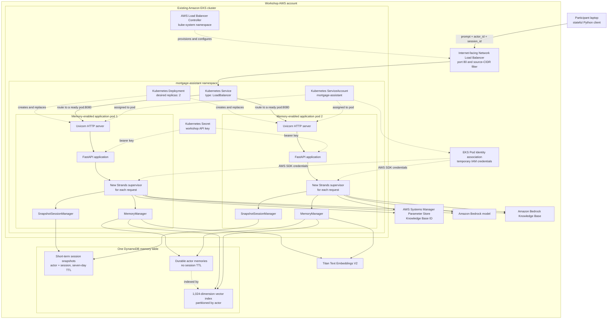

# Lab 04: Add durable memory with Strands and Amazon DynamoDB

In this lab, you add short-term and long-term memory to the mortgage
assistant running on Amazon EKS.

The implementation follows the architecture described in
[Introducing Strands DynamoDB Storage: Durable Agent Storage for the Strands Agents SDK](https://aws.amazon.com/blogs/database/introducing-strands-dynamodb-storage-durable-agent-storage-for-the-strands-agents-sdk/).
It does not use Amazon Bedrock AgentCore.

## Learning objectives

After completing this lab, you will be able to:

- Explain the difference between short-term session state and long-term memory.
- Persist Strands session snapshots in DynamoDB.
- Store and semantically retrieve durable user preferences.
- Scope memory by actor and session.
- Resume a conversation after an EKS pod is replaced.
- Recall a preference from a new conversation.
- Verify that one actor cannot retrieve another actor's memories.
- Inspect the DynamoDB records used by the agent.
- Distinguish production-aligned design patterns from workshop simplifications.
- Trace session restoration and memory retrieval across the complete EKS request path.

## Estimated time

Allow approximately 45–60 minutes, including deployment and the memory
exercises.

## Architecture

Lab 04 keeps the same long-running FastAPI service and EKS routing model from
Lab 03. It adds short-term and long-term storage components to every newly
created supervisor agent.



The existing Bedrock Knowledge Base and mortgage tools remain unchanged. Lab
04 updates the same `mortgage-assistant` Deployment and continues to use the
same Network Load Balancer. Workshop Studio pre-provisions the EKS cluster,
DynamoDB table, vector index, Pod Identity role, and other shared workshop
infrastructure. Lab 04 discovers those resources through canonical Systems
Manager Parameter Store paths.

### Where FastAPI sits in the memory-enabled service

FastAPI still runs inside each application container between Uvicorn and the
Strands application:

```text
EKS pod
└── mortgage-assistant container
    └── Uvicorn process
        └── FastAPI application
            └── newly created Strands supervisor
                ├── SnapshotSessionManager
                ├── MemoryManager
                └── mortgage specialist tools
```

FastAPI remains long-running even though a new supervisor is created for every
prompt. It authenticates the workshop request, validates `prompt`,
`actor_id`, and `session_id`, invokes the agent, translates failures into an
HTTP response, and exposes Kubernetes health endpoints.

The actor and session values are part of the Lab 04 API because they select the
DynamoDB namespace to restore. This is suitable for the isolated workshop, but
a production service must derive the actor from authenticated identity rather
than trusting a caller-provided value.

### End-to-end memory invocation workflow

The workflow below shows a request that may restore short-term state, search
long-term memory, call a mortgage tool, and save updated state. Memory search
and durable memory creation happen only when the supervisor selects those
capabilities.

```mermaid
sequenceDiagram
    actor User
    participant NLB
    participant K8s
    participant API
    participant Agent
    participant Session
    participant Memory
    participant Embed
    participant DDB
    participant Bedrock
    participant Tools

    User->>NLB: Submit prompt with actor and session IDs
    NLB->>K8s: Forward allowed request
    K8s->>API: Route to one ready pod
    API->>API: Authenticate and validate request
    API->>Agent: Create supervisor for actor and session
    Agent->>Session: Initialize session manager
    Session->>DDB: Read actor and session snapshot
    DDB-->>Session: Return prior conversation or empty state
    Session-->>Agent: Restore short term context
    Agent->>Bedrock: Process prompt with restored context
    Bedrock-->>Agent: Return response or capability choice

    opt Search durable memory
        Agent->>Memory: Search memory for current request
        Memory->>Embed: Embed semantic query
        Embed-->>Memory: Return vector
        Memory->>DDB: Search vector index for actor
        DDB-->>Memory: Return relevant preferences
        Memory-->>Agent: Add memories to context
        Agent->>Bedrock: Continue with retrieved memory
        Bedrock-->>Agent: Return next response or tool choice
    end

    opt Use mortgage knowledge or a calculation
        Agent->>Tools: Invoke selected specialist or tool
        Tools-->>Agent: Return grounded result
        Agent->>Bedrock: Compose user response
        Bedrock-->>Agent: Return final answer
    end

    opt Save a permitted preference
        Agent->>Memory: Save approved preference
        Memory->>Embed: Embed preference
        Embed-->>Memory: Return vector
        Memory->>DDB: Write durable memory and vector
        DDB-->>Memory: Confirm write
    end

    Agent->>Session: Persist updated conversation
    Session->>DDB: Write session state with TTL
    DDB-->>Session: Confirm write
    Agent-->>API: Return response text
    API-->>K8s: Return JSON response
    K8s-->>NLB: Return HTTP response
    NLB-->>User: Return result
```



A later prompt can be routed to either replica. The selected pod creates a new
agent and restores the same session and actor memory from DynamoDB, so pod
replacement and rolling deployment do not erase the conversation.

## Memory concepts

### Short-term memory

Short-term memory is the conversation associated with one session. It lets
the assistant understand follow-up questions such as:

```text
User: I am considering a property worth $600,000.
User: What property value did I mention?
```

`SnapshotSessionManager` writes a snapshot after every invocation. A new
agent process with the same actor and session IDs restores that snapshot.

Short-term records use a seven-day DynamoDB TTL by default. The application
filters expired records immediately, while DynamoDB removes them
asynchronously.

### Long-term memory

Long-term memory contains durable facts that remain relevant across
sessions. Examples include:

- Preferred mortgage term.
- Fixed or variable-rate preference.
- Approximate property-price range.
- Deposit goal.
- Monthly-payment priority.
- Refinancing objective.
- Application timeline.

The Strands `MemoryManager` gives the supervisor `search_memory` and
`add_memory` capabilities. Durable memories are embedded with Amazon Titan
Text Embeddings V2 and stored in the same DynamoDB table. Future prompts are
embedded and compared through a DynamoDB vector index.

Long-term memories do not use the short-term session TTL.

## Actor and session IDs

Every API request includes:

```json
{
  "prompt": "What did I tell you?",
  "actor_id": "participant-123456789012",
  "session_id": "session-6e18ca6d-..."
}
```

### Actor ID

The client derives the default actor from the current AWS account:

```text
participant-<AWS-account-id>
```

Each workshop participant has an isolated AWS account and DynamoDB table.
The actor ID still provides a useful application-level memory namespace and
allows this lab to demonstrate actor isolation.

For a production application, derive the actor from an authenticated user
identity. Do not trust an arbitrary actor ID supplied by an unauthenticated
caller.

### Session ID

The client generates a UUID on the first invocation and stores it in:

```text
04-memory/.workshop/client-state.json
```

Normal invocations reuse the current session. `--new-session` creates a new
conversation while retaining the same actor.

Display the current values:

```bash
uv run app/invoke_eks.py --show-context
```

The `.workshop` directory is excluded from source control.

## DynamoDB design

Lab 04 uses one on-demand DynamoDB table with:

- String partition key `pk`.
- String sort key `sk`.
- Server-side encryption with the AWS managed KMS key for DynamoDB,
  `alias/aws/dynamodb`.
- Point-in-time recovery.
- TTL enabled on the `expireAt` attribute.
- A 1,024-dimension cosine vector index.
- `pk` as the vector search partition.

Workshop Studio provisions this shared infrastructure before participants
receive their workshop accounts. Lab 04 discovers the table and vector index
from canonical Parameter Store paths and uses fixed code defaults for the
agent and embedding models. It only deploys application code.

All data for an actor uses a prefix such as:

```text
user/participant-123456789012
```

Example logical keys:

```text
user/participant-123456789012/session/session-123/...
user/participant-123456789012/memories/8a1c3f...
```

Both session and memory operations are scoped to this prefix. Vector searches
also specify the actor partition, preventing accidental cross-actor recall in
application code.

The actor partition is not an authorization boundary by itself. The shared
workshop API key protects the endpoint, while EKS Pod Identity restricts the
application to the workshop table.

## How the implementation works

### DynamoDB storage

The application creates two views of the same table:

```python
durable_storage = DynamoDBStorage(
    table_name,
    prefix=f"user/{actor_id}",
)

session_storage = DynamoDBStorage(
    table_name,
    prefix=f"user/{actor_id}",
    ttl_seconds=604800,
)
```

The session view applies TTL. The durable view does not.

### Short-term session manager

```python
session_manager = SnapshotSessionManager(
    session_id,
    storage=session_storage,
)
```

The manager restores an existing snapshot when the supervisor is created and
saves a new snapshot after the invocation.

### Long-term memory manager

`app/memory.py` implements a small `DynamoDBMemoryStore` adapter. Its `add`
method embeds and writes a memory:

```python
await storage.write(
    memory_key,
    content.encode("utf-8"),
    vector=embed_text(content),
    metadata=metadata,
)
```

Its `search` method embeds a prompt and searches only the current actor's
partition:

```python
await storage.search(
    SearchQuery(
        vector=embed_text(query),
        top_k=5,
        pk=actor_partition,
        include_values=True,
    )
)
```

The store is connected to the supervisor:

```python
memory_manager = MemoryManager(
    stores=[memory_store],
    add_tool_config=True,
)
```

The specialized mortgage subagents remain stateless tools. Memory is applied
at the user-facing supervisor boundary so one conversation is stored once.

## Memory safety policy

The supervisor is instructed to save only durable mortgage goals and
preferences. It must not put these values into long-term memory:

- Customer IDs.
- Account numbers.
- Authentication data.
- Exact income.
- Uploaded documents.
- Other sensitive financial identifiers.

This workshop uses mock data. Do not enter real personal, financial, or
customer information.

## Prerequisites

Open the Workshop Studio environment, complete Labs 01–03, and confirm:

```bash
aws sts get-caller-identity

kubectl get nodes

kubectl get deployment,pods,service \
  --namespace mortgage-assistant
```

You also need:

- AWS CLI v2.
- `kubectl`.
- Docker with Buildx, or Finch's Docker-compatible CLI.
- `uv`.
- Python 3.12 or later.
- Access to the existing EKS cluster and ECR repository.
- Bedrock model access for the agent model and Titan Text Embeddings V2.

When using a named AWS profile, pass `--profile` to both deployment and
client commands.

## Workshop Studio resource discovery

Workshop Studio pre-provisions shared resources and publishes their identifiers
in Systems Manager Parameter Store. Lab 04 uses these canonical paths:

| Resource | Parameter Store path |
|---|---|
| EKS cluster name | `/workshop/mortgage-assistant/eks/cluster-name` |
| ECR repository URI | `/workshop/mortgage-assistant/ecr/repository-uri` |
| DynamoDB memory table name | `/workshop/mortgage-assistant/memory/table-name` |
| DynamoDB vector index name | `/workshop/mortgage-assistant/memory/vector-index-name` |
| Bedrock Knowledge Base ID | `/workshop/mortgage-assistant/bedrock/knowledge-base-id` |

The deployment and cleanup scripts read these parameters directly and do not
depend on a CloudFormation stack name or stack outputs. The application keeps
these model defaults in code:

- Agent model: `us.anthropic.claude-sonnet-4-6`.
- Embedding model: `amazon.titan-embed-text-v2:0`.

`hydrate_memory.py` and `inspect_memory.py` discover the table and vector index
through Parameter Store by default. Their `--table-name`,
`--vector-index-name`, and `--embedding-model-id` options remain available for
direct CLI overrides.

## Step 1: Review the Lab 04 files

```text
04-memory/
├── app/
│   ├── inspect_memory.py
│   ├── invoke_eks.py
│   ├── memory.py
│   ├── mortgage_agent.py
│   └── mortgage_api.py
├── k8s/
├── scripts/
│   ├── cleanup-memory.sh
│   ├── deploy-memory.sh
│   └── hydrate_memory.py
├── tests/
├── Dockerfile
├── pyproject.toml
└── uv.lock
```

Workshop Studio provisions the runtime IAM policy, DynamoDB table, and vector
index before the lab begins. `hydrate_memory.py` is participant-facing
test-data tooling; it does not create infrastructure.

## Step 2: Test the module locally

From the repository root:

```bash
cd 04-memory

uv run python -m unittest discover \
  --start-directory tests \
  --verbose
```

The first `uv run` command creates the lab-local environment, installs its
locked dependencies, and runs the tests. These tests validate the API contract,
identifier rules, TTL separation, and client session-state behaviour. They do
not invoke Bedrock or modify AWS.

## Step 3: Deploy the memory-enabled application

```bash
chmod +x \
  scripts/deploy-memory.sh \
  scripts/cleanup-memory.sh \
  scripts/hydrate_memory.py

./scripts/deploy-memory.sh \
  --region us-west-2
```

For a named profile:

```bash
./scripts/deploy-memory.sh \
  --region us-west-2 \
  --profile YOUR_AWS_PROFILE
```

The deployment script:

1. Reads the canonical Workshop Studio Parameter Store values.
2. Confirms the pre-provisioned memory table and vector index are active.
3. Uses `us.anthropic.claude-sonnet-4-6` for the agent and
   `amazon.titan-embed-text-v2:0` for embeddings.
4. Builds and pushes the Lab 04 image.
5. Updates the existing EKS Deployment.
6. Reuses the existing Kubernetes API-key Secret when present.
7. Waits for the pods and API to become ready.
8. Sends one smoke-test prompt.

The script does not create or update AWS infrastructure. Workshop Studio
manages the shared EKS cluster, Knowledge Base, ECR repository, IAM resources,
DynamoDB table, and vector index.

## Step 4: Check the deployment

```bash
kubectl get deployment,pods,service \
  --namespace mortgage-assistant

kubectl logs \
  --namespace mortgage-assistant \
  deployment/mortgage-assistant \
  --tail=100
```

Confirm the memory configuration:

```bash
kubectl get deployment mortgage-assistant \
  --namespace mortgage-assistant \
  --output jsonpath='{range .spec.template.spec.containers[0].env[*]}{.name}={.value}{"\n"}{end}' |
grep MEMORY
```

## Step 5: Display your actor and session

```bash
uv run app/invoke_eks.py \
  --region us-west-2 \
  --show-context
```

Example:

```text
Actor:   participant-123456789012
Session: session-6e18ca6d-70d1-4be5-ae3b-ff4a98b13c3a
```

Keep this session for the short-term memory tests.

## Step 6: Test short-term memory

Tell the assistant a fact that should remain within the active conversation:

```bash
uv run app/invoke_eks.py \
  --region us-west-2 \
  --prompt "I am considering a property worth 600,000 dollars."
```

Ask a follow-up without supplying IDs:

```bash
uv run app/invoke_eks.py \
  --region us-west-2 \
  --prompt "What property value did I mention in this conversation?"
```

Expected result:

```text
The assistant identifies the $600,000 property value.
```

The client reused the same actor and session, so the newly created supervisor
restored the DynamoDB snapshot.

## Step 7: Prove the session survives an EKS restart

Restart both EKS replicas:

```bash
kubectl rollout restart deployment/mortgage-assistant \
  --namespace mortgage-assistant

kubectl rollout status deployment/mortgage-assistant \
  --namespace mortgage-assistant
```

Ask again using the existing client session:

```bash
uv run app/invoke_eks.py \
  --region us-west-2 \
  --prompt "What property value did I tell you earlier?"
```

Expected result:

```text
The assistant still identifies $600,000.
```

The previous Python process and EKS pods are gone. The conversation was
restored from DynamoDB.

## Step 8: Hydrate deterministic test memories

For a predictable long-term-memory test, seed the sample mortgage profile:

```bash
uv run scripts/hydrate_memory.py seed \
  --region us-west-2 \
  --replace
```

The script derives the actor from the participant's AWS account and stores:

- An approximate $600,000 property goal.
- A preference for a 15-year fixed-rate mortgage.
- A priority to pay the mortgage off early.

It also waits briefly for the eventually consistent vector index to return the
hydrated records.

Inspect them:

```bash
uv run app/inspect_memory.py \
  --region us-west-2 \
  --memories
```

Clear only the hydrated long-term memories:

```bash
uv run scripts/hydrate_memory.py clear \
  --region us-west-2
```

Clear both sessions and long-term memories for the actor:

```bash
uv run scripts/hydrate_memory.py clear \
  --region us-west-2 \
  --all-data
```

## Step 9: Let the agent save a long-term preference

Explicitly ask the assistant to remember a durable preference:

```bash
uv run app/invoke_eks.py \
  --region us-west-2 \
  --prompt "Remember for future conversations that I prefer a 15-year fixed-rate mortgage and prioritize paying the loan off early."
```

Expected result:

```text
The assistant confirms that it saved the preference.
```

The supervisor should invoke `add_memory`. The preference is embedded and
written under the current actor's partition.

Inspect the stored memory:

```bash
uv run app/inspect_memory.py \
  --region us-west-2 \
  --memories
```

If no memory appears, review the pod logs to confirm whether `add_memory` was
called and repeat the prompt with the explicit phrase `Remember for future
conversations`.

## Step 10: Test long-term memory in a new session

Create a new conversation for the same actor:

```bash
uv run app/invoke_eks.py \
  --region us-west-2 \
  --new-session \
  --prompt "What kind of mortgage do I prefer?"
```

Expected result:

```text
The assistant recalls the 15-year fixed-rate preference and early-payoff
priority.
```

The new session has no prior transcript. The answer comes from semantic
long-term memory.

## Step 11: Test semantic retrieval

Use different wording from the stored memory:

```bash
uv run app/invoke_eks.py \
  --region us-west-2 \
  --new-session \
  --prompt "Do you remember how quickly I wanted to repay my home loan?"
```

Expected result:

```text
The assistant connects the question with the remembered preference to pay the
loan off early.
```

You can query the vector index directly:

```bash
uv run app/inspect_memory.py \
  --region us-west-2 \
  --search "preferred repayment period"
```

DynamoDB vector indexes are eventually consistent. The inspection utility
retries for up to 60 seconds by default.

## Step 12: Test actor isolation

Select another actor and start a new session:

```bash
uv run app/invoke_eks.py \
  --region us-west-2 \
  --actor-id alternate-user \
  --new-session \
  --prompt "What mortgage preferences do you remember about me?"
```

Expected result:

```text
The assistant does not return the default participant's 15-year mortgage
preference.
```

Return to the default actor by omitting `--actor-id`:

```bash
uv run app/invoke_eks.py \
  --region us-west-2 \
  --new-session \
  --prompt "What mortgage term do I prefer?"
```

## Step 13: Inspect all memory records

```bash
uv run app/inspect_memory.py \
  --region us-west-2
```

The output separates:

- Short-term session records under `session/`.
- Long-term records under `memories/`.

Inspect an alternate actor:

```bash
uv run app/inspect_memory.py \
  --region us-west-2 \
  --actor-id alternate-user
```

## API contract

The memory-enabled API requires both identifiers:

```bash
curl --request POST "$MORTGAGE_API_URL/invoke" \
  --header "Authorization: Bearer $MORTGAGE_API_KEY" \
  --header "Content-Type: application/json" \
  --data '{
    "prompt": "What do you remember about my mortgage preference?",
    "actor_id": "participant-123456789012",
    "session_id": "session-example"
  }'
```

Response:

```json
{
  "request_id": "7a6b...",
  "actor_id": "participant-123456789012",
  "session_id": "session-example",
  "response": "...",
  "duration_ms": 2450
}
```

## Troubleshooting

### The shared vector table is unavailable

Workshop Studio creates the table before participants begin the workshop.
Confirm that the canonical resource parameters are available:

```bash
aws ssm get-parameters \
  --region us-west-2 \
  --names \
    /workshop/mortgage-assistant/memory/table-name \
    /workshop/mortgage-assistant/memory/vector-index-name
```

If either parameter is absent or empty, use the Workshop Studio support path to
repair the pre-provisioned environment. The Lab 04 utilities require boto3
1.43.64 or later for DynamoDB vector operations.

### The vector index remains in CREATING

Index creation and backfill can take several minutes. Check:

```bash
MEMORY_TABLE_NAME="$(aws ssm get-parameter \
  --region us-west-2 \
  --name /workshop/mortgage-assistant/memory/table-name \
  --query 'Parameter.Value' \
  --output text)"

aws dynamodb describe-table \
  --region us-west-2 \
  --table-name "$MEMORY_TABLE_NAME" \
  --query 'Table.VectorIndexes'
```

The index is ready when `IndexStatus` is `ACTIVE` and `Backfilling` is false.

### Short-term memory is not recalled

Display the client context:

```bash
uv run app/invoke_eks.py --show-context
```

Confirm both prompts used the same actor and session. Supplying
`--new-session` intentionally clears short-term conversational context.

### Long-term memory is not recalled

Check whether a memory was written:

```bash
uv run app/inspect_memory.py --memories
```

If it exists, retry the query because vector-index updates are eventually
consistent. If it does not exist, explicitly ask the assistant to
`Remember for future conversations`.

### The request receives HTTP 401

The client normally reads the API key from the Kubernetes Secret. If using
curl, retrieve it:

```bash
export MORTGAGE_API_KEY="$(
  kubectl get secret mortgage-assistant-api-key \
    --namespace mortgage-assistant \
    --output jsonpath='{.data.api-key}' |
  base64 --decode
)"
```

### Pods receive AccessDenied from DynamoDB

Confirm that Parameter Store discovery succeeds, then inspect the discovered
table and pod logs:

```bash
MEMORY_TABLE_NAME="$(aws ssm get-parameter \
  --region us-west-2 \
  --name /workshop/mortgage-assistant/memory/table-name \
  --query 'Parameter.Value' \
  --output text)"

aws dynamodb describe-table \
  --region us-west-2 \
  --table-name "$MEMORY_TABLE_NAME" \
  --query 'Table.[TableName,TableStatus,SSEDescription]'

kubectl logs \
  --namespace mortgage-assistant \
  deployment/mortgage-assistant \
  --tail=200
```

If discovery works but DynamoDB access is denied, use the Workshop Studio
support path to verify the pre-provisioned EKS Pod Identity permissions.

## Production-aligned patterns demonstrated by this lab

Production readiness is an end-to-end property of the application,
infrastructure, operational processes, and security controls. This workshop is
not a production deployment, but it demonstrates several patterns that are
appropriate foundations for one.

### Create an agent for each request

Every `/invoke` request creates a new supervisor `Agent`. The agent object is
not shared between concurrent requests, actors, or EKS replicas. The new agent
receives a `SnapshotSessionManager` and `MemoryManager` for the request's
actor and session, restores its state from DynamoDB, processes the prompt, and
persists the updated state.

```text
HTTP request
    |
    v
Create supervisor agent
    |
    +-- restore session from DynamoDB
    +-- retrieve relevant durable memories
    +-- process the prompt
    +-- persist updated state
    |
    v
Discard the in-process agent object
```

This keeps the application pods stateless. A subsequent prompt can be processed
by either EKS replica, including after a pod replacement or rolling deployment.
Creating a new Python agent object does not rebuild or redeploy the container
image.

### Externalize conversation state

Short-term state and durable memory are stored outside the pods. Session
snapshots use a configurable TTL, while durable preferences remain until an
explicit deletion workflow removes them. Actor prefixes and vector-search
partition filters separate memory namespaces in application code.

### Use managed data-protection controls

Workshop Studio configures DynamoDB on-demand capacity, server-side encryption
with the AWS managed KMS key for DynamoDB (`alias/aws/dynamodb`), point-in-time
recovery, TTL, and a partition-scoped vector index. The current table does not
use a customer-managed KMS key. These are useful production building blocks,
although retention, backup, restore, and deletion procedures must still be
defined and tested.

### Use workload identity instead of static AWS keys

EKS pods obtain AWS permissions through EKS Pod Identity. AWS access keys are
not stored in the image or Kubernetes manifests, and the pod role is scoped to
the workshop resources required by the application.

### Apply container and Kubernetes safety controls

The deployment provides two replicas, rolling updates, health probes, a Pod
Disruption Budget, resource requests and limits, a non-root user, a read-only
root filesystem, dropped Linux capabilities, seccomp, restricted Pod Security
labels, and bounded Uvicorn concurrency.

These controls improve isolation and availability, but do not replace capacity
testing, autoscaling, multi-AZ scheduling, or a formal security review.

### Validate inputs and pin dependencies

The API validates prompt length and identifier format, returns a request ID,
and avoids returning raw exception details. Dependencies are captured in
`uv.lock`, and tests cover identifiers, client session selection, TTL
separation, and the API contract.

## What is still missing for production and how to address it

The following controls are intentionally outside the scope of this workshop.

| Workshop implementation | Production concern | Recommended solution |
|---|---|---|
| One shared bearer API key | It does not provide individual identity, token expiry, or per-user authorization. | Use Amazon Cognito or another OIDC provider. Validate JWT signature, issuer, audience, and expiry. |
| The request accepts `actor_id` | A caller with the API key can select another actor's namespace. Prefix filtering is not authorization. | Remove caller-controlled actor selection from the public API and derive the actor from the authenticated token's immutable `sub` claim. |
| Internet-facing HTTP NLB | Prompts and credentials lack transport encryption, and the NLB does not provide application-layer WAF controls. | Terminate TLS with ACM. Use an ALB, API Gateway, or suitable ingress when OIDC, AWS WAF, quotas, or application routing are required. Consider a private endpoint for internal applications. |
| No same-session concurrency control | Two prompts can read the same snapshot and persist conflicting updates. | Serialize requests by session, use a short-lived distributed lock, or add versioned conditional writes with conflict detection and bounded retry. |
| No client idempotency key | A network retry can execute a tool or save a memory more than once. | Require an idempotency key for mutating requests, persist its result with a TTL, and make tool operations idempotent where possible. |
| Direct Bedrock and DynamoDB calls | Throttling or transient failures can fail the entire request. | Add explicit timeouts, bounded retries with exponential backoff and jitter, retry budgets, and circuit breaking. Never retry non-idempotent tools blindly. |
| `strands-dynamodb-storage==0.1.2` | An early-version dependency needs additional compatibility, load, and failure-mode assessment before handling production data. | Review its release and support posture, pin an approved version, test recovery and scale, and retain an application-owned storage interface so the implementation can be upgraded or replaced. |
| The model decides when to save memory | Prompt injection or model error could store incorrect, duplicate, or sensitive content. | Put a deterministic policy layer in front of storage. Validate, redact, classify, deduplicate, and authorize proposed memories; require confirmation where appropriate. |
| Prompt-only safety policy | Instructions alone are not a security boundary. | Add Bedrock Guardrails where appropriate, strict tool schemas, tool allowlists, retrieval-source controls, input/output validation, adversarial tests, and least-privilege tool permissions. |
| Prompts and memories may contain sensitive data | Durable storage creates privacy, regulatory, retention, and deletion obligations. | Minimize collection, classify data, redact logs and traces, define retention and residency, and provide memory review, correction, export, and deletion workflows. |
| No OpenTelemetry export or operational alarms | Operators cannot trace requests across FastAPI, Strands, Bedrock, tools, and DynamoDB or detect degradation promptly. | Export OpenTelemetry traces, metrics, and selected logs to CloudWatch. Alarm on latency, errors, throttling, failed writes, token usage, and vector-search failures. |
| Fixed two replicas and no HPA | Capacity does not follow traffic, latency, or downstream model-call concurrency. | Load test the complete path, configure autoscaling, spread replicas across Availability Zones, validate node and Bedrock quotas, and add rate limits and backpressure. |
| One Uvicorn worker with concurrency limited to four per pod | The workshop limit may be too low for production, while increasing it without testing can exhaust memory or service quotas. | Benchmark memory and latency, then tune workers, replicas, concurrency, connection pools, and Bedrock quotas together. Queue long-running asynchronous work. |
| Session growth is not managed | Long conversations can become expensive or approach DynamoDB item-size limits. | Monitor snapshot size, compact or summarize old turns, cap conversation length, and offload large encrypted payloads to Amazon S3 when supported by the storage design. |
| Vector-index updates are eventually consistent | A newly stored preference may not be immediately searchable. | Retain new memory in the active session and use bounded retry or an exact-read fallback when immediate confirmation is required. |
| No tested disaster-recovery procedure | Point-in-time recovery alone does not demonstrate that recovery objectives can be met. | Define RTO and RPO, regularly test table restore and encryption configuration recovery, document regional dependencies, and add multi-Region recovery if required. |
| Deployment runs from a participant laptop | There is no controlled promotion, provenance, approval, or automated rollback process. | Use CI/CD with reviewed changes, automated tests and evaluations, image scanning and signing, immutable image digests, staged rollout, and rollback criteria. |
| Unit tests do not exercise AWS or production load | They cannot detect IAM, quota, race, retrieval-quality, model-behaviour, or integration regressions. | Add integration, concurrency, failure-injection, load, security, and recovery tests plus versioned evaluations for grounding, safety, latency, quality, and cost. |

Before using this design for real mortgage information, complete formal
security, privacy, reliability, model-risk, and operational-readiness reviews.
Use mock or synthetic data until those controls are implemented.

## Cleanup

To remove only Lab 04 resources:

```bash
./scripts/cleanup-memory.sh \
  --region us-west-2
```

This removes only the EKS application namespace and load balancer. Workshop
Studio continues to manage the shared DynamoDB memory table, vector index, IAM
resources, EKS cluster, ECR repository, and Knowledge Base.

To run Lab 03 again afterward:

```bash
cd ../03-eks-service
./scripts/deploy-application.sh --region us-west-2
```

To remove the entire workshop, use the Workshop Studio cleanup instructions.
Do not delete shared resources from the Lab 04 cleanup script.

## Completion checkpoint

You have completed Lab 04 when:

- The API returns actor and session IDs.
- A follow-up prompt recalls information from the current session.
- The same session survives an EKS rollout restart.
- A new session recalls a stored mortgage preference.
- A paraphrased question retrieves the same preference.
- An alternate actor does not retrieve the default actor's memory.
- You can inspect both session and memory records in DynamoDB.
