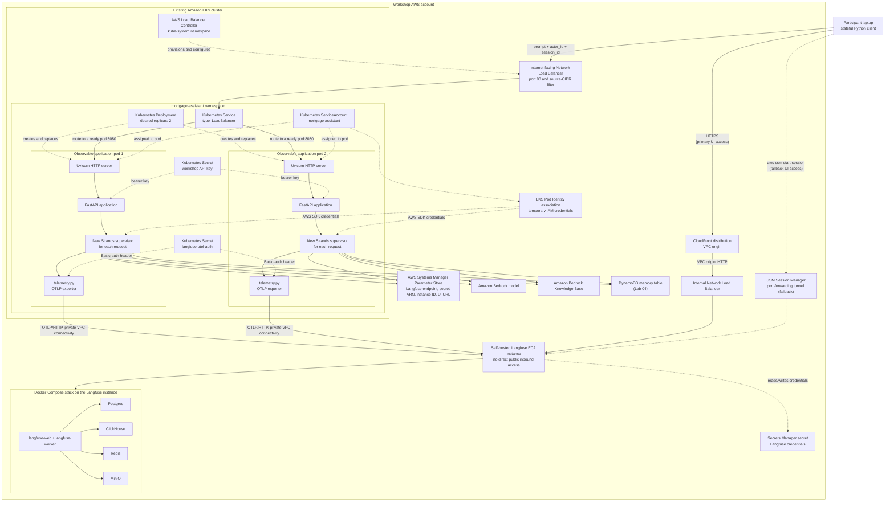
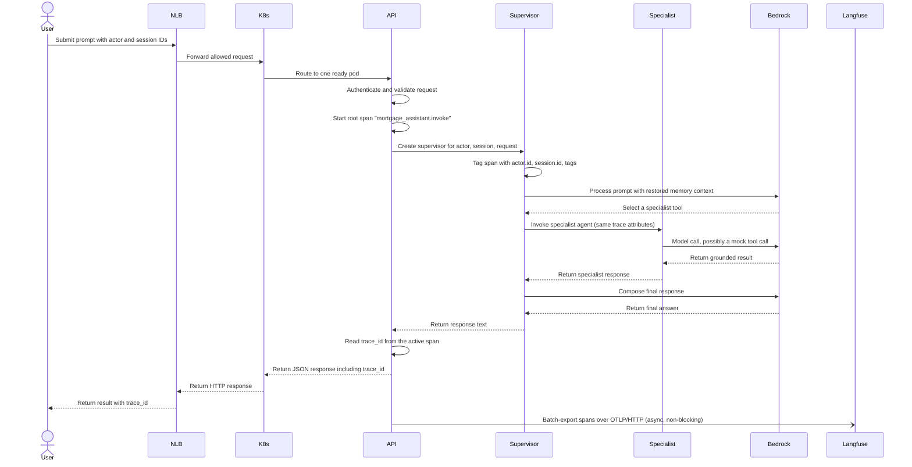

# Lab 05: Add observability with OpenTelemetry and a self-hosted Langfuse instance

In this lab, you instrument the memory-enabled mortgage assistant from Lab
04 with OpenTelemetry tracing and export those traces to a self-hosted
Langfuse instance. You will inspect agent execution, specialist delegation,
tool calls, model calls, latency, and token usage for individual requests
and across a full conversation.

Langfuse runs on a single, workshop-managed EC2 instance in a private
subnet with no direct public inbound access; you reach its UI through a
CloudFront distribution that connects to it over a private VPC origin. This
lab does not use Amazon Bedrock AgentCore or AWS X-Ray/CloudWatch
Application Signals.

## Learning objectives

After completing this lab, you will be able to:

- Explain how a root request span, a supervisor span, and specialist-agent
  spans relate to one another in a single trace.
- Read model latency, token usage, and tool-call duration from a trace in
  Langfuse.
- Confirm that a multi-turn conversation groups into one session in
  Langfuse using actor and session attributes.
- Inject a controlled tool delay or failure and observe it in a trace,
  without rebuilding or redeploying the application image.
- Compare two runs of the same request to reason about relative latency and
  token cost.
- Explain the tradeoff between prompt/response visibility in traces and
  masking that content before it leaves the process.
- Distinguish production-aligned observability patterns from workshop
  simplifications.

## Estimated time

Allow approximately 45–60 minutes, including deployment and the five
observability exercises.

## Architecture

Lab 05 keeps the same long-running FastAPI service, EKS routing model, and
DynamoDB-backed memory from Lab 04. It adds an OpenTelemetry exporter to
every newly created supervisor agent, and a single self-hosted Langfuse
instance that receives OTLP/HTTP trace data over a private VPC connection.



The existing Bedrock Knowledge Base, DynamoDB memory table, and mortgage
tools remain unchanged. Lab 05 updates the same `mortgage-assistant`
Deployment and continues to use the same Network Load Balancer. Workshop
Studio pre-provisions the EKS cluster, DynamoDB table, Langfuse EC2
instance, and other shared workshop infrastructure before the lab begins.
Lab 05 discovers those resources through canonical Systems Manager
Parameter Store paths and reads Langfuse's generated API keys from Secrets
Manager at deploy time.

### Where telemetry sits in the observable service

```text
EKS pod
└── mortgage-assistant container
    └── Uvicorn process
        └── telemetry.init_telemetry()   <- configured once, at import time
            └── FastAPI application
                └── newly created Strands supervisor
                    ├── mortgage specialist tools (each its own Agent)
                    └── memory components (Lab 04)
```

`telemetry.init_telemetry()` runs exactly once per process, as early as
possible in both `mortgage_api.py` (before `mortgage_agent` is imported) and
`mortgage_agent.py`'s CLI entry point. There is a single OpenTelemetry
`TracerProvider` and a single OTLP/HTTP exporter per process; no console
exporter, X-Ray exporter, or second tracer provider is configured anywhere.

If `OTEL_EXPORTER_OTLP_ENDPOINT` is not set, tracing is disabled entirely
and no network calls are attempted. Any failure while configuring or using
telemetry is logged and swallowed — it never blocks request handling or the
`/health`/`/health/ready` endpoints.

### End-to-end trace invocation workflow



The supervisor span, every specialist-agent span, every Bedrock model call,
and every tool call share the same trace and the same `actor.id`/`session.id`
attributes, because the supervisor's `trace_attributes` are stashed in a
`contextvars.ContextVar` (`telemetry.set_current_trace_attributes`) and
recovered inside each `@tool` function before it creates its own `Agent`.
This keeps one conversation grouped together in Langfuse regardless of
which EKS replica handles which request in the conversation.

## Observability concepts

### Traces, spans, and grouping

Each `/invoke` request opens one root span
(`mortgage_assistant.invoke`, started in `mortgage_api.py`). Strands' own
instrumentation adds child spans for the supervisor agent, each specialist
agent it delegates to, every Bedrock model call, and every tool call,
including their latency and, for model calls, input/output token counts.
Langfuse groups spans into traces automatically from the trace ID, and
groups traces into one session view using the `session.id` and `user.id`
attributes this lab sets on every agent (see `telemetry.trace_attributes`).

### Prompt and response capture

Strands' automatic instrumentation records prompt and response text as span
attributes such as `gen_ai.user.message`, `gen_ai.assistant.message`,
`gen_ai.choice`, and `system_prompt`. Those attributes are visible in
Langfuse alongside latency, token usage, and tool calls. For this
workshop's mock data, that visibility is the point of the lab. A deployment
handling real customer data should choose one of:

- Leave `OTEL_EXPORTER_OTLP_ENDPOINT` unset to disable tracing entirely.
- Set `TELEMETRY_MASK_CONTENT=true` (`--telemetry-mask-content` at deploy
  time) so `telemetry.py` replaces those attribute values with
  `[redacted]` before any span leaves the process. Latency, token counts,
  tool names, and error status are still exported; the conversational
  content is not.
- Apply redaction or access controls further downstream in Langfuse
  instead of, or in addition to, the above.

### Fault injection

`mortgage_agent.maybe_inject_fault()` can delay or fail the
`get_mortgage_details` tool on demand, for Exercise 4 below. It is disabled
by default and reads its configuration from environment variables on every
call, so you can toggle it with `kubectl set env` without rebuilding or
restarting the container image. When it fires, it also adds a
`fault_injection` span event so the injected fault is visible in the trace,
not just in application logs.

## Prerequisites

Open the Workshop Studio environment, complete Labs 01–04, and confirm:

```bash
aws sts get-caller-identity

kubectl get nodes

kubectl get deployment,pods,service \
  --namespace mortgage-assistant
```

You also need:

- AWS CLI v2, including the Session Manager plugin for `aws ssm
  start-session`.
- `kubectl`.
- Docker with Buildx, or Finch's Docker-compatible CLI.
- `uv`.
- Python 3.12 or later.
- Access to the existing EKS cluster and ECR repository.
- Bedrock model access for the agent model and Titan Text Embeddings V2.

When using a named AWS profile, pass `--profile` to both deployment and
client commands.

## Workshop Studio resource discovery

Workshop Studio pre-provisions shared resources and publishes their
identifiers in Systems Manager Parameter Store. Lab 05 uses these canonical
paths, in addition to the Lab 04 memory parameters:

| Resource | Parameter Store path |
|---|---|
| EKS cluster name | `/workshop/mortgage-assistant/eks/cluster-name` |
| ECR repository URI | `/workshop/mortgage-assistant/ecr/repository-uri` |
| DynamoDB memory table name | `/workshop/mortgage-assistant/memory/table-name` |
| DynamoDB vector index name | `/workshop/mortgage-assistant/memory/vector-index-name` |
| Bedrock Knowledge Base ID | `/workshop/mortgage-assistant/bedrock/knowledge-base-id` |
| Langfuse OTLP ingestion endpoint | `/workshop/mortgage-assistant/langfuse/otlp-endpoint` |
| Langfuse credentials secret ARN | `/workshop/mortgage-assistant/langfuse/secret-arn` |
| Langfuse EC2 instance ID | `/workshop/mortgage-assistant/langfuse/instance-id` |
| Langfuse public UI URL | `/workshop/mortgage-assistant/langfuse/url` |

The deployment and cleanup scripts read these parameters directly and do
not depend on a CloudFormation stack name or stack outputs. The application
keeps these model defaults in code:

- Agent model: `us.anthropic.claude-sonnet-4-6`.
- Embedding model: `amazon.titan-embed-text-v2:0`.

Workshop Studio also provisions the Langfuse EC2 instance itself: a single
instance (default `t3.xlarge`, 4 vCPU / 16 GiB) running Postgres,
ClickHouse, Redis, MinIO, and the Langfuse web/worker containers via Docker
Compose, with an encrypted root EBS volume (default 100 GiB) for durable
storage across reboots. The instance itself has no direct public inbound
access. A CloudFront distribution reaches it through a VPC origin
targeting an internal Network Load Balancer, giving you a public HTTPS URL
for the UI in Step 5 below; an SSM Session Manager tunnel is also available
as a fallback.

## Step 1: Review the Lab 05 files

```text
05-observability/
├── app/
│   ├── inspect_memory.py
│   ├── invoke_eks.py
│   ├── memory.py
│   ├── mortgage_agent.py
│   ├── mortgage_api.py
│   └── telemetry.py
├── k8s/
├── scripts/
│   ├── cleanup-observability.sh
│   ├── deploy-observability.sh
│   └── hydrate_memory.py
├── tests/
├── Dockerfile
├── pyproject.toml
└── uv.lock
```

`telemetry.py` is the only new application module. Every other Lab 04 file
is unchanged except for the small additions needed to configure tracing,
propagate trace attributes to specialist agents, return `trace_id` in the
API response, and support fault injection.

## Step 2: Install and test the module locally

From the repository root:

```bash
cd 05-observability

uv sync --frozen

uv run python -m unittest discover \
  --start-directory tests \
  --verbose
```

These tests validate the API contract, telemetry helper functions (header
parsing, content masking, redaction against real OpenTelemetry SDK spans,
global tracer-provider registration), fault injection, and the Lab 04
memory/client-state behavior. They do not call Bedrock, and they do not
require a reachable Langfuse endpoint.

## Step 3: Deploy the observable application

```bash
chmod +x \
  scripts/deploy-observability.sh \
  scripts/cleanup-observability.sh \
  scripts/hydrate_memory.py

./scripts/deploy-observability.sh \
  --region us-west-2
```

For a named profile:

```bash
./scripts/deploy-observability.sh \
  --region us-west-2 \
  --profile YOUR_AWS_PROFILE
```

The deployment script:

1. Reads the canonical Workshop Studio Parameter Store values, including
   the Langfuse OTLP endpoint and credentials-secret ARN.
2. Confirms the pre-provisioned memory table and vector index are active.
3. Reads the bootstrapped Langfuse project API key pair from Secrets
   Manager and builds the OTLP Basic-auth header in memory (never written
   to a rendered manifest file on disk).
4. Builds and pushes the Lab 05 image.
5. Applies the `mortgage-assistant-api-key` and `langfuse-otel-auth`
   Kubernetes Secrets directly with `kubectl create secret ... | kubectl
   apply -f -`.
6. Updates the existing EKS Deployment with the OTEL and fault-injection
   environment variables.
7. Waits for the pods and API to become ready.
8. Sends one smoke-test prompt and checks that the response includes a
   `trace_id` — confirming a real trace reached Langfuse, not just that the
   deployment is healthy.

Optional flags:

```bash
./scripts/deploy-observability.sh \
  --region us-west-2 \
  --telemetry-mask-content \
  --fault-injection-enabled \
  --fault-injection-mode delay \
  --fault-injection-delay-seconds 5
```

Run `./scripts/deploy-observability.sh --help` for the complete list.

The script does not create or update shared AWS infrastructure. Workshop
Studio manages the EKS cluster, Knowledge Base, ECR repository, IAM
resources, DynamoDB table, vector index, and the Langfuse EC2 instance.

## Step 4: Check the deployment

```bash
kubectl get deployment,pods,service \
  --namespace mortgage-assistant

kubectl logs \
  --namespace mortgage-assistant \
  deployment/mortgage-assistant \
  --tail=100
```

Confirm the telemetry configuration:

```bash
kubectl get deployment mortgage-assistant \
  --namespace mortgage-assistant \
  --output jsonpath='{range .spec.template.spec.containers[0].env[*]}{.name}={.value}{"\n"}{end}' |
grep -E 'OTEL|FAULT_INJECTION|TELEMETRY_MASK_CONTENT'
```

## Step 5: Open the Langfuse UI

Look up the public Langfuse URL from Parameter Store:

```bash
aws ssm get-parameter \
  --region us-west-2 \
  --name /workshop/mortgage-assistant/langfuse/url \
  --query 'Parameter.Value' --output text
```

Browse to that URL. Sign in with the bootstrapped workshop user:

```bash
aws secretsmanager get-secret-value \
  --region us-west-2 \
  --secret-id "$(aws ssm get-parameter \
    --region us-west-2 \
    --name /workshop/mortgage-assistant/langfuse/secret-arn \
    --query 'Parameter.Value' --output text)" \
  --query SecretString --output text |
python3 -c 'import json,sys; c=json.load(sys.stdin); print("Email:", c["init_user_email"]); print("Password:", c["init_user_password"])'
```

The Langfuse instance itself still has no direct public inbound access —
CloudFront reaches it over a private VPC origin. Langfuse's Tracing view is
where you will read each trace for the remaining exercises.

**Alternative: SSM Session Manager tunnel.** If you'd rather bypass
CloudFront entirely, forward a local port to the instance directly:

```bash
aws ssm start-session \
  --region us-west-2 \
  --target "$(aws ssm get-parameter \
    --region us-west-2 \
    --name /workshop/mortgage-assistant/langfuse/instance-id \
    --query 'Parameter.Value' --output text)" \
  --document-name AWS-StartPortForwardingSession \
  --parameters '{"portNumber":["3000"],"localPortNumber":["3000"]}'
```

Leave that command running in its own terminal, then browse to
`http://localhost:3000`.

## Step 6 — Exercise 1: A general mortgage question

```bash
python3 app/invoke_eks.py \
  --region us-west-2 \
  --prompt "What are the benefits of a 15-year mortgage?"
```

The CLI prints the response, then (on its own line, after a blank line)
`Trace ID: ...`. In the
Langfuse UI, open **Tracing**, find that trace ID, and inspect:

- The root `mortgage_assistant.invoke` span and its total latency.
- The supervisor span and the `answer_general_mortgage_questions` specialist
  span nested under it.
- The Bedrock model call span, including input/output token counts.
- The Knowledge Base `retrieve` tool call and its duration.

## Step 7 — Exercise 2: An existing-account question

```bash
python3 app/invoke_eks.py \
  --region us-west-2 \
  --new-session \
  --prompt "What is the outstanding principal on account 555000111?"
```

Open the new trace and compare its shape to Exercise 1's: the supervisor
now delegates to `answer_existing_mortgage_questions`, which calls the
mock `get_mortgage_details` tool instead of the Knowledge Base. Note the
tool span's duration under normal conditions — you will compare it against
an injected delay in Exercise 4.

## Step 8 — Exercise 3: Multi-request session grouping

Display your current actor and session, then send two related prompts in
the same session:

```bash
python3 app/invoke_eks.py --region us-west-2 --show-context

python3 app/invoke_eks.py \
  --region us-west-2 \
  --prompt "I am considering a property worth 600,000 dollars."

python3 app/invoke_eks.py \
  --region us-west-2 \
  --prompt "What property value did I mention in this conversation?"
```

In Langfuse, open **Sessions** and find the session ID printed by
`--show-context`. Both requests appear as separate traces grouped under one
session, tagged with the same `user.id` (the `participant-<AWS-account-id>`
actor). This grouping is derived entirely from the `session.id`/`user.id`
span attributes set by `telemetry.trace_attributes` — it holds regardless
of which of the two EKS replicas handled each request. Confirm this by
checking which pod handled each request:

```bash
kubectl logs \
  --namespace mortgage-assistant \
  --selector app.kubernetes.io/name=mortgage-assistant \
  --prefix \
  --tail=50 |
grep -i invoke
```

(`kubectl logs deployment/mortgage-assistant` only streams one pod's logs;
the label selector above fans out across both replicas so you can see which
pod handled each request.)

## Step 9 — Exercise 4: Controlled tool delay and failure

Enable a delay on the same tool exercised in Step 7, without rebuilding the
image:

```bash
kubectl set env deployment/mortgage-assistant \
  --namespace mortgage-assistant \
  FAULT_INJECTION_ENABLED=true \
  FAULT_INJECTION_TOOL=get_mortgage_details \
  FAULT_INJECTION_MODE=delay \
  FAULT_INJECTION_DELAY_SECONDS=8

kubectl rollout status deployment/mortgage-assistant \
  --namespace mortgage-assistant

python3 app/invoke_eks.py \
  --region us-west-2 \
  --new-session \
  --prompt "What is the outstanding principal on account 555000111?"
```

Open the new trace. The `get_mortgage_details` tool span now shows the
added latency, and a `fault_injection` event marks exactly where the delay
was introduced. Now switch to a simulated failure:

```bash
kubectl set env deployment/mortgage-assistant \
  --namespace mortgage-assistant \
  FAULT_INJECTION_MODE=error

kubectl rollout status deployment/mortgage-assistant \
  --namespace mortgage-assistant

python3 app/invoke_eks.py \
  --region us-west-2 \
  --new-session \
  --prompt "What is the outstanding principal on account 555000111?"
```

This request should return an HTTP 500. Its trace shows the tool span
ending in an error status with a `fault_injection` event. Reset to the
deterministic disabled state for the rest of the workshop:

```bash
kubectl set env deployment/mortgage-assistant \
  --namespace mortgage-assistant \
  FAULT_INJECTION_ENABLED=false

kubectl rollout status deployment/mortgage-assistant \
  --namespace mortgage-assistant
```

`FAULT_INJECTION_ENABLED=false` is also the deployment script's default, so
redeploying at any point returns to this disabled state.

## Step 10 — Exercise 5: Compare runs for cost and latency

Send the same prompt twice, in two separate sessions:

```bash
python3 app/invoke_eks.py \
  --region us-west-2 \
  --new-session \
  --prompt "What are the benefits of a 15-year mortgage?"

python3 app/invoke_eks.py \
  --region us-west-2 \
  --new-session \
  --prompt "What are the benefits of a 15-year mortgage?"
```

In Langfuse, open both traces' model-call spans side by side and compare:

- Total request latency (root span duration).
- Time-to-first-token versus total generation time, if shown.
- Input and output token counts for each model call.

To turn token counts into an estimated cost, multiply each run's input and
output token counts by the current Amazon Bedrock on-demand price per
1,000 (or 1,000,000, depending on how the page states it) tokens for the
exact model ID this lab uses (`us.anthropic.claude-sonnet-4-6`). Look this
up on the
[Amazon Bedrock pricing page](https://aws.amazon.com/bedrock/pricing/)
at the time you run this exercise — model pricing changes over time and
this README does not hardcode a number that could go stale. Because both
runs use the same prompt, differences in token counts you observe between
runs are more informative for this exercise than the absolute dollar
figure.

## API contract

The observability-enabled API adds one field to the Lab 04 contract:

```bash
curl --request POST "$MORTGAGE_API_URL/invoke" \
  --header "Authorization: Bearer $MORTGAGE_API_KEY" \
  --header "Content-Type: application/json" \
  --data '{
    "prompt": "What are the benefits of a 15-year mortgage?",
    "actor_id": "participant-123456789012",
    "session_id": "session-example"
  }'
```

Response:

```json
{
  "request_id": "7a6b...",
  "actor_id": "participant-123456789012",
  "session_id": "session-example",
  "response": "...",
  "duration_ms": 2450,
  "trace_id": "503879386ef6296c386db09b9a8247bc"
}
```

`trace_id` is `null` whenever `OTEL_EXPORTER_OTLP_ENDPOINT` is not
configured, so the field is safe to check unconditionally without breaking
Lab 04 clients that ignore unknown response fields.

## Troubleshooting

### The smoke-test response has no `trace_id`

```bash
kubectl get deployment mortgage-assistant \
  --namespace mortgage-assistant \
  --output jsonpath='{range .spec.template.spec.containers[0].env[*]}{.name}={.value}{"\n"}{end}' |
grep OTEL_EXPORTER_OTLP_ENDPOINT

kubectl logs \
  --namespace mortgage-assistant \
  deployment/mortgage-assistant \
  --tail=200 |
grep -i -E 'otlp|telemetry'
```

`telemetry.init_telemetry()` never raises; a misconfigured endpoint or
missing/invalid OTLP headers is logged and tracing is silently disabled
instead of crashing the pod. Confirm the `langfuse-otel-auth` Secret exists
and holds a non-empty `otlp-headers` key:

```bash
kubectl get secret langfuse-otel-auth \
  --namespace mortgage-assistant \
  --output jsonpath='{.data.otlp-headers}' |
base64 --decode
```

### Traces do not appear in the Langfuse UI

Confirm the Langfuse instance is reachable from an EKS pod and that the
credentials in the OTLP header are still valid for the current Langfuse
project:

```bash
kubectl run otlp-check --rm -it --restart=Never \
  --namespace mortgage-assistant \
  --image=curlimages/curl -- \
  curl -v "$(aws ssm get-parameter \
    --region us-west-2 \
    --name /workshop/mortgage-assistant/langfuse/otlp-endpoint \
    --query 'Parameter.Value' --output text)"
```

Any HTTP response here (even an error status, since the OTLP exporter sends
`POST` requests and this check sends a `GET`) confirms the pod can reach the
Langfuse instance over the network; the problem is then further up the
stack, for example an incorrect or missing `OTEL_EXPORTER_OTLP_HEADERS`
value. A connection timeout or "connection refused" instead points to the
`LangfuseSecurityGroup` or VPC routing; consult the Workshop Studio support
path if it is not permitting traffic from the EKS node/pod security groups.

### The Langfuse UI will not load at the CloudFront URL

Confirm you browsed to the exact URL from the
`/workshop/mortgage-assistant/langfuse/url` parameter, over `https://`. A
new CloudFront distribution can take several minutes to fully propagate; if
it was just created, wait and retry before assuming something is broken.
As a fallback, use the SSM Session Manager tunnel from Step 5 to confirm
the Langfuse instance itself is healthy.

### The Langfuse UI will not load after `aws ssm start-session`

Confirm the tunnel command is still running in its terminal and that you
browsed to `http://localhost:3000` (not `https://`). If the session ends
unexpectedly, re-run the `aws ssm start-session` command from Step 5.

### Fault injection does not appear to change anything

Confirm the environment variable rollout completed and that
`FAULT_INJECTION_TOOL` matches the tool your prompt actually triggers
(`get_mortgage_details`, used by existing-account questions):

```bash
kubectl get deployment mortgage-assistant \
  --namespace mortgage-assistant \
  --output jsonpath='{range .spec.template.spec.containers[0].env[*]}{.name}={.value}{"\n"}{end}' |
grep FAULT_INJECTION
```

### The request receives HTTP 401

The client normally reads the API key from the Kubernetes Secret. If using
curl, retrieve it:

```bash
export MORTGAGE_API_KEY="$(
  kubectl get secret mortgage-assistant-api-key \
    --namespace mortgage-assistant \
    --output jsonpath='{.data.api-key}' |
  base64 --decode
)"
```

## Production-aligned patterns demonstrated by this lab

Production readiness is an end-to-end property of the application,
infrastructure, operational processes, and security controls. This workshop
is not a production deployment, but it demonstrates several patterns that
are appropriate foundations for one.

### Configure tracing once, as early as possible, with a single exporter

`telemetry.init_telemetry()` is idempotent and is called before any `Agent`
is created in either the API process or the CLI entry point. There is
exactly one `TracerProvider` and one exporter configuration per process,
which avoids duplicate or conflicting instrumentation.

### Never let telemetry failures affect availability

Every telemetry function in `telemetry.py` — configuration, span creation,
span attribute assignment, fault-injection event recording, and shutdown —
catches and logs its own exceptions instead of propagating them. A
misconfigured or unreachable Langfuse endpoint degrades observability, not
request handling or Kubernetes health checks.

### Propagate correlation identifiers instead of hardcoding assumptions

Actor, session, and request IDs flow from the API request through the
supervisor into every specialist agent via a `contextvars.ContextVar`,
without threading them through every tool function signature. This is what
lets Langfuse group a multi-turn conversation into one session even when
different requests are served by different EKS replicas.

### Give operators an explicit, deterministic fault-injection lever

`FAULT_INJECTION_*` environment variables are read fresh on every tool
call, default to disabled, and can be toggled without an image rebuild.
This is a small-scale analog of chaos-engineering controls used to validate
that observability actually surfaces a known failure mode before you need
it in production.

### Treat prompt/response content as sensitive by default

The module docstring and `TELEMETRY_MASK_CONTENT` flag make the
prompt/response-visibility tradeoff explicit rather than implicit. Masking
happens by wrapping the actual span exporter (not by mutating an already-
finished span, which the OpenTelemetry SDK does not allow) so that masking
cannot be silently bypassed by relying on span-processor mutation.

## What is still missing for production and how to address it

The following controls are intentionally outside the scope of this
workshop. See Lab 04's README for the memory- and API-related items that
still apply unchanged; this table adds the observability-specific gaps.

| Workshop implementation | Production concern | Recommended solution |
|---|---|---|
| One self-hosted Langfuse EC2 instance | No high availability, automated backup/restore testing, or horizontal scaling for the tracing backend itself. | Use Langfuse Cloud, a managed deployment behind a load balancer with multiple replicas, or an alternative managed OTLP-compatible backend; define RTO/RPO for the tracing data store. |
| `TELEMETRY_MASK_CONTENT` is opt-in and off by default | A misconfigured deployment could export real customer prompts/responses to Langfuse. | Make masking mandatory by policy for any deployment handling non-synthetic data, and add a startup check that refuses to start if masking is off outside an explicitly marked non-production environment. |
| No trace sampling | Every request is fully traced, which is fine at workshop scale but does not represent production request volume or exporter cost. | Add head- or tail-based sampling appropriate to traffic volume and cost constraints once request volume is known. |
| No alerting on the traces themselves | An operator must manually browse Langfuse to notice elevated latency, error rates, or cost. | Export key metrics (latency, error rate, token usage) to CloudWatch or Langfuse's own alerting, and page on SLO breaches. |
| OTLP Basic-auth header stored as a single shared Kubernetes Secret | Any pod in the namespace can read the same Langfuse project credentials; there is no per-pod or per-environment scoping. | Use a dedicated Langfuse project and credential per environment, and prefer a secrets-management integration (for example, the Secrets Store CSI Driver) over `kubectl create secret` for rotation and auditability. |
| Fault injection is a code-level hook, not a real chaos-engineering tool | It only covers one tool and two failure modes; it cannot simulate network partitions, throttling, or partial outages. | Adopt a dedicated fault-injection or chaos-engineering framework for broader failure-mode coverage once the application is otherwise production-ready. |
| Cost comparison in Exercise 5 is manual | There is no automated cost-per-request tracking or budget alerting. | Aggregate token usage per environment/customer in Langfuse or a downstream analytics pipeline, and set budget alerts. |

Before using this design for real mortgage information, complete formal
security, privacy, reliability, model-risk, and operational-readiness
reviews. Use mock or synthetic data until those controls are implemented.

## Cleanup

To remove only Lab 05 resources:

```bash
./scripts/cleanup-observability.sh \
  --region us-west-2
```

This removes only the EKS application namespace (which also removes the
`langfuse-otel-auth` Secret, since it lives in the same namespace) and its
load balancer. Workshop Studio continues to manage the shared DynamoDB
memory table, vector index, self-hosted Langfuse EC2 instance, IAM
resources, EKS cluster, ECR repository, and Knowledge Base.

To run Lab 04 again afterward:

```bash
cd ../04-memory
./scripts/deploy-memory.sh --region us-west-2
```

To remove the entire workshop, use the Workshop Studio cleanup
instructions. Do not delete shared resources from the Lab 05 cleanup
script.

## Completion checkpoint

You have completed Lab 05 when:

- The API returns a `trace_id` for a general mortgage question, and you can
  find the corresponding trace in Langfuse.
- You can see the supervisor span, a specialist-agent span, and the model
  call span nested within one trace.
- A multi-request conversation appears as one grouped session in Langfuse.
- You have observed an injected tool delay and an injected tool failure,
  each with a visible `fault_injection` event in its trace.
- You have compared token usage and latency between two runs of the same
  prompt.
- You can explain what `TELEMETRY_MASK_CONTENT=true` changes about what
  Langfuse receives.
