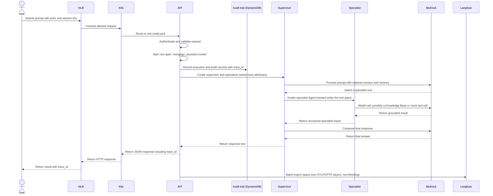

# Lab 5: Add observability with OpenTelemetry and self-hosted Langfuse

In this lab, you instrument the audited, resumable multi-agent mortgage
assistant from Lab 4 with OpenTelemetry tracing and export those traces to a
self-hosted Langfuse deployment. You will inspect supervisor and specialist
agent execution, tool calls, model calls, latency, and token usage for
individual requests and across a full conversation, and you will join each
trace to the durable audit trail that Lab 4 already writes for the same
request.

Langfuse runs on the same Amazon EKS cluster as the mortgage assistant,
with Amazon Aurora PostgreSQL, Amazon ElastiCache for Valkey, and Amazon S3
as managed backing services and ClickHouse running in the cluster. The
agents send traces to it over the cluster's internal network. It has no
direct public inbound access; you reach its UI through a CloudFront
distribution that connects to it over a private VPC origin. This
lab does not use Amazon Bedrock AgentCore or AWS X-Ray/CloudWatch
Application Signals.

## What you build on

Lab 5 is a complete checkpoint of Lab 4 plus tracing. This README documents
only what Lab 5 adds. For the rest of the service, see
[Lab 4 (`../04-memory/README.md`)](../04-memory/README.md):

- the FastAPI service and the supervisor with three specialists as
  agents-as-tools, each a persistent `Agent` with its own session;
- DynamoDB session snapshots and semantic long-term memory;
- the hash-chained audit trail, `GET /executions/{request_id}`, `request_id`
  idempotency with resume and replay, the tool ledger, and human approvals;
- the actor, session, and request state client (`app/invoke_eks.py`) and the
  `delay`, `error`, `abort`, and `crash` fault-injection modes.

What Lab 5 adds:

- `app/telemetry.py`: OpenTelemetry configuration, trace attributes, content
  masking, and fault-injection span events;
- one root span per API request, with supervisor and specialist spans nested
  under it and tagged with the same actor, session, and request identifiers;
- the trace ID recorded on every audit record, on the execution record,
  returned in the `/invoke` response, and printed by `invoke_eks.py`
  (`Trace ID:`), so an audit trail and a Langfuse trace can be joined;
- a deploy script that creates the `langfuse-otel-auth` Kubernetes Secret
  from Secrets Manager; and
- five exercises that read traces in Langfuse.

The agent behavior, the API routes, and the audit and resume logic are
unchanged from Lab 4.

## Learning objectives

After completing this lab, you will be able to:

- Explain how a root request span, a supervisor span, and specialist-agent
  spans relate to one another in a single trace.
- Read model latency, token usage, and tool-call duration from a trace in
  Langfuse.
- Confirm that a multi-turn conversation groups into one session in
  Langfuse using actor and session attributes.
- Join a Langfuse trace to the Lab 4 audit trail of the same request using
  the trace ID.
- Inject a controlled tool delay or failure, observe it in a trace and in
  the audit trail, and explain why a tool error and an aborted request look
  different, without rebuilding or redeploying the application image.
- Compare two runs of the same request to reason about relative latency and
  token cost.
- Explain the tradeoff between prompt/response visibility in traces and
  masking that content before it leaves the process, and how that differs
  from audit-record redaction.
- Distinguish production-aligned observability patterns from workshop
  simplifications.

## Estimated time

Allow about 2 hours, including deployment and the five observability exercises:
roughly 45 minutes of reading, 25 of typing, 15 of waiting for deployments and
requests, and 40 of exploring traces in the Langfuse UI. A first image build with
a cold cache adds about 10 minutes.

## Architecture

Lab 5 keeps the same long-running FastAPI service, EKS routing model, and
DynamoDB-backed memory, audit, and execution state from Lab 4. It adds an
OpenTelemetry exporter to the process and a trace-attribute set to every
agent the service creates for a request, plus a self-hosted Langfuse
deployment on the same cluster that receives OTLP/HTTP trace data through
its in-cluster Kubernetes Service.


```mermaid
flowchart TB
    client["Participant laptop<br/>stateful Python client"]

    subgraph account["Workshop AWS account"]
        nlb["Internet-facing Network Load Balancer<br/>port 80 and source-CIDR filter"]

        subgraph eks["Existing Amazon EKS cluster"]
            controller["AWS Load Balancer Controller<br/>kube-system namespace"]
            subgraph namespace["mortgage-assistant namespace"]
                service["Kubernetes Service<br/>type: LoadBalancer"]
                deployment["Kubernetes Deployment<br/>desired replicas: 2"]
                apiSecret["Kubernetes Secret<br/>workshop API key"]
                otelSecret["Kubernetes Secret<br/>langfuse-otel-auth"]
                serviceAccount["Kubernetes ServiceAccount<br/>mortgage-assistant"]

                subgraph pod1["Observable application pod 1"]
                    uvicorn1["Uvicorn HTTP server"] --> fastapi1["FastAPI application<br/>root span per request"]
                    fastapi1 --> agent1["New supervisor + three specialist Agents<br/>(agents-as-tools) for each request"]
                    agent1 --> telemetry1["telemetry.py<br/>OTLP exporter"]
                end

                subgraph pod2["Observable application pod 2"]
                    uvicorn2["Uvicorn HTTP server"] --> fastapi2["FastAPI application<br/>root span per request"]
                    fastapi2 --> agent2["New supervisor + three specialist Agents<br/>(agents-as-tools) for each request"]
                    agent2 --> telemetry2["telemetry.py<br/>OTLP exporter"]
                end

                deployment -.->|creates and replaces| uvicorn1
                deployment -.->|creates and replaces| uvicorn2
                service -->|"route to a ready pod:8080"| uvicorn1
                service -->|"route to a ready pod:8080"| uvicorn2
                apiSecret -.->|bearer key| fastapi1
                apiSecret -.->|bearer key| fastapi2
                otelSecret -.->|Basic-auth header| telemetry1
                otelSecret -.->|Basic-auth header| telemetry2
                serviceAccount -.->|assigned to pod| uvicorn1
                serviceAccount -.->|assigned to pod| uvicorn2
            end
        end

        podIdentity["EKS Pod Identity association<br/>temporary IAM credentials"]
        ssm["AWS Systems Manager Parameter Store<br/>Langfuse endpoint, secret ARN, UI URL"]
        model["Amazon Bedrock model"]
        knowledgeBase["Amazon Bedrock Knowledge Base"]
        dynamodb["DynamoDB table (Lab 4)<br/>sessions, memory, audit trail,<br/>executions, ledger"]

        langfuseSecret["Secrets Manager secret<br/>Langfuse credentials"]
        langfuseNlb["Internal Network Load Balancer"]
        langfuseCloudFront["CloudFront distribution<br/>VPC origin"]

        subgraph langfuse["Langfuse on the EKS cluster (namespace: langfuse)"]
            langfuseWeb["langfuse-web + langfuse-worker"]
            clickhouse["ClickHouse<br/>(in-cluster)"]
            langfuseWeb --> clickhouse
        end
        aurora["Amazon Aurora PostgreSQL<br/>Serverless v2"]
        valkey["Amazon ElastiCache Serverless<br/>(Valkey)"]
        langfuseS3["Amazon S3 bucket<br/>events and media"]
        langfuseWeb --> aurora
        langfuseWeb --> valkey
        langfuseWeb --> langfuseS3
    end

    client -->|"prompt + actor_id + session_id"| nlb
    controller -.->|provisions and configures| nlb
    nlb --> service
    serviceAccount -.-> podIdentity
    podIdentity -.->|AWS SDK credentials| agent1
    podIdentity -.->|AWS SDK credentials| agent2
    agent1 --> dynamodb
    agent2 --> dynamodb
    agent1 --> ssm
    agent2 --> ssm
    agent1 --> model
    agent2 --> model
    agent1 --> knowledgeBase
    agent2 --> knowledgeBase
    telemetry1 -->|"OTLP/HTTP, in-cluster Service DNS"| langfuseWeb
    telemetry2 -->|"OTLP/HTTP, in-cluster Service DNS"| langfuseWeb
    langfuseSecret -.->|bootstrap user and API keys| langfuseWeb
    client -->|"HTTPS<br/>(UI access)"| langfuseCloudFront
    langfuseCloudFront -->|VPC origin, HTTP| langfuseNlb
    langfuseNlb --> langfuseWeb
```

The existing Bedrock Knowledge Base, DynamoDB table, and mortgage tools
remain unchanged. Lab 5 updates the same `mortgage-assistant` Deployment
and continues to use the same Network Load Balancer. Workshop Studio
pre-provisions the EKS cluster, the DynamoDB table, the Langfuse
deployment and its backing services, and other shared workshop
infrastructure before the lab begins.
Lab 5 discovers those resources through canonical Systems Manager
Parameter Store paths and reads Langfuse's generated API keys from Secrets
Manager at deploy time.

### Where telemetry sits in the observable service

```text
EKS pod
└── mortgage-assistant container
    └── Uvicorn process
        └── telemetry.init_telemetry()   <- configured once, at import time
            └── FastAPI application
                └── root span "mortgage_assistant.invoke" (one per request)
                    └── supervisor Agent (mortgage_supervisor)
                        ├── specialist Agents as tools (own session, own tools)
                        │   general_mortgage_specialist      -> retrieve
                        │   existing_mortgage_specialist     -> get_mortgage_details
                        │   new_application_specialist       -> application tools
                        ├── calculator
                        └── memory, audit, resume, and approval components (Lab 4)
```

`telemetry.init_telemetry()` runs exactly once per process, as early as
possible: at import time in both `mortgage_api.py` and `mortgage_agent.py`
(the latter also covers the local CLI), before any `Agent` is created. There
is a single OpenTelemetry `TracerProvider` and a single OTLP/HTTP exporter
per process; no console exporter, X-Ray exporter, or second tracer provider
is configured anywhere.

If `OTEL_EXPORTER_OTLP_ENDPOINT` is not set, tracing is disabled entirely
and no network calls are attempted. Any failure while configuring or using
telemetry is logged and swallowed — it never blocks request handling or the
`/health`/`/health/ready` endpoints.

### End-to-end trace invocation workflow


```mermaid
sequenceDiagram
    actor User
    participant NLB
    participant K8s
    participant API
    participant Audit as Audit trail (DynamoDB)
    participant Supervisor
    participant Specialist
    participant Bedrock
    participant Langfuse

    User->>NLB: Submit prompt with actor and session IDs
    NLB->>K8s: Forward allowed request
    K8s->>API: Route to one ready pod
    API->>API: Authenticate and validate request
    API->>API: Start root span "mortgage_assistant.invoke"
    API->>Audit: Record execution and audit records with trace_id
    API->>Supervisor: Create supervisor and specialists (same trace attributes)
    Supervisor->>Bedrock: Process prompt with restored session and memory
    Bedrock-->>Supervisor: Select a specialist tool

    Supervisor->>Specialist: Invoke specialist Agent (nested under the tool span)
    Specialist->>Bedrock: Model call, possibly a Knowledge Base or mock tool call
    Bedrock-->>Specialist: Return grounded result
    Specialist-->>Supervisor: Return structured specialist report

    Supervisor->>Bedrock: Compose final response
    Bedrock-->>Supervisor: Return final answer
    Supervisor-->>API: Return response text
    API-->>K8s: Return JSON response including trace_id
    K8s-->>NLB: Return HTTP response
    NLB-->>User: Return result with trace_id

    API-)Langfuse: Batch-export spans over OTLP/HTTP (async, non-blocking)
```

The supervisor span, every specialist-agent span, every Bedrock model call,
and every tool call share the same trace and the same `session.id`/`user.id`
attributes. The supervisor receives its trace attributes directly; each
specialist `Agent` is built while those attributes are installed in a
`contextvars.ContextVar` (`telemetry.use_trace_attributes`, set in
`run_supervisor`), and passes them to its own `trace_attributes`. This keeps
one conversation grouped together in Langfuse regardless of which EKS
replica handles which request in the conversation.

## Observability concepts

### Traces, spans, and grouping

Each `/invoke`, `/executions/{request_id}/resume`, and
`/executions/{request_id}/approvals` request opens one root span
(`mortgage_assistant.invoke`, started in `mortgage_api.py`). Strands' own
instrumentation adds child spans below it. For a request routed to a
specialist, the trace has this shape (span names as emitted by the Strands
version locked in `uv.lock`):

```text
mortgage_assistant.invoke
└── invoke_agent mortgage_supervisor
    ├── execute_event_loop_cycle
    │   ├── chat                                     supervisor model call (routing)
    │   └── execute_tool existing_mortgage_specialist
    │       └── invoke_agent existing_mortgage_specialist
    │           ├── execute_event_loop_cycle
    │           │   ├── chat                         specialist model call
    │           │   └── execute_tool get_mortgage_details
    │           ├── execute_event_loop_cycle
    │           │   └── chat
    │           └── execute_event_loop_cycle
    │               ├── chat                         structured report
    │               └── execute_tool SpecialistReport
    └── execute_event_loop_cycle
        └── chat                                     supervisor final answer
```

The tree above was produced by running the real supervisor and specialist
agents with a scripted model and an in-memory exporter, so the nesting is
exact; the number of `execute_event_loop_cycle` and `chat` spans in a real
request varies with the model. You may also see `memory.*` spans (for
example `memory.search` and `memory.inject`) emitted by the Strands memory
manager from Lab 4, and `calculator` or other tool spans when the model uses
them.

Key points:

- The specialist is a persistent `Agent` exposed as a tool, so its
  `invoke_agent` span sits *under* the supervisor's `execute_tool
  <specialist>` span, and the specialist's own tool calls (for example
  `retrieve` or `get_mortgage_details`) are separate spans beneath it. The
  specialist's `SpecialistReport` structured-output step is also recorded as
  an `execute_tool SpecialistReport` span.
- Every span in the trace — including the root span — carries `session.id`,
  `user.id`, and a `tags` attribute (`mortgage-assistant` and
  `request:<request_id>`), set by `telemetry.trace_attributes`. Model-call
  (`chat`) spans carry token usage.
- Langfuse groups spans into traces automatically from the trace ID, and
  groups traces into one session view using `session.id` and `user.id`.
  Whether Langfuse also promotes the `tags` attribute to a trace-level tag
  depends on its attribute mapping in your version; if a tag filter returns
  nothing, search by trace ID instead (the `Trace ID:` line) — the
  `request:<request_id>` value is still visible in the span attributes.
- Each request, resume, or approval continuation is its own trace, because
  each opens its own root span. Re-sending a *completed* `request_id`
  replays the stored response without running any agent, so its trace
  contains only the root span.

### Correlating traces with the audit trail

Lab 4 writes a durable audit record for every invocation, model decision,
tool call, memory read/write, and approval. Lab 5 stamps each of those
records with the trace ID of the request that wrote them. The same
identifiers now show up in both places:

| Identifier | In Langfuse | In the Lab 4 audit trail and API |
|---|---|---|
| `request_id` | `request:<request_id>` in the `tags` attribute | `request_id` on every record; path of `GET /executions/{request_id}` |
| `session_id` | `session.id` attribute; Langfuse **Sessions** view | `session_id` on every record |
| `actor_id` | `user.id` attribute; Langfuse **Users** view | `actor_id` on every record |
| `trace_id` | the trace ID in **Tracing** | `trace_id` on every record, on `execution.trace_id`, and in the `/invoke` response |

Ways to get from one to the other:

- From a response: `invoke_eks.py` prints a `Trace ID:` line after the
  `Request ID:` line. Paste it into the Langfuse **Tracing** search.
- From a trace to the audit trail: copy the `request_id` from the
  `request:<request_id>` tag or span attribute and the `session.id` span
  attribute, then run
  `uv run app/invoke_eks.py --trail <request_id> --session-id <session.id>`.
  The trail is looked up within a session, so without `--session-id` the
  command returns HTTP 404 for any request that is not in your client's
  current session (for example one sent before `--new-session`). Passing
  `--session-id` also makes that session the client's current session.
- From the audit trail to a trace (including requests that failed and
  therefore returned no `trace_id`): run
  `uv run app/invoke_eks.py --trail last --json` and read `trace_id` on the
  records. Each record carries the trace ID of the attempt that wrote it, so
  a request that was resumed or approved has records belonging to more than
  one trace. `execution.trace_id` is the trace of the first attempt, or of
  the most recent resume.

The audit trail is the durable record; the trace is the diagnostic view.
Traces can be sampled, masked, or expire in Langfuse. The audit records in
DynamoDB are not affected by any of that.

### Prompt and response capture, and content masking

Strands' automatic instrumentation records prompt and response text as span
attributes or span events (for example `gen_ai.input.messages`,
`gen_ai.output.messages`, `gen_ai.system_instructions`,
`gen_ai.tool.call.arguments`, and `gen_ai.tool.call.result`, or the older
`gen_ai.user.message`, `gen_ai.assistant.message`, `gen_ai.choice`, and
`system_prompt` names). Those values are visible in Langfuse alongside
latency, token usage, and tool calls. For this workshop's mock data, that
visibility is the point of the lab. A deployment handling real customer data
should choose one of:

- Leave `OTEL_EXPORTER_OTLP_ENDPOINT` unset to disable tracing entirely.
- Set `TELEMETRY_MASK_CONTENT=true` (`--telemetry-mask-content` at deploy
  time). `telemetry.py` then (1) tells Strands to redact every sensitive
  GenAI field at the source (`OTEL_SEMCONV_STABILITY_OPT_IN` with an empty
  `gen_ai_unredacted_attributes=` allowlist), and (2) wraps the OTLP span
  exporter so that any remaining content attributes — including the generic
  `content`, `message`, `query`, and `results` keys used by memory events —
  are replaced with `[redacted]` before a span leaves the process. Latency,
  token counts, tool names, status, identifiers, and the `fault_injection`
  event are still exported; the conversational content is not. Exception
  messages and span status descriptions are not masked, so do not put
  customer data in exception text.
- Apply redaction or access controls further downstream in Langfuse
  instead of, or in addition to, the above.

### Masking spans is not the same as redacting the audit trail

Lab 5 now has two independent stores that can contain conversation content,
with two independent controls:

| | Langfuse traces | Lab 4 audit store (DynamoDB) |
|---|---|---|
| What it holds | Spans, token usage, and (unless masked) prompts, responses, and tool inputs/outputs | Hash-chained records of prompts, model decisions, tool inputs and results, memory reads/writes, approvals |
| Control | `TELEMETRY_MASK_CONTENT` / `--telemetry-mask-content` | `AUDIT_REDACT_KEYS` (default `password,token,authorization,api_key,ssn`) plus truncation of long values |
| What it does | Replaces conversational span attributes with a placeholder before export | Masks the *values of the named keys* inside record data; does not mask free-text prompts or answers |
| Effect of the other control | None. Masking spans does not change the audit store. | None. Redacting audit keys does not change spans. |

`TELEMETRY_MASK_CONTENT=true` masks span attributes only. It does **not**
change what `GET /executions/{request_id}` returns: the trail endpoint still
returns the full prompt, tool results, and model text, subject to the audit
redaction and truncation rules. If you need to restrict content in both
places, configure both controls, and restrict who can call the audit
endpoints (see Lab 4 for the administrator-key caveat).

### Fault injection

`mortgage_agent.maybe_inject_fault()` can delay, fail, abort, or crash the
`get_mortgage_details` tool on demand. It is disabled by default and reads
its configuration from environment variables on every call, so you can
toggle it with `kubectl set env` without rebuilding or restarting the
container image. The four modes are:

| `FAULT_INJECTION_MODE` | Behavior | Used in |
|---|---|---|
| `delay` | Sleeps `FAULT_INJECTION_DELAY_SECONDS` (default 5) before returning normally. | Lab 5, Exercise 4 |
| `error` | The tool raises. Strands turns that into an error tool result that the *specialist's model* sees and handles; the request normally still completes. | Lab 5, Exercise 4 |
| `abort` | The tool call fails *and* the request is failed (HTTP 500, status `FAILED`, resumable). | Lab 4 resume exercises (optional comparison here) |
| `crash` | Kills the process mid-turn. | Lab 4 crash exercise |

Whenever it fires, it adds a `fault_injection` event (attributes
`tool.name` and `fault.mode`) to the active tool span and writes a
`fault_injection` record to the audit trail, so the injected fault is
visible in both the trace and the audit trail, not just in application
logs. `FAULT_INJECTION_TOOL` selects the tool; only `get_mortgage_details`
has the hook, so other tool names do nothing.

## Prerequisites

Open the Workshop Studio environment, complete Labs 0–4, and confirm:

```bash
aws sts get-caller-identity

kubectl get nodes

kubectl get deployment,pods,service \
  --namespace mortgage-assistant
```

Lab 4 must be deployed first. Lab 5 reuses the `mortgage-assistant`
namespace, Deployment, and Network Load Balancer, and reuses the existing
`mortgage-assistant-api-key` Secret, so the API key you already use keeps
working.

You also need:

- AWS CLI v2.
- `kubectl`.
- Docker with Buildx, or Finch's Docker-compatible CLI (the deploy script
  falls back to plain `docker build` when `buildx` is missing).
- `uv`.
- Python 3.12 or later, plus `python3`, `curl`, `openssl`, `grep`, and `sed`
  on your `PATH` (the deploy script checks for them).
- Access to the existing EKS cluster and ECR repository.
- Bedrock model access for the agent model and Titan Text Embeddings V2.

When using a named AWS profile, pass `--profile` to both deployment and
client commands.

## Workshop Studio resource discovery

Workshop Studio pre-provisions shared resources and publishes their
identifiers in Systems Manager Parameter Store. Lab 5 uses these canonical
paths, in addition to the Lab 4 memory parameters:

| Resource | Parameter Store path |
|---|---|
| EKS cluster name | `/workshop/mortgage-assistant/eks/cluster-name` |
| ECR repository URI | `/workshop/mortgage-assistant/ecr/repository-uri` |
| DynamoDB memory table name | `/workshop/mortgage-assistant/memory/table-name` |
| DynamoDB vector index name | `/workshop/mortgage-assistant/memory/vector-index-name` |
| Bedrock Knowledge Base ID | `/workshop/mortgage-assistant/bedrock/knowledge-base-id` |
| Langfuse OTLP ingestion endpoint | `/workshop/mortgage-assistant/langfuse/otlp-endpoint` |
| Langfuse credentials secret ARN | `/workshop/mortgage-assistant/langfuse/secret-arn` |
| Langfuse public UI URL | `/workshop/mortgage-assistant/langfuse/url` |

The deployment and cleanup scripts read these parameters directly and do
not depend on a CloudFormation stack name or stack outputs. The application
keeps these model defaults in code:

- Agent model: `us.anthropic.claude-sonnet-4-6`.
- Embedding model: `amazon.titan-embed-text-v2:0`.

Workshop Studio also provisions Langfuse itself, installed on the shared
EKS cluster with Helm. Its backing services are Amazon Aurora Serverless v2
(PostgreSQL) for metadata, Amazon ElastiCache Serverless (Valkey) for the
queue and cache, and an Amazon S3 bucket for raw events; ClickHouse runs in
the cluster on a `gp3` EBS volume. The Langfuse pods have no direct public
inbound access. A CloudFront distribution reaches them through a VPC origin
targeting an internal Network Load Balancer, giving you a public HTTPS URL
for the UI in Step 5 below. Your agent pods do not use that path: they send
traces straight to the `langfuse-web` Service inside the cluster.

## Step 1: Review the Lab 5 files

```text
05-observability/
├── app/
│   ├── approvals.py
│   ├── audit.py
│   ├── execution.py
│   ├── inspect_audit.py
│   ├── inspect_memory.py
│   ├── invoke_eks.py
│   ├── ledger.py
│   ├── memory.py
│   ├── mortgage_agent.py
│   ├── mortgage_api.py
│   ├── resilience.py
│   ├── service.py
│   ├── store.py
│   └── telemetry.py
├── k8s/
│   ├── base.yaml
│   └── service.template.yaml
├── scripts/
│   ├── check_memory_ready.py
│   ├── cleanup-observability.sh
│   ├── deploy-observability.sh
│   └── hydrate_memory.py
├── tests/
├── Dockerfile
├── pyproject.toml
└── uv.lock
```

`telemetry.py` is the only new application module. Every other Lab 4 module
is unchanged except for small additions in three files:

- `mortgage_agent.py` initializes telemetry, builds the trace attributes for
  the supervisor and passes them to each specialist, and records a
  `fault_injection` span event.
- `mortgage_api.py` opens the `mortgage_assistant.invoke` root span, passes
  its trace ID into the orchestrator (which stores it on the execution and
  audit records), returns `trace_id` in the response, and flushes spans on
  shutdown.
- `invoke_eks.py` prints the `Trace ID:` line.

Lab 4 already carries the `trace_id` field through the execution and audit
code; it is simply always empty there because Lab 4 has no tracing.

## Step 2: Test the module locally

From the repository root:

```bash
cd 05-observability

uv run python -m unittest discover tests
```

Add `--verbose` for per-test output (`uv run python -m unittest discover
--start-directory tests --verbose`).

The first `uv run` command creates the lab-local environment, installs its
locked dependencies, and runs the tests. These tests validate the API
contract, telemetry helper functions (header parsing, content masking,
redaction against real OpenTelemetry SDK spans, global tracer-provider
registration), fault injection, and the Lab 4 audit, resume, approval,
memory, and client-state behavior (using a scripted model). They do not call
Bedrock, and they do not require a reachable Langfuse endpoint.

## Step 3: Deploy the observable application

```bash
chmod +x \
  scripts/deploy-observability.sh \
  scripts/cleanup-observability.sh \
  scripts/hydrate_memory.py

./scripts/deploy-observability.sh \
  --region us-west-2
```

For a named profile:

```bash
./scripts/deploy-observability.sh \
  --region us-west-2 \
  --profile YOUR_AWS_PROFILE
```

The deployment script:

1. Reads the canonical Workshop Studio Parameter Store values, including
   the Langfuse OTLP endpoint, credentials-secret ARN, and UI URL.
2. Confirms the pre-provisioned memory table and vector index are active.
3. Configures `kubectl` for the cluster and checks that the AWS Load
   Balancer Controller is ready.
4. Reads the bootstrapped Langfuse project API key pair from Secrets
   Manager and builds the OTLP Basic-auth header in memory (never written
   to a rendered manifest file on disk).
5. Builds and pushes the Lab 5 image (`lab05-agent-<timestamp>`), unless
   you pass `--image-uri`.
6. Applies `k8s/base.yaml` (the namespace and ServiceAccount), then
   reuses the existing `mortgage-assistant-api-key` Secret (or
   `MORTGAGE_API_KEY` if you set it, or generates a new key if neither
   exists).
7. **Creates** the `langfuse-otel-auth` Kubernetes Secret from the
   Secrets Manager credentials, directly with `kubectl create secret ... |
   kubectl apply -f -`. Lab 4 does not have this Secret.
8. Renders and applies `k8s/service.template.yaml`, which updates the
   existing EKS Deployment with the OTEL, fault-injection, and Lab 4
   environment variables, and configures the Service source-CIDR filter.
9. Waits for the pods, the Network Load Balancer, and the API readiness
   endpoint.
10. Sends one smoke-test prompt and checks that the response includes a
    `trace_id` — confirming a real trace was started, not just that the
    deployment is healthy. It then fetches the smoke request's audit trail,
    requires `chain_valid` and a `COMPLETED` status, and replays the
    `request_id` to confirm the stored response is returned without a new
    attempt.

Optional flags:

```bash
./scripts/deploy-observability.sh \
  --region us-west-2 \
  --telemetry-mask-content \
  --fault-injection-enabled \
  --fault-injection-mode delay \
  --fault-injection-delay-seconds 5
```

| Flag | Effect |
|---|---|
| `--region REGION` / `--profile PROFILE` | AWS Region (default `us-west-2`) and optional CLI profile. |
| `--service-access-cidr CIDR` | CIDR allowed to reach the NLB. Defaults to your detected public IP (`/32`). |
| `--prompt TEXT` | Prompt for the smoke test. |
| `--telemetry-mask-content` | Sets `TELEMETRY_MASK_CONTENT=true` (mask span content before export). |
| `--fault-injection-enabled` | Sets `FAULT_INJECTION_ENABLED=true`. Off by default. |
| `--fault-injection-tool NAME` | Target tool (default `get_mortgage_details`). |
| `--fault-injection-mode MODE` | `delay`, `error`, `abort`, or `crash` (default `delay`). |
| `--fault-injection-delay-seconds N` | Delay used in `delay` mode (default 5). |
| `--image-uri URI` | Deploy an image already in ECR and skip the build and push (a settings change takes about 2 minutes instead of about 12). |
| `--approval-required-tools LIST` | Tools that pause for human approval (default `create_loan_application`; empty disables). Lab 4 feature. |
| `--lease-seconds N` | Per-session lease, at least 30 (default 180). Lab 4 feature. |
| `--enable-reasoning` | Capture Bedrock extended-thinking in the audit trail. Lab 4 feature. |
| `--no-snapshot-history` | Keep only the latest snapshot per agent. Lab 4 feature. |
| `--session-ttl-seconds N` | Short-term session retention, at least 3600 (default 604800). |

Run `./scripts/deploy-observability.sh --help` for the complete list. The
script prints the final image URI; to change settings later without a
rebuild, rerun it with `--image-uri` set to that value.

The script does not create or update shared AWS infrastructure. Workshop
Studio manages the EKS cluster, Knowledge Base, ECR repository, IAM
resources, DynamoDB table, vector index, and Langfuse with its backing
services.

## Step 4: Check the deployment

```bash
kubectl get deployment,pods,service \
  --namespace mortgage-assistant

kubectl logs \
  --namespace mortgage-assistant \
  deployment/mortgage-assistant \
  --tail=100
```

Confirm the telemetry configuration:

```bash
kubectl get deployment mortgage-assistant \
  --namespace mortgage-assistant \
  --output jsonpath='{range .spec.template.spec.containers[0].env[*]}{.name}={.value}{"\n"}{end}' |
grep -E 'OTEL|FAULT_INJECTION|TELEMETRY_MASK_CONTENT'
```

`OTEL_EXPORTER_OTLP_HEADERS` is read from the `langfuse-otel-auth` Secret,
so it shows an empty value here; that is expected.

## Step 5: Open the Langfuse UI

Look up the public Langfuse URL from Parameter Store:

```bash
aws ssm get-parameter \
  --region us-west-2 \
  --name /workshop/mortgage-assistant/langfuse/url \
  --query 'Parameter.Value' --output text
```

Browse to that URL. Sign in with the bootstrapped workshop user:

```bash
aws secretsmanager get-secret-value \
  --region us-west-2 \
  --secret-id "$(aws ssm get-parameter \
    --region us-west-2 \
    --name /workshop/mortgage-assistant/langfuse/secret-arn \
    --query 'Parameter.Value' --output text)" \
  --query SecretString --output text |
uv run python -c 'import json,sys; c=json.load(sys.stdin); print("Email:", c["init_user_email"]); print("Password:", c["init_user_password"])'
```

Langfuse still has no direct public inbound access — CloudFront reaches it
over a private VPC origin. Langfuse's Tracing view is
where you will read each trace for the remaining exercises. The deploy
script's smoke test already produced one trace; its ID was printed as
`Smoke-test trace ID`.

## Step 6 — Exercise 1: A general mortgage question

```bash
uv run app/invoke_eks.py \
  --region us-west-2 \
  --prompt "What are the benefits of a 15-year mortgage?"
```

The CLI prints the response, then the request ID and, on its own line after
a blank line, `Trace ID: ...`. In the Langfuse UI, open **Tracing**, find
that trace ID, and inspect:

- The root `mortgage_assistant.invoke` span and its total latency.
- The `invoke_agent mortgage_supervisor` span and, under its
  `execute_tool general_mortgage_specialist` span, the
  `invoke_agent general_mortgage_specialist` span — the specialist's own
  agent run, nested inside the supervisor's tool call.
- The specialist's `retrieve` tool span (the Knowledge Base call) and its
  duration.
- The `chat` model-call spans for the supervisor and the specialist,
  including input/output token counts.

Now join the trace to the audit trail. The trail is the durable record of the
same request:

```bash
uv run app/invoke_eks.py --region us-west-2 --trail last
uv run app/invoke_eks.py --region us-west-2 --trail last --json
```

The first command prints the routing and tool summary (the supervisor's
`general_mortgage_specialist` call and the specialist's own `retrieve` call)
and the ordered records. In the `--json` output, find `execution.trace_id`
and the `trace_id` on each record, and confirm they match the `Trace ID:`
line from the invocation and the trace you opened in Langfuse. The
`request:<request_id>` tag on the Langfuse spans matches the `request_id`
in the trail.

## Step 7 — Exercise 2: An existing-account question

```bash
uv run app/invoke_eks.py \
  --region us-west-2 \
  --new-session \
  --prompt "What is the balance on customer ID 123456's mortgage?"
```

Open the new trace and compare its shape to Exercise 1's: the supervisor
now delegates to `existing_mortgage_specialist`, whose own agent span calls
the mock `get_mortgage_details` tool instead of the Knowledge Base. Note
the tool span's duration under normal conditions — you will compare it
against an injected delay in Exercise 4. Use `--new-session` here and in
Exercise 4: the specialist persists its conversation in the session, so in a
session where it has already looked up a customer it may answer from its
own history and never call the tool (or trigger the fault).

## Step 8 — Exercise 3: Multi-request session grouping

Display your current actor and session, then send two related prompts in
the same session:

```bash
uv run app/invoke_eks.py --region us-west-2 --show-context

uv run app/invoke_eks.py \
  --region us-west-2 \
  --prompt "I am considering a property worth 600,000 dollars."

uv run app/invoke_eks.py \
  --region us-west-2 \
  --prompt "What property value did I mention in this conversation?"
```

In Langfuse, open **Sessions** and find the session ID printed by
`--show-context` (`Session:`). Both requests appear as separate traces
grouped under one session, associated with the same `user.id` (the
`participant-<AWS-account-id>` actor). This grouping is derived entirely
from the `session.id`/`user.id` span attributes set by
`telemetry.trace_attributes` — it holds regardless of which of the two EKS
replicas handled each request. The second answer works because the Lab 4
supervisor restores the first request's messages from its DynamoDB
snapshot; the two traces are linked by the session, not by a shared trace.
Confirm which pod handled each request:

```bash
kubectl logs \
  --namespace mortgage-assistant \
  --selector app.kubernetes.io/name=mortgage-assistant \
  --prefix \
  --tail=50 |
grep -i invoke
```

(`kubectl logs deployment/mortgage-assistant` only streams one pod's logs;
the label selector above fans out across both replicas so you can see which
pod handled each request.)

You can also list the session's requests from the audit side and match each
`trace_id` to a trace in the Langfuse session. This is a direct `curl` call,
so first set the API key, the API URL (`http://` plus the Service's load
balancer hostname), and the actor and session from `--show-context`, then
call the API:

```bash
export MORTGAGE_API_KEY="$(
  kubectl get secret mortgage-assistant-api-key \
    --namespace mortgage-assistant \
    --output jsonpath='{.data.api-key}' |
  base64 --decode
)"

export MORTGAGE_API_URL="http://$(
  kubectl get service mortgage-assistant \
    --namespace mortgage-assistant \
    --output jsonpath='{.status.loadBalancer.ingress[0].hostname}'
)"

CONTEXT="$(uv run app/invoke_eks.py --region us-west-2 --show-context)"
ACTOR_ID="$(printf '%s\n' "$CONTEXT" | sed -n 's/^Actor: *//p')"
SESSION_ID="$(printf '%s\n' "$CONTEXT" | sed -n 's/^Session: *//p')"

curl --silent --get \
  "$MORTGAGE_API_URL/sessions/$SESSION_ID/executions" \
  --data-urlencode "actor_id=$ACTOR_ID" \
  --header "Authorization: Bearer $MORTGAGE_API_KEY"
```

The response lists each request in the session with its `status` and
`trace_id`. Keep `MORTGAGE_API_URL` and `MORTGAGE_API_KEY` exported in this
terminal; the "API contract" section below reuses them.

## Step 9 — Exercise 4: Controlled tool delay and failure

Enable a delay on the tool exercised in Step 7, without rebuilding the
image:

```bash
kubectl set env deployment/mortgage-assistant \
  --namespace mortgage-assistant \
  FAULT_INJECTION_ENABLED=true \
  FAULT_INJECTION_TOOL=get_mortgage_details \
  FAULT_INJECTION_MODE=delay \
  FAULT_INJECTION_DELAY_SECONDS=8

kubectl rollout status deployment/mortgage-assistant \
  --namespace mortgage-assistant

uv run app/invoke_eks.py \
  --region us-west-2 \
  --new-session \
  --prompt "What is the balance on customer ID 123456's mortgage?"
```

### A delayed tool

Open the new trace. The `execute_tool get_mortgage_details` span now
lasts at least 8 seconds, and a `fault_injection` event (with
`tool.name=get_mortgage_details` and `fault.mode=delay`) marks where the
delay was introduced. Because the specialist is nested inside the
supervisor's tool call, the delay shows up all the way up the tree: the
`invoke_agent existing_mortgage_specialist`, `execute_tool
existing_mortgage_specialist`, `invoke_agent mortgage_supervisor`, and root
spans all lengthen by about the same amount, while the `chat` spans do not.
Reading a trace bottom-up like this is how you attribute latency to a leaf
tool rather than to the model.

Confirm the same fault in the audit trail:

```bash
uv run app/invoke_eks.py --region us-west-2 --trail last
```

The record list includes a `fault_injection` record, and the
`tool existing/get_mortgage_details` line reports `success`; with `--json`,
that tool call's `duration_s` shows the delay.

### A failing tool (error mode)

Now switch to a simulated failure:

```bash
kubectl set env deployment/mortgage-assistant \
  --namespace mortgage-assistant \
  FAULT_INJECTION_MODE=error

kubectl rollout status deployment/mortgage-assistant \
  --namespace mortgage-assistant

uv run app/invoke_eks.py \
  --region us-west-2 \
  --new-session \
  --prompt "What is the balance on customer ID 123456's mortgage?"
```

Unlike the earlier single-agent labs, this request normally does **not**
return an HTTP 500. In `error` mode the tool raises, but Strands converts
the exception into an error *tool result* and hands it to the specialist's
model. The specialist is a separate agent with its own model, so it reacts:
it may retry the tool (and hit the fault again) or report that the account
data was unavailable, and the supervisor relays that. The request completes
with status `completed` and a response that explains the problem. The exact
wording varies with the model.

In Langfuse, look for:

- one or more `execute_tool get_mortgage_details` spans with an error status
  and the message `Fault injection: simulated failure in tool
  'get_mortgage_details'.`, each with a `fault_injection` event
  (`fault.mode=error`) — more than one if the specialist retried;
- the specialist's `invoke_agent`, the supervisor's `execute_tool
  existing_mortgage_specialist` span, and the root span **without** an error
  status, because the failure was handled below them; and
- further `chat` spans after the failed tool, which are the specialist model
  reacting to the error.

In the audit trail:

```bash
uv run app/invoke_eks.py --region us-west-2 --trail last
```

Expect `tool existing/get_mortgage_details: error` alongside
`tool supervisor/existing_mortgage_specialist: success`, the request
`COMPLETED (attempt 1)`, and a `fault_injection` record. The error is
handled by the specialist model; it is not a failed request.

### Optional: compare with abort mode

`abort` is a Lab 4 resume feature, and resuming is covered there. To see
how a failed *request* differs from a failed *tool*, switch modes and send a
new prompt:

```bash
kubectl set env deployment/mortgage-assistant \
  --namespace mortgage-assistant \
  FAULT_INJECTION_MODE=abort

kubectl rollout status deployment/mortgage-assistant \
  --namespace mortgage-assistant

uv run app/invoke_eks.py \
  --region us-west-2 \
  --new-session \
  --prompt "What is the balance on customer ID 654321's mortgage?"
```

This request returns HTTP 500, so there is no response body and no
`Trace ID:` line. The client prints the request ID instead. Find the trace
from the audit trail:

```bash
uv run app/invoke_eks.py --region us-west-2 --trail last --json
```

The execution status is `FAILED`, and `execution.trace_id` (and each
record's `trace_id`) identifies the trace to open. In Langfuse, the tool
span has an error status with a `fault_injection` event (`fault.mode=abort`)
like `error` mode, but this time the error propagates: the supervisor's
`invoke_agent` span ends in an error status, and the supervisor makes no
final `chat` call after the specialist returns. That is the difference
between the two modes: `error` is absorbed by the specialist's model,
`abort` fails the request.

### Reset

Reset to the deterministic disabled state for the rest of the workshop. This
also puts the mode and delay back to the deployment script's defaults, so a
later `FAULT_INJECTION_ENABLED=true` does not start in `abort` mode:

```bash
kubectl set env deployment/mortgage-assistant \
  --namespace mortgage-assistant \
  FAULT_INJECTION_ENABLED=false \
  FAULT_INJECTION_MODE=delay \
  FAULT_INJECTION_DELAY_SECONDS=5

kubectl rollout status deployment/mortgage-assistant \
  --namespace mortgage-assistant
```

`FAULT_INJECTION_ENABLED=false` is also the deployment script's default, so
redeploying at any point returns to this disabled state. If you left a
request in `FAILED` status (the `abort` comparison), you can ignore it, or
complete it with `uv run app/invoke_eks.py --region us-west-2 --resume last`
once the fault is disabled; each resume attempt is a new trace.

## Step 10 — Exercise 5: Compare runs for cost and latency

Send the same prompt twice, in two separate sessions:

```bash
uv run app/invoke_eks.py \
  --region us-west-2 \
  --new-session \
  --prompt "What are the benefits of a 15-year mortgage?"

uv run app/invoke_eks.py \
  --region us-west-2 \
  --new-session \
  --prompt "What are the benefits of a 15-year mortgage?"
```

In Langfuse, open both traces and compare:

- Total request latency (root span duration).
- Latency per agent: the supervisor's `invoke_agent` span versus the
  specialist's, to see how much of the request is routing and composition
  versus the specialist's work.
- Time-to-first-token versus total generation time, if shown.
- Input and output token counts for each model call. A single request makes
  several model calls (supervisor routing, specialist reasoning, the
  structured report, and the supervisor's final answer), so add up the
  `chat` spans of both agents to get the cost-relevant total.

As a cross-check, the audit trail records token usage per agent on each
`invocation_end` record (`uv run app/invoke_eks.py --trail last --json`).

To turn token counts into an estimated cost, multiply each run's input and
output token counts by the current Amazon Bedrock on-demand price per
1,000 (or 1,000,000, depending on how the page states it) tokens for the
exact model ID this lab uses (`us.anthropic.claude-sonnet-4-6`). Look this
up on the
[Amazon Bedrock pricing page](https://aws.amazon.com/bedrock/pricing/)
at the time you run this exercise — model pricing changes over time and
this README does not hardcode a number that could go stale. Because both
runs use the same prompt, differences in token counts you observe between
runs are more informative for this exercise than the absolute dollar
figure.

## API contract

The API is the Lab 4 contract. Lab 5 only starts populating the `trace_id`
field that Lab 4 returns empty:

```bash
curl --request POST "$MORTGAGE_API_URL/invoke" \
  --header "Authorization: Bearer $MORTGAGE_API_KEY" \
  --header "Content-Type: application/json" \
  --data '{
    "prompt": "What are the benefits of a 15-year mortgage?",
    "actor_id": "participant-123456789012",
    "session_id": "session-example",
    "request_id": "request-example"
  }'
```

Response (abridged; see Lab 4 for the full `explanation` block):

```json
{
  "request_id": "request-example",
  "actor_id": "participant-123456789012",
  "session_id": "session-example",
  "status": "completed",
  "response": "...",
  "interrupts": [],
  "attempt": 1,
  "duration_ms": 2450,
  "trace_id": "503879386ef6296c386db09b9a8247bc",
  "explanation": { "...": "..." }
}
```

`trace_id` is `null` whenever `OTEL_EXPORTER_OTLP_ENDPOINT` is not
configured (or the root span could not be started), so the field is safe to
check unconditionally. The same value is stored on every audit record and
on the execution record, and is returned by
`GET /executions/{request_id}` (`execution.trace_id` and each record's
`trace_id`) and `GET /sessions/{session_id}/executions`. Error responses
(for example HTTP 500) do not include a `trace_id`, so use the audit trail
to find the trace of a failed request.

## Troubleshooting

### The smoke-test response has no `trace_id`

```bash
kubectl get deployment mortgage-assistant \
  --namespace mortgage-assistant \
  --output jsonpath='{range .spec.template.spec.containers[0].env[*]}{.name}={.value}{"\n"}{end}' |
grep OTEL_EXPORTER_OTLP_ENDPOINT

kubectl logs \
  --namespace mortgage-assistant \
  deployment/mortgage-assistant \
  --tail=200 |
grep -i -E 'otlp|telemetry'
```

`telemetry.init_telemetry()` never raises; a misconfigured endpoint or
missing/invalid OTLP headers is logged and tracing is silently disabled
instead of crashing the pod. A healthy pod prints no OTLP line at the default
log level (the `OTLP tracing configured` message is INFO), so the `grep`
above normally shows only a `strands.telemetry` line. A configuration
error is logged at ERROR level as `Failed to configure OTLP tracing`, and an
empty `OTEL_EXPORTER_OTLP_ENDPOINT` (tracing disabled, no log line) shows up
in the first command's output instead. Confirm the `langfuse-otel-auth` Secret exists
and holds a non-empty `otlp-headers` key (the command masks the
credential):

```bash
kubectl get secret langfuse-otel-auth \
  --namespace mortgage-assistant \
  --output jsonpath='{.data.otlp-headers}' |
base64 --decode |
sed 's/Basic [^,]*/Basic ********/'
```

If the Secret is missing, rerun `./scripts/deploy-observability.sh`; it
recreates the Secret from Secrets Manager. The deploy script also stops
with an error if the smoke response has no `trace_id`.

### The response has a `trace_id` but the trace does not appear in Langfuse

Spans are exported in batches, asynchronously, so allow a few seconds and
refresh. If it still does not appear, confirm the Langfuse web Service is
reachable from an EKS pod and that the credentials in the OTLP header are
still valid for the current Langfuse project. The `mortgage-assistant` namespace enforces the `restricted` Pod Security
Standard, so the check pod needs a restricted-compliant security context
(without it, `kubectl run` fails with `violates PodSecurity "restricted:latest"`):

```bash
OTLP_ENDPOINT="$(aws ssm get-parameter \
  --region us-west-2 \
  --name /workshop/mortgage-assistant/langfuse/otlp-endpoint \
  --query 'Parameter.Value' --output text)"

kubectl run otlp-check --rm -it --restart=Never \
  --namespace mortgage-assistant \
  --image=curlimages/curl \
  --overrides='{"spec":{"securityContext":{"runAsNonRoot":true,"runAsUser":100,"seccompProfile":{"type":"RuntimeDefault"}},"containers":[{"name":"otlp-check","image":"curlimages/curl","args":["curl","-v","--max-time","10","'"$OTLP_ENDPOINT"'"],"securityContext":{"allowPrivilegeEscalation":false,"capabilities":{"drop":["ALL"]}}}]}}'
```

Any HTTP response here (even an error status, since the OTLP exporter sends
`POST` requests and this check sends a `GET`) confirms the pod can reach the
`langfuse-web` Service; the problem is then further up the stack, for
example an incorrect or missing `OTEL_EXPORTER_OTLP_HEADERS` value. A
"Could not resolve host" error means the endpoint's Service name does not exist
(check the Parameter Store value). A
connection timeout or "connection refused" instead points to the Langfuse
pods themselves. Ask your facilitator to check that the `langfuse-web`
Deployment in the `langfuse` namespace is ready (`kubectl get pods
--namespace langfuse`); the Service has no endpoints when its pods are not
ready.

### The trace shows content as `[redacted]` or `[REDACTED]`

`TELEMETRY_MASK_CONTENT` is `true` on the Deployment (you passed
`--telemetry-mask-content`). To see prompts and responses again, rerun the
deploy script without that flag (add `--image-uri` to skip the rebuild).

### The Langfuse UI will not load at the CloudFront URL

Confirm you browsed to the exact URL from the
`/workshop/mortgage-assistant/langfuse/url` parameter, over `https://`. A
new CloudFront distribution can take several minutes to fully propagate; if
it was just created, wait and retry before assuming something is broken.

### Fault injection does not appear to change anything

Confirm the environment variable rollout completed and that
`FAULT_INJECTION_TOOL` matches the tool your prompt actually triggers
(`get_mortgage_details`, used by existing-account questions):

```bash
kubectl get deployment mortgage-assistant \
  --namespace mortgage-assistant \
  --output jsonpath='{range .spec.template.spec.containers[0].env[*]}{.name}={.value}{"\n"}{end}' |
grep FAULT_INJECTION
```

Also use `--new-session`: a specialist that already looked up the same
customer in this session may answer from its own history without calling the
tool, so no fault fires and the trace has no `get_mortgage_details` span.

### The error-mode request returned a normal answer, not an HTTP 500

That is the expected behavior: in `error` mode the specialist's model
handles the tool error (see Exercise 4). Use `abort` mode if you want the
request itself to fail.

### The request receives HTTP 401

The client normally reads the API key from the Kubernetes Secret. If using
curl, retrieve it:

```bash
export MORTGAGE_API_KEY="$(
  kubectl get secret mortgage-assistant-api-key \
    --namespace mortgage-assistant \
    --output jsonpath='{.data.api-key}' |
  base64 --decode
)"
```

### HTTP 409 or 429

These come from the Lab 4 resilience controls (a busy or approval-pending
session, or all agent slots in use), not from tracing. See Lab 4 for how to
resolve them.

## Production-aligned patterns demonstrated by this lab

Production readiness is an end-to-end property of the application,
infrastructure, operational processes, and security controls. This workshop
is not a production deployment, but it demonstrates several patterns that
are appropriate foundations for one.

### Configure tracing once, as early as possible, with a single exporter

`telemetry.init_telemetry()` is idempotent and is called before any `Agent`
is created in either the API process or the CLI entry point. There is
exactly one `TracerProvider` and one exporter configuration per process,
which avoids duplicate or conflicting instrumentation.

### Never let telemetry failures affect availability

Every telemetry function in `telemetry.py` — configuration, span creation,
span attribute assignment, fault-injection event recording, and shutdown —
catches and logs its own exceptions instead of propagating them. A
misconfigured or unreachable Langfuse endpoint degrades observability, not
request handling or Kubernetes health checks.

### Propagate correlation identifiers instead of hardcoding assumptions

Actor, session, and request IDs flow from the API request into the
supervisor and every specialist agent via trace attributes carried in a
`contextvars.ContextVar`, without threading them through every function
signature. This is what lets Langfuse group a multi-turn conversation into
one session even when different requests are served by different EKS
replicas.

### Join telemetry to a durable system of record

The trace ID is written onto the execution record and every audit record,
so an operator can move from a trace to the tamper-evident audit trail (and
back) for the same request. Telemetry is diagnostic and may be sampled,
masked, or expire; the audit trail remains the record of what happened.

### Give operators an explicit, deterministic fault-injection lever

`FAULT_INJECTION_*` environment variables are read fresh on every tool
call, default to disabled, and can be toggled without an image rebuild.
This is a small-scale analog of chaos-engineering controls used to validate
that observability actually surfaces a known failure mode — and that the
trace and the audit trail agree about it — before you need it in
production.

### Treat prompt/response content as sensitive by default

The module docstring and `TELEMETRY_MASK_CONTENT` flag make the
prompt/response-visibility tradeoff explicit rather than implicit. Masking
is applied in two layers: Strands is told to redact sensitive GenAI fields
at the source, and the actual span exporter is wrapped (not an
already-finished span mutated, which the OpenTelemetry SDK does not allow)
so that masking cannot be silently bypassed by relying on span-processor
mutation. The audit store has its own, separate controls
(`AUDIT_REDACT_KEYS`, truncation), because masking one store does not
protect the other.

## What is still missing for production and how to address it

The following controls are intentionally outside the scope of this
workshop. See Lab 4's README for the memory-, audit-, resume-, and
API-related items that still apply unchanged; this table adds the
observability-specific gaps.

| Workshop implementation | Production concern | Recommended solution |
|---|---|---|
| One self-hosted Langfuse deployment on the shared EKS cluster, with single-replica in-cluster ClickHouse | No high availability for ClickHouse, no automated backup/restore testing, and tracing shares cluster capacity with the workload it observes. | Use Langfuse Cloud, a managed deployment behind a load balancer with multiple replicas, or an alternative managed OTLP-compatible backend; define RTO/RPO for the tracing data store. |
| `TELEMETRY_MASK_CONTENT` is opt-in and off by default | A misconfigured deployment could export real customer prompts/responses to Langfuse. | Make masking mandatory by policy for any deployment handling non-synthetic data, and add a startup check that refuses to start if masking is off outside an explicitly marked non-production environment. |
| Span masking and audit redaction are separate and independently configured; the audit endpoints return full prompts and tool results behind a single shared API key | Masking traces gives a false sense of protection if the audit store and its read endpoints are not equally controlled. | Define one data-classification policy that covers traces and the audit store, apply per-user authorization on audit reads, and set retention and encryption separately for each store. |
| No trace sampling | Every request is fully traced, which is fine at workshop scale but does not represent production request volume or exporter cost. | Add head- or tail-based sampling appropriate to traffic volume and cost constraints once request volume is known. Keep the audit trail unsampled, and note that an unsampled-out request still has a `trace_id` in the audit record but no trace behind it. |
| No alerting on the traces themselves | An operator must manually browse Langfuse to notice elevated latency, error rates, or cost. | Export key metrics (latency, error rate, token usage) to CloudWatch or Langfuse's own alerting, and page on SLO breaches. |
| OTLP Basic-auth header stored as a single shared Kubernetes Secret | Any pod in the namespace can read the same Langfuse project credentials; there is no per-pod or per-environment scoping. | Use a dedicated Langfuse project and credential per environment, and prefer a secrets-management integration (for example, the Secrets Store CSI Driver) over `kubectl create secret` for rotation and auditability. |
| Fault injection is a code-level hook, not a real chaos-engineering tool | It only covers one tool and four failure modes; it cannot simulate network partitions, throttling, or partial outages. | Adopt a dedicated fault-injection or chaos-engineering framework for broader failure-mode coverage once the application is otherwise production-ready. |
| Cost comparison in Exercise 5 is manual | There is no automated cost-per-request tracking or budget alerting. | Aggregate token usage per environment/customer in Langfuse or a downstream analytics pipeline, and set budget alerts. |

Before using this design for real mortgage information, complete formal
security, privacy, reliability, model-risk, and operational-readiness
reviews. Use mock or synthetic data until those controls are implemented.

## Cleanup

Do not run this cleanup before Lab 6. Lab 6 reuses the `langfuse-otel-auth`
Secret, and the cleanup deletes the whole `mortgage-assistant` namespace,
including that Secret. If you run it anyway, rerun
`./scripts/deploy-observability.sh` before Lab 6 (or any other lab) so the
Secret exists again. Move on to Lab 6 first, and clean up at the end of the
workshop.

To remove only the Lab 5 application:

```bash
./scripts/cleanup-observability.sh \
  --region us-west-2
```

This removes only the EKS application namespace (the Deployment, Service and
its load balancer, the API-key Secret, and the `langfuse-otel-auth` Secret,
which lives in the same namespace). It does not touch `credit-services`,
Langfuse, or other shared resources. Workshop Studio continues to manage the
shared DynamoDB table and vector index, the self-hosted Langfuse deployment
and its backing services, IAM resources, EKS cluster, ECR repository, and
Knowledge Base. Session, memory, audit, execution, and ledger items stay in
the DynamoDB table, and your traces stay in Langfuse.

To run Lab 4 again afterward:

```bash
cd ../04-memory
./scripts/deploy-memory.sh --region us-west-2
```

To remove the entire workshop, use the Workshop Studio cleanup
instructions. Do not delete shared resources from the Lab 5 cleanup
script.

## Completion checkpoint

You have completed Lab 5 when:

- The API returns a `trace_id` for a general mortgage question, `invoke_eks.py`
  prints it as `Trace ID:`, and you can find the corresponding trace in
  Langfuse.
- You can see the root span, the supervisor span, a specialist-agent span
  nested under the supervisor's tool call, and the model-call spans within
  one trace.
- You can match that trace to the request's audit trail by `trace_id` and
  `request_id`.
- A multi-request conversation appears as one grouped session in Langfuse.
- You have observed an injected tool delay and an injected tool error, each
  with a visible `fault_injection` event in its trace and a matching record
  in the audit trail, and you can explain why the error did not fail the
  request.
- You have compared token usage and latency between two runs of the same
  prompt.
- You can explain what `TELEMETRY_MASK_CONTENT=true` changes about what
  Langfuse receives, and why it does not change the audit trail.

## Next lab

Continue to Lab 6, which adds a remote credit-score tool exposed over the
Model Context Protocol (MCP) to this instrumented, audited supervisor. Lab 6
keeps Lab 5's tracing and `langfuse-otel-auth` Secret, so the remote call
appears both in the audit trail and in Langfuse:
[`../06-mcp-credit-score/README.md`](../06-mcp-credit-score/README.md).
