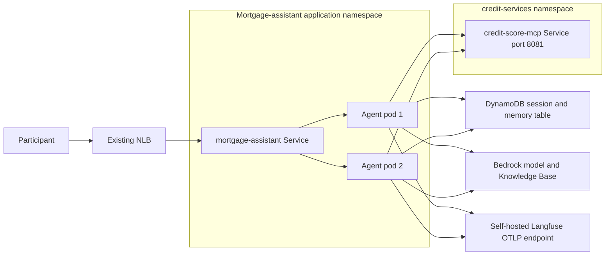

# Lab 6: Integrate MCP Tools with the Strands Agent

Lab 6 is a complete checkpoint of the instrumented mortgage assistant from Lab 05. Participants first initialize a pre-provisioned credit-score MCP server managed by the credit-services team, list and call its tool independently, then integrate that remote capability with the Strands supervisor and deploy the changed agent.
It preserves the FastAPI service, three mortgage specialists, calculator,
DynamoDB session snapshots, semantic long-term memory, OpenTelemetry tracing
to self-hosted Langfuse, participant state client, inspection and hydration
utilities, two EKS replicas, and the existing Network Load Balancer. It adds
one remote Model Context Protocol (MCP) tool named
`get_credit_score`.

This directory is self-contained. Runtime modules do not import files from an
earlier lab.

## Architecture



Each `/invoke` request creates a new supervisor for the supplied actor and
session. The supervisor receives:

- `answer_general_mortgage_questions`
- `answer_existing_mortgage_questions`
- `answer_new_loan_application_questions`
- `calculator`
- the remote `get_credit_score` MCP tool
- the Lab 05 `SnapshotSessionManager` and `MemoryManager`
- shared actor, session, and request trace attributes exported to Langfuse

The API starts one root request span before MCP initialization. The application
then opens a Strands `MCPClient`, initializes the Streamable HTTP transport,
discovers the MCP server tools, validates the exact contract, creates the
supervisor, and invokes it while the MCP client context and request span remain
open. The response includes the active `trace_id` for correlation in Langfuse.
MCP discovery occurs before the supervisor selects a route, so MCP server failure
affects every `/invoke` request, including prompts that would otherwise use
only the Knowledge Base, calculator, or memory. The request fails safely if
`CREDIT_SCORE_MCP_URL` is absent, malformed, the MCP server is unavailable, or
the MCP server exposes anything other than exactly one tool named
`get_credit_score`.

The pinned MCP transport uses bounded HTTP defaults: 30 seconds for connect,
write, and pool operations and 300 seconds for stream reads. Strands startup is
bounded to 30 seconds. The participant explorer uses a 30-second MCP request
read timeout.

## MCP server ownership boundary

Lab 6 uses but never deploys, modifies, restarts, scales, replaces, or deletes the credit-score MCP server:

```text
credit-services/service/credit-score-mcp:8081
```

Workshop Studio deploys the `credit-services` namespace, Deployment, Service,
endpoint, and configuration before participants begin. The credit-services team
manages the MCP server, and participants only inspect and invoke it. In production,
another organizational team could own and maintain the MCP server in another
account, network, or EKS cluster. The workshop simulates that lifecycle boundary
with a separate namespace in the same cluster; it is not hard isolation.

Lab 6 owns the `mortgage-assistant` namespace and
continues to replace the earlier checkpoint's `mortgage-assistant` Deployment in place.
The existing service account, API-key Secret, and NLB Service names are
preserved.

The cleanup script deletes only the `mortgage-assistant` application namespace.
It does not touch `credit-services` or shared AWS infrastructure.

## Credit-score safety policy

Use synthetic workshop customer IDs only. Do not enter real customer or
financial data.

The supervisor is instructed to:

- call `get_credit_score` only for an explicit credit-score request that
  includes a customer ID;
- treat a returned score as data only;
- never interpret a score as approval, denial, pricing, eligibility, or
  financial advice;
- never invent a score;
- report tool failures rather than fabricate a result; and
- never store customer IDs or credit scores in long-term memory.

Lab 05 memory and telemetry rules remain in force: durable mortgage goals and
preferences may be stored, but customer IDs, account numbers, authentication
data, exact income, uploaded documents, and sensitive financial identifiers
must not be stored. Prompt and response attributes can be masked before trace
export with `TELEMETRY_MASK_CONTENT=true`.

## Files

```text
06-mcp-credit-score/
├── app/
│   ├── credit_score_mcp.py
│   ├── inspect_memory.py
│   ├── invoke_eks.py
│   ├── memory.py
│   ├── mortgage_agent.py
│   ├── mortgage_api.py
│   └── telemetry.py
├── k8s/
│   ├── base.yaml
│   └── service.template.yaml
├── scripts/
│   ├── cleanup-mcp-integration.sh
│   ├── deploy-mcp-integration.sh
│   ├── explore_credit_score_mcp.py
│   ├── hydrate_memory.py
│   └── validate_otlp_headers.py
├── tests/
├── Dockerfile
├── pyproject.toml
└── uv.lock
```

The direct MCP dependency is pinned to `mcp==2.1.1`, and the Strands `otel`
extra supplies the OTLP/HTTP exporter used by Langfuse. The lockfile captures
the complete compatible environment.

## Resource discovery

The deployment uses these Workshop Studio Parameter Store paths:

| Resource | Parameter Store path |
|---|---|
| EKS cluster | `/workshop/mortgage-assistant/eks/cluster-name` |
| ECR repository | `/workshop/mortgage-assistant/ecr/repository-uri` |
| DynamoDB memory table | `/workshop/mortgage-assistant/memory/table-name` |
| DynamoDB vector index | `/workshop/mortgage-assistant/memory/vector-index-name` |
| Bedrock Knowledge Base | `/workshop/mortgage-assistant/bedrock/knowledge-base-id` |
| Langfuse OTLP endpoint | `/workshop/mortgage-assistant/langfuse/otlp-endpoint` |
| Langfuse UI | `/workshop/mortgage-assistant/langfuse/url` |
| Credit-score MCP URL | `/workshop/mortgage-assistant/mcp/credit-score-url` |

The MCP URL is required in the application as `CREDIT_SCORE_MCP_URL` and is
validated against the fixed credit-score MCP server identity:

```text
http://credit-score-mcp.credit-services.svc.cluster.local:8081/mcp
```

The explorer does not accept an arbitrary URL. It always uses a temporary
loopback-only `kubectl port-forward` to the fixed credit-score MCP Service and local
`/mcp` path.

## Prerequisites

- Python 3.12 or later and `uv`
- AWS CLI v2
- `kubectl` access to the workshop EKS cluster
- Docker Buildx or a Docker-compatible builder
- completed Lab 5 observability deployment, including the namespaced
  `langfuse-otel-auth` Secret
- active credit-score MCP Deployment, Service, and endpoints in `credit-services`

Confirm identity and cluster access:

```bash
aws sts get-caller-identity
kubectl get nodes
kubectl get deployment,service,endpoints --namespace credit-services
```

## Validate locally

```bash
cd 06-mcp-credit-score
uv run python -m unittest discover \
  --start-directory tests \
  --verbose

bash -n scripts/deploy-mcp-integration.sh
bash -n scripts/cleanup-mcp-integration.sh
```

The first `uv run` command creates the lab-local environment, installs its
locked dependencies, and runs the tests. The tests use mocks, local source
inspection, and a real local loopback Streamable HTTP contract fixture that
initializes MCP, discovers the tool, and calls it. They do not call AWS,
Kubernetes, Bedrock, DynamoDB, the NLB, the credit-score MCP server in
`credit-services`, or an external network.

## Explore the credit-score MCP server contract

Every explorer operation:

1. finds a free loopback port;
2. starts `kubectl port-forward` from the fixed credit-score MCP Service port 8081;
3. waits until the tunnel accepts connections;
4. creates a real MCP `ClientSession`;
5. initializes the protocol and lists tools;
6. requires exactly one `get_credit_score` tool; and
7. terminates or kills the port-forward in `finally`.

Show server initialization details:

```bash
uv run scripts/explore_credit_score_mcp.py info
```

List tools:

```bash
uv run scripts/explore_credit_score_mcp.py list-tools
```

Inspect the expected tool schema:

```bash
uv run scripts/explore_credit_score_mcp.py inspect-tool
```

Call the MCP server with synthetic data:

```bash
uv run scripts/explore_credit_score_mcp.py \
  call-credit-score \
  --customer-id workshop-customer-12345
```

Run the deployment preflight contract check:

```bash
uv run scripts/explore_credit_score_mcp.py verify
```

Output is structured, indented JSON. Failures are written to standard error
and return a nonzero status.

## Deploy the integrated `mortgage-assistant` application

```bash
chmod +x \
  scripts/deploy-mcp-integration.sh \
  scripts/cleanup-mcp-integration.sh \
  scripts/explore_credit_score_mcp.py \
  scripts/hydrate_memory.py

./scripts/deploy-mcp-integration.sh --region us-west-2
```

For a named profile or explicit source CIDR:

```bash
./scripts/deploy-mcp-integration.sh \
  --region us-west-2 \
  --profile YOUR_PROFILE \
  --service-access-cidr 203.0.113.10/32
```

The deployment script:

1. discovers the cluster, ECR repository, memory table/index, Knowledge Base,
   Langfuse OTLP endpoint/UI, and MCP URL;
2. verifies the memory table, vector index, and Lab 5 `langfuse-otel-auth`
   Secret are available;
3. checks the existing credit-score MCP Deployment, Service, and ready endpoint on
   port 8081;
4. runs the fixed-target explorer `verify` operation before building;
5. builds and pushes a Linux AMD64 image tagged
   `lab06-agent-<UTC timestamp>`;
6. applies only `mortgage-assistant` Kubernetes resources;
7. reapplies the API-key Secret, retaining its existing value unless explicitly overridden, and reads the existing Langfuse OTLP Secret without reapplying it;
8. injects MCP, OTLP, content-masking, and fault-injection configuration into
   both application replicas;
9. waits for rollout, NLB discovery, and readiness; and
10. sends an explicit synthetic credit-score smoke test and requires a
    returned `trace_id`.

The script does not print the `mortgage-assistant` API key.

## Invoke the integrated agent

The Lab 05 state client and trace-ID output are preserved. It derives an actor from the AWS account
and keeps the current session in:

```text
06-mcp-credit-score/.workshop/client-state.json
```

Request a synthetic credit score:

```bash
uv run app/invoke_eks.py \
  --region us-west-2 \
  --prompt "Get the credit score for synthetic customer ID workshop-customer-12345."
```

Display or replace the current session:

```bash
uv run app/invoke_eks.py --region us-west-2 --show-context
uv run app/invoke_eks.py --region us-west-2 --new-session \
  --prompt "What mortgage preferences do you remember?"
```

Existing routes remain unchanged:

- `GET /health`
- `GET /health/ready`
- `POST /invoke`

`POST /invoke` still requires `prompt`, `actor_id`, and `session_id` and returns
a nullable `trace_id`. For MCP readiness, the endpoint checks the configured
fixed URL without opening a live connection; it also resolves the Knowledge
Base ID and reports model/memory configuration.

## Preserved Lab 05 memory operations

Test same-session state:

```bash
uv run app/invoke_eks.py --prompt \
  "I am considering a property worth 600,000 dollars."
uv run app/invoke_eks.py --prompt \
  "What property value did I mention in this conversation?"
```

Prove state survives replacement:

```bash
kubectl rollout restart deployment/mortgage-assistant \
  --namespace mortgage-assistant
kubectl rollout status deployment/mortgage-assistant \
  --namespace mortgage-assistant
uv run app/invoke_eks.py --prompt \
  "What property value did I tell you earlier?"
```

Seed, inspect, search, and clear deterministic long-term memories:

```bash
uv run scripts/hydrate_memory.py seed --replace
uv run app/inspect_memory.py --memories
uv run app/inspect_memory.py --search "preferred repayment period"
uv run scripts/hydrate_memory.py clear
uv run scripts/hydrate_memory.py clear --all-data
```

`clear --all-data` removes both sessions and long-term memories for the selected
actor. DynamoDB vector indexes are eventually consistent, so the utilities can
wait up to 60 seconds for search visibility.

Test durable recall across sessions:

```bash
uv run app/invoke_eks.py --prompt \
  "Remember for future conversations that I prefer a 15-year fixed-rate mortgage."
uv run app/invoke_eks.py --new-session --prompt \
  "What mortgage term do I prefer?"
```

Test actor isolation:

```bash
uv run app/invoke_eks.py \
  --actor-id alternate-user \
  --new-session \
  --prompt "What mortgage preferences do you remember about me?"
```

Actor partitioning is application-level isolation, not authorization. A
production API must derive the actor from authenticated identity instead of
trusting a caller-provided value.

## Kubernetes and container controls

Lab 6 preserves Lab 05 controls:

- two replicas with rolling updates;
- Pod Disruption Budget with `minAvailable: 1`;
- readiness and liveness probes;
- CPU and memory requests and limits;
- non-root UID/GID 10001;
- read-only root filesystem;
- all Linux capabilities dropped;
- RuntimeDefault seccomp;
- restricted Pod Security labels;
- disabled service-account token automount;
- bounded `/tmp` volume; and
- one bounded-concurrency Uvicorn worker per pod.

AWS access remains through the existing EKS Pod Identity association. No AWS
credentials are stored in this checkpoint or image.

This checkpoint intentionally preserves the existing Lab 05 internet-facing,
source-CIDR-restricted HTTP NLB. That workshop transport does not provide TLS.
A production deployment must terminate TLS, use HTTPS clients, replace the
shared bearer key with individual authentication, and enforce an egress policy
for the credit-score MCP server destination.

## Langfuse tracing exercise

After a synthetic credit-score request, compare immediate logs from both
workloads:

```bash
kubectl logs deployment/mortgage-assistant \
  --namespace mortgage-assistant \
  --tail=100
kubectl logs deployment/credit-score-mcp \
  --namespace credit-services \
  --tail=100
```

The invocation client prints `Trace ID: ...` when tracing is configured. Open
the Langfuse UI from `/workshop/mortgage-assistant/langfuse/url`, select
**Tracing**, and locate that trace ID. Inspect the root request, supervisor,
model, and tool spans and compare their durations with a general mortgage
request.

The remote operation can appear as a named tool span, an HTTP client span, or
nested work beneath the supervisor. Cross-service trace joining from the
credit-score MCP server is not part of this checkpoint. The absence of a
particular MCP-labeled span does not prove a contract failure; use the explorer
`verify` operation, API response, MCP server logs, and trace error/latency
evidence together. CloudWatch Container Insights and workload logs remain
supplementary platform telemetry. Use only synthetic data because logs and
traces can retain request-related values.

## Troubleshooting

### `CREDIT_SCORE_MCP_URL is required`

Confirm the Parameter Store value and rendered Deployment environment:

```bash
aws ssm get-parameter \
  --name /workshop/mortgage-assistant/mcp/credit-score-url \
  --region us-west-2
kubectl get deployment mortgage-assistant \
  --namespace mortgage-assistant \
  --output jsonpath='{range .spec.template.spec.containers[0].env[*]}{.name}={.value}{"\n"}{end}' |
grep CREDIT_SCORE_MCP_URL
```

### Credit-score MCP server verification fails

The `mortgage-assistant` deployment does not repair credit-score MCP server
resources. Inspect them and use the Workshop Studio support path if they are
missing or unhealthy:

```bash
kubectl get deployment,service,endpoints,pods \
  --namespace credit-services
kubectl logs deployment/credit-score-mcp \
  --namespace credit-services \
  --tail=100
```

### Unexpected or missing tools

Run:

```bash
uv run scripts/explore_credit_score_mcp.py list-tools
uv run scripts/explore_credit_score_mcp.py inspect-tool
```

The MCP server contract must contain exactly one tool named
`get_credit_score`. Lab 6 rejects extra tools rather than broadening agent
capabilities silently.

### MCP port-forward does not start

Check `kubectl` context and permissions. The explorer binds only to
`127.0.0.1`, automatically selects a free local port, and always attempts to
terminate the child process. It does not accept a remote URL override.

### Memory is not recalled

Use `app/invoke_eks.py --show-context` to confirm the same actor and session,
then inspect records with `app/inspect_memory.py`. Long-term memory must be
explicitly requested or stated as a durable preference. Customer IDs and
credit scores intentionally must not become long-term memories.

## Cleanup

```bash
./scripts/cleanup-mcp-integration.sh --region us-west-2
```

This removes the `mortgage-assistant` application namespace and its NLB,
API-key Secret, and Langfuse OTLP Secret. It leaves the `credit-services`
namespace managed for the credit-services team, Workshop Studio-managed
Langfuse infrastructure, memory table, vector index, ECR repository, EKS
cluster, Knowledge Base, IAM resources, and Parameter Store values unchanged.
