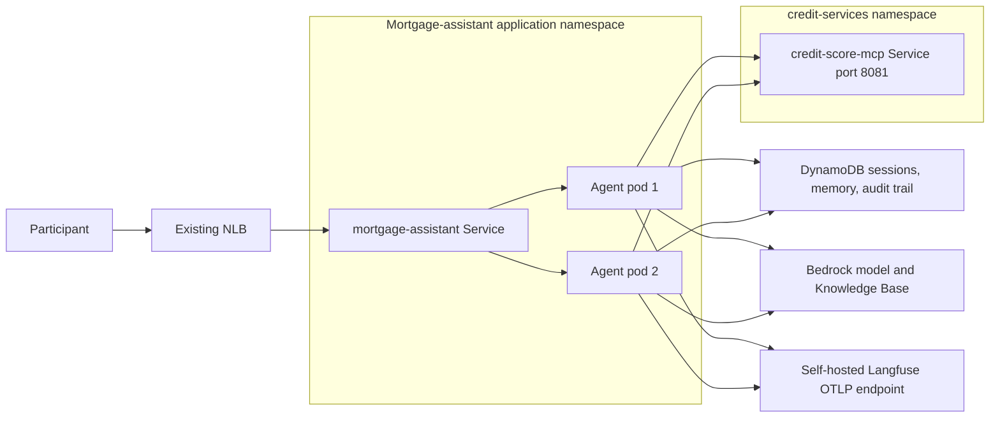

# Lab 6: Integrate MCP Tools with the Strands Agent

Lab 6 is a complete checkpoint of the instrumented, audited mortgage assistant from Lab 5. Participants first initialize a pre-provisioned credit-score MCP server managed by the credit-services team, list and call its tool independently, then integrate that remote capability with the Strands supervisor, deploy the changed agent, and watch the remote call appear in the audit trail.

It adds one remote Model Context Protocol (MCP) tool named `get_credit_score`.
Everything else is carried forward unchanged from Labs 4 and 5.

This directory is self-contained. Runtime modules do not import files from an
earlier lab.

## What you build on

This README documents only what Lab 6 adds. The rest of the service is the Lab 5 checkpoint, which itself builds on Lab 4:

- [Lab 4 (`../04-memory/README.md`)](../04-memory/README.md): the FastAPI service, the supervisor with three specialists as agents-as-tools (each with its own persistent session), DynamoDB session snapshots and semantic long-term memory, the hash-chained audit trail, `GET /executions/{request_id}`, `request_id` idempotency with resume and replay, the tool ledger, Strands-interrupt approvals (`--approve`, `--deny`, `--cancel`), the session lease with heartbeat, the 429 agent-turn cap, the fault-injection modes (`delay`, `error`, `abort`, `crash`), and the participant state client, inspection and hydration utilities.
- [Lab 5 (`../05-observability/README.md`)](../05-observability/README.md): OpenTelemetry tracing to self-hosted Langfuse, the `trace_id` in every response, content masking, and the `langfuse-otel-auth` Secret.

What Lab 6 adds:

- the remote `get_credit_score` MCP tool, wired into the supervisor only;
- `get_credit_score` as a side-effect-class tool in the audit trail: strictly audited, blocked if the audit write fails, and optionally approval-gated;
- the fixed-target MCP explorer and contract verification;
- MCP readiness and failure behavior; and
- two exercises that follow the credit-score call through the audit trail and behind an approval gate.

## Estimated time

Allow about 1 hour, including the optional approval-gating exercise: roughly 26
minutes of reading, 12 of typing, 10 of waiting for the deployment and requests,
and 5 in the Langfuse UI. A first image build with a cold cache adds about 10
minutes.

## Architecture


```mermaid
flowchart LR
    participant[Participant] --> nlb[Existing NLB]
    nlb --> service[mortgage-assistant Service]
    service --> pod1[Agent pod 1]
    service --> pod2[Agent pod 2]
    pod1 --> memory[DynamoDB sessions, memory, audit trail]
    pod2 --> memory
    pod1 --> kb[Bedrock model and Knowledge Base]
    pod2 --> kb
    pod1 --> mcp[credit-score-mcp Service port 8081]
    pod2 --> mcp
    pod1 --> langfuse[Self-hosted Langfuse OTLP endpoint]
    pod2 --> langfuse

    subgraph consumer[Mortgage-assistant application namespace]
        service
        pod1
        pod2
    end

    subgraph mcpserver[credit-services namespace]
        mcp
    end
```

Each agent run (a new prompt, a resume, or an approval decision) builds a new supervisor for the supplied actor and session. The supervisor receives:

- `general_mortgage_specialist`, `existing_mortgage_specialist`, and `new_application_specialist` (agents-as-tools from Lab 4);
- `calculator`;
- the remote `get_credit_score` MCP tool (new in Lab 6);
- the Lab 4 session manager and memory manager; and
- the Lab 5 actor, session, and request trace attributes.

The specialists never receive `get_credit_score`. Only the supervisor can call it.

The API starts one root request span, then the orchestrator takes the session lease and binds the audit trail. Inside the agent run, the application opens a Strands `MCPClient`, initializes the Streamable HTTP transport, discovers the MCP server tools, validates the exact contract, creates the supervisor, and invokes it while the MCP client context and request span remain open. The response includes the active `trace_id` for correlation in Langfuse and in the audit trail.

MCP discovery occurs before the supervisor selects a route, so an MCP server failure affects every request that actually runs the agent, including prompts that would otherwise use only the Knowledge Base, calculator, or memory. A request that is already `COMPLETED` is replayed from the stored response and does not contact the MCP server. See [MCP failure behavior](#mcp-failure-behavior).

The pinned MCP transport uses bounded HTTP defaults: 30 seconds for connect, write, and pool operations and 300 seconds for stream reads. Strands startup is bounded to 30 seconds. The participant explorer uses a 30-second MCP request read timeout.

## MCP server ownership boundary

Lab 6 uses but never deploys, modifies, restarts, scales, replaces, or deletes the credit-score MCP server:

```text
credit-services/service/credit-score-mcp:8081
```

Workshop Studio deploys the `credit-services` namespace, Deployment, Service, endpoint, and configuration before participants begin. The credit-services team manages the MCP server, and participants only inspect and invoke it. In production, another organizational team could own and maintain the MCP server in another account, network, or EKS cluster. The workshop simulates that lifecycle boundary with a separate namespace in the same cluster; it is not hard isolation.

Lab 6 owns the `mortgage-assistant` namespace and continues to replace the earlier checkpoint's `mortgage-assistant` Deployment in place. The existing service account, API-key Secret, and NLB Service names are preserved.

The cleanup script deletes only the `mortgage-assistant` application namespace. It does not touch `credit-services` or shared AWS infrastructure.

## Credit-score safety policy

Use synthetic workshop customer IDs only. Do not enter real customer or financial data.

The supervisor is instructed to:

- call `get_credit_score` only for an explicit credit-score request that includes a customer ID;
- treat a returned score as data only;
- never interpret a score as approval, denial, pricing, eligibility, or financial advice;
- never invent a score;
- report tool failures rather than fabricate a result; and
- never store customer IDs or credit scores in long-term memory.

The Lab 4 memory rules and Lab 5 telemetry rules remain in force: durable mortgage goals and preferences may be stored, but customer IDs, account numbers, authentication data, exact income, uploaded documents, and sensitive financial identifiers must not be stored. Prompt and response attributes can be masked before trace export with `--telemetry-mask-content` (`TELEMETRY_MASK_CONTENT=true`).

The audit trail is different. It records tool inputs and results, so a `get_credit_score` call stores the customer ID and returned score in the audit records in the DynamoDB memory table. Only keys named `password`, `token`, `authorization`, `api_key`, and `ssn` are redacted, and `--telemetry-mask-content` does not apply to the audit trail. This is another reason to use synthetic IDs only.

## `get_credit_score` in the audit trail

`get_credit_score` is in the audit trail's side-effect tool class (`SIDE_EFFECT_TOOLS` in `app/audit.py`, alongside `create_customer_id`, `create_loan_application`, and `add_memory`), even though the synthetic call does not change anything. The class means "reaches an external system or changes state", and it has stricter rules than ordinary audited events:

| Behavior | Effect on `get_credit_score` |
|---|---|
| Strict audit | The `tool_start` and `tool_call` records are written as critical records. |
| Fail closed | If the `tool_start` write fails, the tool is cancelled with `Audit trail unavailable; the action was not performed.` and the call never reaches the MCP server. Ordinary events only log and drop a failed audit write. |
| Lease check | If the session lease was lost, the call is cancelled with `The session lease was lost; the action was not performed.` |
| Approval (optional) | `get_credit_score` can be added to `APPROVAL_REQUIRED_TOOLS` (`--approval-required-tools`). The default gates only `create_loan_application`. |
| Tool ledger | Not applied. The ledger covers only the mock write tools `create_customer_id` and `create_loan_application`. A resumed request can call `get_credit_score` again. |

The supervisor sends each call as `get_credit_score(customer_id)`. The `tools_used` section of the explanation lists it as `supervisor/get_credit_score`.

## Files

```text
06-mcp-credit-score/
├── app/
│   ├── approvals.py
│   ├── audit.py
│   ├── credit_score_mcp.py
│   ├── execution.py
│   ├── inspect_audit.py
│   ├── inspect_memory.py
│   ├── invoke_eks.py
│   ├── ledger.py
│   ├── memory.py
│   ├── mortgage_agent.py
│   ├── mortgage_api.py
│   ├── resilience.py
│   ├── service.py
│   ├── store.py
│   └── telemetry.py
├── k8s/
│   ├── base.yaml
│   └── service.template.yaml
├── scripts/
│   ├── check_memory_ready.py
│   ├── cleanup-mcp-integration.sh
│   ├── deploy-mcp-integration.sh
│   ├── explore_credit_score_mcp.py
│   ├── hydrate_memory.py
│   └── validate_otlp_headers.py
├── tests/
├── Dockerfile
├── pyproject.toml
└── uv.lock
```

The Lab 6 additions are `app/credit_score_mcp.py` (URL validation, MCP connection, exact-contract check), the `get_credit_score` wiring in `app/mortgage_agent.py`, `scripts/explore_credit_score_mcp.py`, and the deploy and cleanup scripts.

The direct MCP dependency is pinned to `mcp==2.1.1`, and the Strands `otel` extra supplies the OTLP/HTTP exporter used by Langfuse. The lockfile captures the complete compatible environment.

## Resource discovery

The deployment uses these Workshop Studio Parameter Store paths:

| Resource | Parameter Store path |
|---|---|
| EKS cluster | `/workshop/mortgage-assistant/eks/cluster-name` |
| ECR repository | `/workshop/mortgage-assistant/ecr/repository-uri` |
| DynamoDB memory table | `/workshop/mortgage-assistant/memory/table-name` |
| DynamoDB vector index | `/workshop/mortgage-assistant/memory/vector-index-name` |
| Bedrock Knowledge Base | `/workshop/mortgage-assistant/bedrock/knowledge-base-id` |
| Langfuse OTLP endpoint | `/workshop/mortgage-assistant/langfuse/otlp-endpoint` |
| Langfuse UI | `/workshop/mortgage-assistant/langfuse/url` |
| Credit-score MCP URL | `/workshop/mortgage-assistant/mcp/credit-score-url` |

The MCP URL is required in the application as `CREDIT_SCORE_MCP_URL` and is validated against the fixed credit-score MCP server identity. A missing value, a non-HTTP URL, embedded credentials, or any other URL is rejected, both by the deploy script and by the application:

```text
http://credit-score-mcp.credit-services.svc.cluster.local:8081/mcp
```

The explorer does not accept an arbitrary URL. It always uses a temporary loopback-only `kubectl port-forward` to the fixed credit-score MCP Service and local `/mcp` path.

## Prerequisites

- Labs 0 through 5 completed in the same Workshop Studio environment.
- **Do not run the Lab 5 cleanup before Lab 6.** It deletes the `mortgage-assistant` namespace, including the namespaced `langfuse-otel-auth` Secret that Lab 6 reuses. The Lab 6 deploy script stops with an error if that Secret is missing or its OTLP headers are invalid.
- Python 3.12 or later and `uv`
- AWS CLI v2, `kubectl` access to the workshop EKS cluster, `curl`, `python3`, `openssl`, and Docker Buildx or a Docker-compatible builder (the script falls back to plain `docker build` if `buildx` is missing)
- An active credit-score MCP Deployment, Service, and endpoints in `credit-services`

All commands in this README run from the `06-mcp-credit-score` directory unless noted:

```bash
cd 06-mcp-credit-score    # from the repository root
```

Confirm identity and cluster access:

```bash
aws sts get-caller-identity
kubectl get nodes
kubectl get deployment,service,endpoints --namespace credit-services
```

## Validate locally

```bash
uv sync --frozen
uv run python -m unittest discover \
  --start-directory tests \
  --verbose

bash -n scripts/deploy-mcp-integration.sh
bash -n scripts/cleanup-mcp-integration.sh
```

The first `uv sync` creates the lab-local environment and installs its locked dependencies. The tests use mocks, local source inspection, a scripted model that drives the real supervisor, specialists, hooks, and orchestrator, and a real local loopback Streamable HTTP contract fixture that initializes MCP, discovers the tool, and calls it. They do not call AWS, Kubernetes, Bedrock, DynamoDB, the NLB, the credit-score MCP server in `credit-services`, or an external network.

## Explore the credit-score MCP server contract

Every explorer operation:

1. finds a free loopback port;
2. starts `kubectl port-forward` from the fixed credit-score MCP Service port 8081;
3. waits until the tunnel accepts connections;
4. creates a real MCP `ClientSession`;
5. initializes the protocol and lists every page of tools;
6. requires exactly one `get_credit_score` tool; and
7. terminates or kills the port-forward in `finally`.

Show server initialization details:

```bash
uv run scripts/explore_credit_score_mcp.py info
```

List tools:

```bash
uv run scripts/explore_credit_score_mcp.py list-tools
```

Inspect the expected tool schema:

```bash
uv run scripts/explore_credit_score_mcp.py inspect-tool
```

Call the MCP server with synthetic data:

```bash
uv run scripts/explore_credit_score_mcp.py \
  call-credit-score \
  --customer-id workshop-customer-12345
```

Run the deployment preflight contract check:

```bash
uv run scripts/explore_credit_score_mcp.py verify
```

`verify` calls `get_credit_score` with the synthetic ID `lab06-explorer-verify` and requires a non-error, structured result whose `customer_id` echoes that ID, whose `credit_score` is `80`, and whose `source` is `synthetic-workshop`. The deploy script runs `verify` before building anything, so a broken or changed MCP server stops the deployment early.

Output is structured, indented JSON. Failures are written to standard error and return a nonzero status.

## Deploy the integrated `mortgage-assistant` application

```bash
chmod +x \
  scripts/deploy-mcp-integration.sh \
  scripts/cleanup-mcp-integration.sh \
  scripts/explore_credit_score_mcp.py \
  scripts/hydrate_memory.py

./scripts/deploy-mcp-integration.sh --region us-west-2
```

For a named profile or explicit source CIDR:

```bash
./scripts/deploy-mcp-integration.sh \
  --region us-west-2 \
  --profile YOUR_PROFILE \
  --service-access-cidr 203.0.113.10/32
```

### Deploy flags

| Flag | Effect |
|---|---|
| `--region REGION` | AWS Region (default `us-west-2`). |
| `--profile PROFILE` | AWS CLI profile; omit to use the default profile. |
| `--service-access-cidr CIDR` | CIDR allowed to reach the NLB. Defaults to your detected public IPv4 address as a `/32`. |
| `--session-ttl-seconds N` | Short-term session retention, at least 3600 (default 604800). |
| `--prompt TEXT` | Synthetic smoke-test prompt. The default asks for the credit score of `workshop-customer-12345`. |
| `--telemetry-mask-content` | Redact prompt and response span attributes before trace export. |
| `--approval-required-tools LIST` | Comma-separated tools that need human approval (default `create_loan_application`; empty disables). |
| `--lease-seconds N` | Per-session lease, at least 30 (default 180). A crashed request can be retried after it expires. |
| `--enable-reasoning` | Capture Bedrock extended thinking in the audit trail. |
| `--no-snapshot-history` | Keep only the latest snapshot per agent. |
| `--image-uri URI` | Deploy an image that is already in ECR and skip the build and push, so a settings change takes about 2 minutes. |
| `--fault-injection-enabled` | Enable the fault-injection exercises from Lab 4. |
| `--fault-injection-tool NAME` | Tool to target (default `get_mortgage_details`). |
| `--fault-injection-mode MODE` | `delay` (default), `error`, `abort`, or `crash`. |
| `--fault-injection-delay-seconds N` | Delay used in `delay` mode (default 5). |

Fault injection is wired into `get_mortgage_details` only, so other tool names, including `get_credit_score`, do nothing. To set the API key yourself instead of reusing the existing one, export `MORTGAGE_API_KEY` before running the script.

### What the deployment script does

1. discovers the cluster, ECR repository, memory table and vector index, Knowledge Base, Langfuse OTLP endpoint and UI, and MCP URL, and requires the MCP URL to match the fixed credit-score MCP Service;
2. verifies the memory table and vector index are `ACTIVE`, then configures `kubectl` and checks the AWS Load Balancer Controller;
3. checks the existing credit-score MCP Deployment, Service, and ready endpoint on port 8081, then runs the fixed-target explorer `verify` operation before building;
4. verifies the Lab 5 `langfuse-otel-auth` Secret exists and passes `scripts/validate_otlp_headers.py`;
5. builds and pushes a Linux AMD64 image tagged `lab06-agent-<UTC timestamp>`, unless `--image-uri` is given;
6. applies only `mortgage-assistant` Kubernetes resources, reapplying the API-key Secret (retaining its existing value unless `MORTGAGE_API_KEY` is set) and reading, but not reapplying, the Langfuse OTLP Secret;
7. injects MCP, OTLP, content-masking, approval, lease, reasoning, snapshot, and fault-injection configuration into both application replicas;
8. waits for rollout, NLB discovery, and two consecutive successful `/health/ready` checks; and
9. sends an explicit synthetic credit-score smoke test, requires a returned `trace_id`, fetches the request's audit trail, requires `chain_valid`, status `COMPLETED`, and a non-empty trail, and replays the same `request_id` to confirm the stored response comes back without a new attempt.

The script does not print the `mortgage-assistant` API key.

## Invoke the integrated agent

The Lab 5 state client and trace-ID output are preserved. The client derives an actor from the AWS account and keeps the current session and last request ID in:

```text
06-mcp-credit-score/.workshop/client-state.json
```

Request a synthetic credit score:

```bash
uv run app/invoke_eks.py \
  --region us-west-2 \
  --prompt "Get the credit score for synthetic customer ID workshop-customer-12345."
```

`--trail`, `--resume`, `--approve`, `--deny`, and `--cancel` accept a request ID or `last`, which means the most recent `--prompt` for the current actor. Display or replace the current session:

```bash
uv run app/invoke_eks.py --region us-west-2 --show-context
uv run app/invoke_eks.py --region us-west-2 --new-session \
  --prompt "What mortgage preferences do you remember?"
```

The API routes are unchanged from Lab 4:

- `GET /health`
- `GET /health/ready`
- `POST /invoke`
- `GET /executions/{request_id}`, `POST /executions/{request_id}/resume`, `/approvals`, and `/cancel`
- `GET /sessions/{session_id}/executions`

`POST /invoke` still requires `prompt`, `actor_id`, and `session_id`, accepts an optional `request_id`, and returns a nullable `trace_id`.

### Readiness

For MCP readiness, `GET /health/ready` only checks that `CREDIT_SCORE_MCP_URL` is present and equals the fixed URL. It does not open a live connection, and it reports `"credit_score_mcp": "configured"` without echoing the URL. It also resolves the Knowledge Base ID and reports the model and memory configuration.

Two consequences follow:

- a missing or wrong `CREDIT_SCORE_MCP_URL` keeps pods from becoming ready, so the rollout and the NLB targets fail early; and
- an MCP server that is configured but down does not make the pods unready. Readiness stays green and requests fail instead (see below).

## MCP failure behavior

| Situation | What happens |
|---|---|
| `CREDIT_SCORE_MCP_URL` is missing, malformed, has embedded credentials, or is not the fixed URL | `/health/ready` fails and the pod is not ready. If it reached an agent run, the run would fail with a `CREDIT_SCORE_MCP_URL ...` error. |
| The MCP server is unreachable, does not initialize within 30 seconds, or the connection fails during startup | The run fails before the supervisor is built with `The credit-score MCP server is unavailable or has an invalid contract`. This applies to every prompt, not just credit-score prompts. |
| The server exposes anything other than exactly one tool named `get_credit_score` | Same fail-fast path, with `Credit-score MCP server must expose exactly one tool named get_credit_score; found: ...`. Extra tools are rejected rather than silently broadening agent capabilities. |
| `get_credit_score` raises (connection reset, timeout, protocol error) after the supervisor has started | `FailFastHook` ends the request: it is `FAILED` and resumable with the same `request_id`, like a startup failure. |
| `get_credit_score` returns an error result (for example an unknown customer) | The error becomes an ordinary tool result with status `error`, recorded in the audit trail. The supervisor is instructed to say the score could not be retrieved without inventing one, so the request normally ends `COMPLETED` with that explanation. |
| The `tool_start` audit write fails, or the lease was lost | The call is cancelled before it reaches the MCP server (see [`get_credit_score` in the audit trail](#get_credit_score-in-the-audit-trail)). |

The first two rows are fail-fast failures. The orchestrator records an `execution_failed` audit record, the execution becomes `FAILED`, and the API returns HTTP 500 with `retry with the same request_id to resume`. The client prints the request ID and the retry command:

```bash
uv run app/invoke_eks.py --resume last
# or send the same prompt again with the same ID:
uv run app/invoke_eks.py --request-id REQUEST_ID --prompt "SAME PROMPT"
```

Resuming starts attempt 2 of the same request using the Lab 4 resume rules (rollback of the unfinished turn, then re-run). It reconnects to the MCP server, so it succeeds once the credit-services team has restored the server. Sending the same `request_id` with a different prompt is rejected.

`FailFastHook` from Lab 4 watches the specialist agents-as-tools and, in this lab, also treats an exception raised by `get_credit_score` (`FAIL_FAST_TOOLS` in `app/mortgage_agent.py`) as a failure. A result the tool returns with an error status is a domain answer, so the model reports it instead. To get a fresh attempt after such a response, send the prompt again as a new request. Re-sending the same `request_id` of a `COMPLETED` request returns the stored response (a replay) without calling the MCP server.

## Exercise: follow the credit-score call in the audit trail

Send a synthetic credit-score request, then print its audit trail:

```bash
uv run app/invoke_eks.py \
  --region us-west-2 \
  --prompt "Get the credit score for synthetic customer ID workshop-customer-12345."

uv run app/invoke_eks.py --region us-west-2 --trail last
```

Expect a header with the request status and `hash chain valid`, followed by the explanation and one row per audit record. Look for:

- a `tool supervisor/get_credit_score: success` line under the explanation. There is no `routed to ...` line unless the supervisor also called a specialist;
- a `decision` record in which the supervisor chooses `get_credit_score`;
- a `tool_start` record, which is the critical record written before the MCP call, followed by a `tool_call` record with the result; and
- the `invocation_start`, `execution_start`, and `execution_completed` records from the Lab 4 request lifecycle.

Print the full records to see the tool input and the returned score:

```bash
uv run app/invoke_eks.py --region us-west-2 --trail last --json
```

Find the `tool_call` record for `get_credit_score`. Its `data` holds `input` (the customer ID), `status`, `result`, and `duration_s`, and every record carries the request's `trace_id`.

Then compare it with a request that does not use the tool:

```bash
uv run app/invoke_eks.py --region us-west-2 --prompt "What is a fixed-rate mortgage?"
uv run app/invoke_eks.py --region us-west-2 --trail last
```

This trail shows a route to `general_mortgage_specialist` and no `get_credit_score` records, even though the MCP connection was still opened and validated for the request. You can also read the same trail directly from DynamoDB with `uv run app/inspect_audit.py --region us-west-2 --session-id SESSION_ID --request-id REQUEST_ID --records`, which uses your AWS identity instead of the API key.

## Exercise (optional): gate `get_credit_score` behind approval

Redeploy with `get_credit_score` added to the approval list. Reuse the image your previous deployment printed as `Image:` so the change takes about 2 minutes, and use a non-credit-score smoke-test prompt. The default smoke test asks for a credit score, which would now pause for approval, and the script requires the smoke request to finish as `COMPLETED`:

```bash
./scripts/deploy-mcp-integration.sh \
  --region us-west-2 \
  --image-uri IMAGE_URI_PRINTED_BY_YOUR_PREVIOUS_DEPLOY \
  --approval-required-tools create_loan_application,get_credit_score \
  --prompt "What is a fixed-rate mortgage?"
```

Send the credit-score request again:

```bash
uv run app/invoke_eks.py \
  --region us-west-2 \
  --prompt "Get the credit score for synthetic customer ID workshop-customer-12345."
```

The request pauses with status `awaiting_approval` and prints `approve_get_credit_score` with the tool input. Inspect the paused request, then decide:

```bash
uv run app/invoke_eks.py --region us-west-2 --trail last
uv run app/invoke_eks.py --region us-west-2 --approve last --reviewer YOUR_NAME
# or: --deny last --comment "Not needed"
# or: --cancel last to abandon the paused request
```

What to observe:

- while the request is paused, the audit trail has a `tool_start` for `get_credit_score` (the audit hook still runs when the approval interrupt is raised) but no `tool_call`, so the call has not reached the MCP server. The only `tool_call` is written when the call actually runs;
- after `--approve`, the request completes as attempt 2 and the trail gains an `approval` record naming the reviewer, a second `tool_start`, and the `tool_call` for `get_credit_score`;
- after `--deny`, the trail records the denial and the tool call is cancelled with `Denied by reviewer ...`, so the MCP server is never called and the supervisor reports that the score was not retrieved; and
- while a request awaits approval, new prompts in the same session are rejected with HTTP 409 until you approve, deny, or cancel it.

The paused request holds no MCP connection. Approving a request reconnects to the MCP server and rediscovers the contract, so if the server is unavailable at that moment the decision run fails and the request returns to `awaiting_approval`. Run `--approve last` again after the server recovers.

When you finish, restore the default policy:

```bash
./scripts/deploy-mcp-integration.sh \
  --region us-west-2 \
  --image-uri IMAGE_URI_PRINTED_BY_YOUR_PREVIOUS_DEPLOY
```

## Kubernetes and container controls

Lab 6 preserves the Lab 4 and Lab 5 controls:

- two replicas with rolling updates (`maxUnavailable: 0`);
- Pod Disruption Budget with `minAvailable: 1`;
- startup, readiness, and liveness probes;
- CPU and memory requests and limits;
- non-root UID/GID 10001;
- read-only root filesystem;
- all Linux capabilities dropped;
- RuntimeDefault seccomp;
- restricted Pod Security labels;
- disabled service-account token automount;
- bounded `/tmp` volume;
- one Uvicorn worker per pod, with bounded concurrency and a 429 cap on concurrent agent turns; and
- a long graceful-shutdown window so in-flight requests can finish.

Lab 6 adds one setting: the `CREDIT_SCORE_MCP_URL` environment variable on the Deployment.

AWS access remains through the existing EKS Pod Identity association. No AWS credentials are stored in this checkpoint or image.

This checkpoint intentionally preserves the existing internet-facing, source-CIDR-restricted HTTP NLB. That workshop transport does not provide TLS. A production deployment must terminate TLS, use HTTPS clients, replace the shared bearer key with individual authentication, and enforce an egress policy for the credit-score MCP server destination.

## Langfuse tracing exercise

After a synthetic credit-score request, compare immediate logs from both workloads:

```bash
kubectl logs deployment/mortgage-assistant \
  --namespace mortgage-assistant \
  --tail=100
kubectl logs deployment/credit-score-mcp \
  --namespace credit-services \
  --tail=100
```

`kubectl logs deployment/...` reads one pod (it prints `Found 2 pods, using pod/...`), and readiness probes fill most of the 100 lines. If you do not see your `POST /invoke` (or `POST /mcp`) line, read both replicas and filter out the probes:

```bash
kubectl logs --namespace mortgage-assistant \
  --selector app.kubernetes.io/name=mortgage-assistant --prefix --tail=100 | grep -v "GET /health"
```

The invocation client prints `Trace ID: ...` when tracing is configured. Open the Langfuse UI from `/workshop/mortgage-assistant/langfuse/url`, select **Tracing**, and locate that trace ID. Inspect the root request, supervisor, model, and tool spans and compare their durations with a general mortgage request. The same `trace_id` is stored on the execution and on every audit record (`--trail last --json`), so you can move between the audit trail and the trace.

The remote operation can appear as a named tool span, an HTTP client span, or nested work beneath the supervisor. Cross-service trace joining from the credit-score MCP server is not part of this checkpoint: the supervisor's span for the call is visible in Langfuse, but spans from the MCP server itself are not joined to it. The absence of a particular MCP-labeled span does not prove a contract failure; use the explorer `verify` operation, the API response, the audit trail, MCP server logs, and trace error and latency evidence together. CloudWatch Container Insights and workload logs remain supplementary platform telemetry. Use only synthetic data because logs, traces, and audit records can retain request-related values.

## Troubleshooting

### `CREDIT_SCORE_MCP_URL is required`

Confirm the Parameter Store value and rendered Deployment environment:

```bash
aws ssm get-parameter \
  --name /workshop/mortgage-assistant/mcp/credit-score-url \
  --region us-west-2
kubectl get deployment mortgage-assistant \
  --namespace mortgage-assistant \
  --output jsonpath='{range .spec.template.spec.containers[0].env[*]}{.name}={.value}{"\n"}{end}' |
grep CREDIT_SCORE_MCP_URL
```

### Credit-score MCP server verification fails

The `mortgage-assistant` deployment does not repair credit-score MCP server resources. Inspect them and use the Workshop Studio support path if they are missing or unhealthy:

```bash
kubectl get deployment,service,endpoints,pods \
  --namespace credit-services
kubectl logs deployment/credit-score-mcp \
  --namespace credit-services \
  --tail=100
```

### Unexpected or missing tools

Run:

```bash
uv run scripts/explore_credit_score_mcp.py list-tools
uv run scripts/explore_credit_score_mcp.py inspect-tool
```

The MCP server contract must contain exactly one tool named `get_credit_score`. Lab 6 rejects extra tools rather than broadening agent capabilities silently.

### MCP port-forward does not start

Check `kubectl` context and permissions. The explorer binds only to `127.0.0.1`, automatically selects a free local port, and always attempts to terminate the child process. It does not accept a remote URL override.

### Requests fail with HTTP 500 and mention retrying

The MCP server was probably unreachable or returned an unexpected contract. Run the explorer `verify` operation. When it passes again, resume with `uv run app/invoke_eks.py --resume last`. If the server stays unhealthy, contact the credit-services team through the Workshop Studio support path; do not try to change it yourself.

### The deploy script stops at the Langfuse Secret

`The Langfuse OTLP Secret from Lab 5 is missing` or `invalid OTLP headers` means the `langfuse-otel-auth` Secret is gone or damaged. Running the Lab 5 or Lab 6 cleanup deletes the `mortgage-assistant` namespace and that Secret. Rerun the Lab 5 deploy script to recreate it, then rerun the Lab 6 deploy.

### The deploy script fails its smoke verification after gating `get_credit_score`

The default smoke prompt asks for a credit score, which pauses for approval when `get_credit_score` is gated, so the execution is `INTERRUPTED` instead of `COMPLETED`. The Deployment is already applied. Rerun the script with `--prompt "What is a fixed-rate mortgage?"` (and `--image-uri`) so the smoke request completes.

### HTTP 409 or 429 responses

A 409 means the session is busy, the request is awaiting approval, or the `request_id` was reused with a different prompt. Use `--trail last`, then `--approve`, `--deny`, or `--cancel`. A 429 means all agent slots on the pod are busy; retry shortly with the same `request_id`. Lab 4 explains both.

### Memory is not recalled

Use `app/invoke_eks.py --show-context` to confirm the same actor and session, then inspect records with `app/inspect_memory.py`. Long-term memory must be explicitly requested or stated as a durable preference. Customer IDs and credit scores intentionally must not become long-term memories. Lab 4 covers the memory operations in detail.

## Known limitations

- The shared bearer API key is an administrator key. Anyone who holds it can invoke the agent as any actor, read any actor's audit trail, approve or deny any pending approval, and cancel requests. The `--reviewer` name is self-declared and is not authenticated.
- The NLB uses plain HTTP, restricted by source CIDR, so the bearer key and payloads cross the network without TLS.
- The agent-to-MCP connection is also plain, unauthenticated HTTP inside the cluster. The workshop does not enforce an egress policy for it.
- Langfuse traces cannot be joined to spans from the MCP server. Only the supervisor's own view of the call is traced.
- `GET /health/ready` does not test live MCP connectivity, and `get_credit_score` is audited but not covered by the tool ledger.
- Audit records store tool inputs and results, including customer IDs and scores, with only the default key-based redaction. Use synthetic data only.

## Cleanup

```bash
./scripts/cleanup-mcp-integration.sh --region us-west-2
```

This removes the `mortgage-assistant` application namespace and its NLB, API-key Secret, and Langfuse OTLP Secret. It leaves the `credit-services` namespace managed for the credit-services team, Workshop Studio-managed Langfuse infrastructure, the memory table and its session, audit, and execution records, the vector index, ECR repository, EKS cluster, Knowledge Base, IAM resources, and Parameter Store values unchanged. To deploy any lab again afterwards, rerun the Lab 5 deploy first so the `langfuse-otel-auth` Secret exists.
