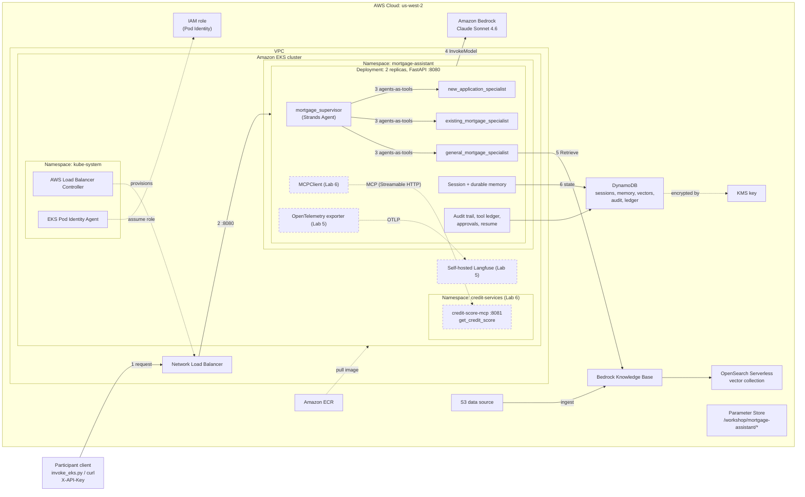

# Build and deploy Strands agents to Amazon EKS

This repository contains complete participant checkpoints for building a Strands mortgage assistant, deploying it to Amazon EKS, adding DynamoDB-backed memory with agents-as-tools orchestration, a tamper-evident audit trail, and resumable execution, instrumenting it with OpenTelemetry traces exported to self-hosted Langfuse, and integrating a tool from a pre-provisioned credit-score MCP server managed by the credit-services team.

Workshop Studio deploys `credit-services` and provisions the shared AWS environment and self-hosted Langfuse infrastructure before participants begin. The standalone `00-workshop-setup` module can provision the shared Bedrock, EKS, ECR, load-balancing, and memory resources, but it does not provision the Lab 5 Langfuse stack or Lab 6 credit-score MCP server.

## Workshop Modules

| Lab | Module | Outcome |
| --- | --- | --- |
| 0 | `00-workshop-setup` | Optional standalone setup for shared Knowledge Base, EKS, ECR, IAM, load-balancing, and DynamoDB memory resources. |
| 1 | `01-test-knowledge-base` | Query the Knowledge Base, inspect EKS, and independently initialize/list/call the installed MCP server. |
| 2 | `02-local-strands` | Run the multi-agent Strands mortgage assistant locally. |
| 3 | `03-eks-service` | Deploy the assistant as a persistent two-replica FastAPI service on EKS. |
| 4 | `04-memory` | Add short-term sessions and durable semantic memory backed by DynamoDB, turn the specialists into persistent agents-as-tools, and add a hash-chained audit trail, per-response explanations, resumable failed requests, and human approval pauses. |
| 5a | `05-observability/05a-langfuse` | Export correlated Strands traces to self-hosted Langfuse and inspect model/tool latency, token usage, and controlled failures. |
| 5b | `05-observability/05b-cloudwatch-omni` | Optional: send the same traces to Amazon CloudWatch Omni, alongside or instead of Langfuse. |
| 6 | `06-mcp-credit-score` | Explore an MCP server, integrate its tool with the Strands supervisor, and deploy the updated agent to EKS. |

Numbered application modules are self-contained checkpoints. Runtime modules do not import code from earlier lab directories.

## Reference Architecture

The diagram shows the application as it stands after Lab 6. Solid elements exist after Labs 0 through 4; dashed elements are added by Labs 5 and 6 and need a Workshop Studio environment. An editable draw.io version with AWS icons is in [`architecture.drawio`](architecture.drawio).



Request path: (1) the client calls the NLB with an API key, (2) the NLB forwards to a FastAPI pod, (3) the supervisor routes to one specialist exposed as a tool, (4) agents call Bedrock for inference, (5) the general specialist retrieves from the Knowledge Base, (6) sessions, durable memory, the audit trail and the tool ledger persist to DynamoDB. Parameter Store holds the resource names the deploy scripts discover; it is not on the request path.

## Application Progression

Lab 3 creates the `mortgage-assistant` application namespace, a two-replica Deployment, an NLB-backed Kubernetes Service, an API-key Secret, and health and invocation routes.

Lab 4 updates those resources in place and adds:

- Strands `SnapshotSessionManager` for short-term conversation state, one session per agent, saved after every message.
- Strands `MemoryManager` for actor-scoped durable mortgage preferences, with provenance on every write.
- DynamoDB session, memory, and vector-search storage.
- Specialists as persistent agents-as-tools (`Agent.as_tool`) that return structured reports to the supervisor.
- A hash-chained audit trail of invocations, model decisions, tool calls, memory reads and writes, and approvals, plus an `explanation` block on every response.
- Resumable execution: request-level idempotency, a per-session lease with heartbeat, a tool ledger for exactly-once effects, rollback of unfinished turns, and Strands interrupts that pause side-effecting tool calls for human approval and survive pod restarts.
- A stateful participant client and deterministic hydration utilities.

Lab 5 updates the service with OpenTelemetry/Langfuse tracing, request correlation (trace IDs are recorded on the audit trail and returned by the API), content masking, and controlled fault injection.

Lab 6 is a complete checkpoint of Lab 5. Participants first use the installed MCP server independently, then the application adds:

- `mcp==2.1.1` and Streamable HTTP.
- A fixed-target explorer for info, discovery, schema inspection, invocation, and live contract verification.
- A Strands `MCPClient` opened for each `/invoke` request.
- Exact validation that the MCP server exposes only `get_credit_score`.
- A synthetic score of `80` that is explicitly not a lending decision.

Every `/invoke` initializes and discovers MCP before the supervisor chooses a route. MCP server failure therefore affects all invocation routes. For MCP, `GET /health/ready` checks the fixed configured URL identity without connecting to the server; it also resolves the Knowledge Base ID. The explorer `verify` operation performs the live protocol and tool-contract check.


## MCP Server Ownership

Workshop Studio deploys `credit-services` before participants begin and provisions:

```text
credit-services/service/credit-score-mcp:8081
http://credit-score-mcp.credit-services.svc.cluster.local:8081/mcp
```

Participants may inspect and call the MCP server, but must not modify, restart, scale, replace, or delete its namespace, Deployment, pods, Service, endpoint, image, or configuration. Broad workshop permissions do not transfer ownership. The credit-services team manages the MCP server. In production, another organizational team could own and maintain it in another account, network, or EKS cluster.

The standalone `00-workshop-setup` path does not create this MCP server or the `/workshop/mortgage-assistant/mcp/credit-score-url` Parameter Store value. Lab 6 requires a Workshop Studio-provisioned environment.

## Prerequisites

Install AWS CLI v2, Python 3.12 or later, `uv`, Docker with Buildx or a Docker-compatible builder, `kubectl`, `curl`, and `openssl`. Configure the intended AWS identity and Region before running deployment commands:

```bash
aws sts get-caller-identity
aws configure get region
```

Use only synthetic workshop data. Run Python commands through `uv run`; the
first invocation in each lab creates its local environment and installs the
locked dependencies automatically.

## Lab 1: Explore the Provisioned Environment

Query the Knowledge Base directly:

```bash
cd 01-test-knowledge-base
uv run query_knowledge_base.py \
  --query "What are the benefits of a 15-year mortgage?"
```

The Workshop Studio Lab 1 pages also inspect EKS and use the fixed-target Lab 6 explorer to initialize the installed MCP server, list and inspect `get_credit_score`, call it with a synthetic ID, and run `verify` before any agent integration.

## Lab 2: Run the Local Strands Application

```bash
cd ../02-local-strands
uv run mortgage_agent.py \
  --prompt "Compare 15-year and 30-year mortgages"
```

## Lab 3: Deploy the EKS Service

```bash
cd ../03-eks-service
./scripts/deploy-application.sh --region us-west-2
uv run app/invoke_eks.py \
  --prompt "When does refinancing make sense?"
```

The script discovers provisioned resources, builds and pushes a `linux/amd64` image, applies `mortgage-assistant` Kubernetes resources, waits for two ready replicas and the NLB, and runs a smoke request.

## Lab 4: Add Memory, Agent Orchestration, and Resumable Execution

```bash
cd ../04-memory
uv run python -m unittest discover --start-directory tests --verbose
./scripts/deploy-memory.sh --region us-west-2
uv run app/invoke_eks.py --region us-west-2 --prompt "What is the balance on customer ID 123456's mortgage?"
uv run app/invoke_eks.py --region us-west-2 --trail last
```

See [`04-memory/README.md`](04-memory/README.md) for the session, pod replacement, durable recall, actor-scoping, inspection, audit and explanation, failed-request resume, approval, and cleanup exercises.

## Lab 5a: Add OpenTelemetry and Langfuse Observability

```bash
cd ../05-observability/05a-langfuse
uv run python -m unittest discover --start-directory tests --verbose
./scripts/deploy-observability.sh --region us-west-2
```

See [`05-observability/05a-langfuse/README.md`](05-observability/05a-langfuse/README.md) for trace correlation, content masking, controlled fault injection, and Langfuse exercises.

## Lab 5b: Send traces to CloudWatch Omni (optional)

```bash
cd ../05b-cloudwatch-omni
uv run python -m unittest discover --start-directory tests --verbose
./scripts/deploy-omni.sh --region us-west-2
```

See [`05-observability/05b-cloudwatch-omni/README.md`](05-observability/05b-cloudwatch-omni/README.md).

## Lab 6: Integrate MCP Tools with the Strands Agent

```bash
cd ../06-mcp-credit-score
uv run python -m unittest discover \
  --start-directory tests \
  --verbose
```

Explore the credit-score MCP server:

```bash
uv run scripts/explore_credit_score_mcp.py info
uv run scripts/explore_credit_score_mcp.py list-tools
uv run scripts/explore_credit_score_mcp.py inspect-tool
uv run scripts/explore_credit_score_mcp.py \
  call-credit-score \
  --customer-id workshop-customer-12345
uv run scripts/explore_credit_score_mcp.py verify
```

Deploy only the updated `mortgage-assistant` application and invoke it:

```bash
./scripts/deploy-mcp-integration.sh --region us-west-2
uv run app/invoke_eks.py \
  --region us-west-2 \
  --prompt "Get the credit score for synthetic customer ID workshop-customer-12345."
```

The deployment preserves the existing `mortgage-assistant` NLB, Service, service account, Pod Identity association, Knowledge Base, DynamoDB memory resources, and OpenTelemetry configuration. It reapplies the API-key Secret while retaining its value unless explicitly overridden, and reads the existing Langfuse OTLP Secret without reapplying it. It verifies but does not modify `credit-services`.

See [`06-mcp-credit-score/README.md`](06-mcp-credit-score/README.md) for the complete contract, safety, observability, troubleshooting, and `mortgage-assistant`-only cleanup exercises.


## Standalone Setup Limitation

To provision only the shared base resources outside Workshop Studio:

```bash
./00-workshop-setup/scripts/deploy-infrastructure.sh --region us-west-2
```

This is sufficient for Labs 1 through 4. It is not sufficient for Lab 5 or
Lab 6 because it does not provision the self-hosted Langfuse stack or the
credit-score MCP server. Do not substitute another MCP URL or deploy an ad
hoc MCP server; use a Workshop Studio-provisioned environment for those labs.

## Cleanup

Each deployment module documents its own cleanup scope. Lab 6 cleanup deletes only the `mortgage-assistant` application namespace and NLB. It leaves `credit-services` and shared AWS resources unchanged.

Shared infrastructure cleanup is destructive and charge-impacting. Run it only in a standalone environment you intentionally provisioned and only after confirming the AWS account and Region.
